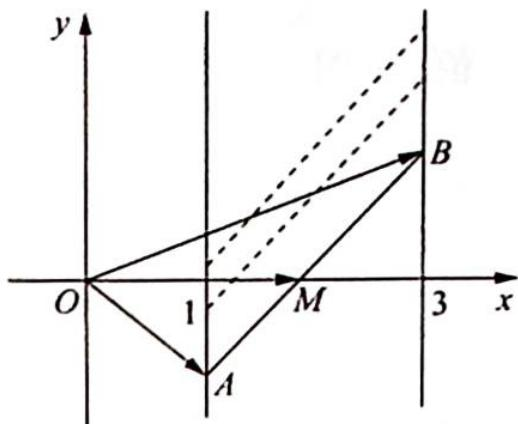

> [!faq]- 《高考数学培优40讲》参考答案
>
> > [!success]- **【答案】** A
>
> > [!note]- **【分析】**
> > 本题未单列分析。
>
> > [!note]- **【解析】**
> > 如图所示,由题意得 $|\overrightarrow{AB}| = 4$ ,点 $A,B$ 分别在直线 $x = 1,x = 3$ 上,则 $AB$ 的中点在 $x = 2$ 上,设 $AB$ 的中点 $M$ ,则 $|\overrightarrow{OA} +\overrightarrow{OB}| = 2|\overrightarrow{OM}|$ .
> > 若 $|\overrightarrow{OA} +\overrightarrow{OB}|$ 取得最小值,即 $OM$ 垂直于直线 $x = 2$ 时, $AB$ 的中点 $M$ 在 $x$ 轴上,即 $M(2,0)$ .
> > 由极化恒等式得 $\overrightarrow{OA} \cdot \overrightarrow{OB} = |\overrightarrow{OM}|^{2} - \frac{1}{4} |\overrightarrow{AB}|^{2} = 4 - \frac{1}{4} \times 4^{2} = 0$ ,故选 A.
> > 
