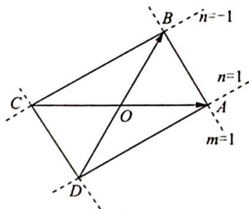

> [!faq]- 《高考数学培优40讲》参考答案
>
> > [!success]- **【答案】** D
>
> > [!note]- **【分析】**
> > 本题未单列分析。
>
> > [!note]- **【解析】**
> > 【分析】由 $|\lambda| + |\mu| \leqslant 1$ 可分类讨论,再由等和线及等差线结论可求解.
> > 【解析】因为 $|\overrightarrow{OA}| = |\overrightarrow{OB}| = \overrightarrow{OA} \cdot \overrightarrow{OB} = 2$ ,所以 $\angle AOB = \frac{\pi}{3}$ .如图所示, $\overrightarrow{OC} = -\overrightarrow{OA}, \overrightarrow{OD} = -\overrightarrow{OB}$ ,令 $\lambda + \mu = m, \lambda - \mu = n$ .
> > - **①**：当 $\lambda \geqslant 0, \mu \geqslant 0$ ,则 $\overrightarrow{OP} = \lambda \overrightarrow{OA} + \mu \overrightarrow{OB}, \lambda + \mu \leqslant 1$ .由等和线结论知,点集所表示的区域为 $\triangle OAB$ .
> > - **②**：当 $\lambda \geqslant 0, \mu \leqslant 0$ ,则 $\overrightarrow{OP} = \lambda \overrightarrow{OA} + \mu \overrightarrow{OB}, \lambda - \mu \leqslant 1$ .由等差线结论知,点集表示的区域为 $\triangle OAD$ ,同理可知,点集 $\{P | \overrightarrow{OP} = \lambda \overrightarrow{OA} + \mu \overrightarrow{OB}, |\lambda| + |\mu| \leqslant 1, \lambda, \mu \in \mathbb{R}\}$ ,所表示其内部,且为矩形.易知 $|AB| = 2, |AD| = 2\sqrt{3}$ ,则其面积为 $4\sqrt{3}$ ,故选 D.
> > 
> > 域为 $\triangle OAD$ , 同理可知, 点集 $\{P \mid \overrightarrow{OP} = \lambda \overrightarrow{OA} + \mu \overrightarrow{OB}, |\lambda| + |\mu| \leqslant 1, \lambda, \mu \in \mathbb{R}\}$ , 所表示的区域为四边形 $ABCD$ 及其内部, 且为矩形. 易知 $|AB| = 2, |AD| = 2\sqrt{3}$ , 则其面积为 $4\sqrt{3}$ ,
> >
> > 故选 **D**.
