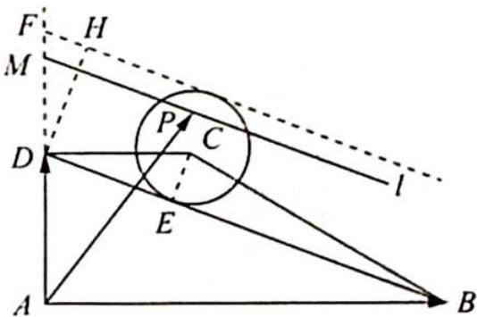

> [!faq]- 《高考数学培优40讲》参考答案
>
> > [!success]- **【答案】** 详见解析
>
> > [!note]- **【分析】**
> > 本题未单列分析。
>
> > [!note]- **【解析】**
> > 如图所示,作 $CE \perp BD$ 于 $E$ , 由 $\triangle CDE \sim \triangle DBA$ 可知 $\frac{CE}{DA} = \frac{CD}{BD}$ , 即 $\frac{CE}{1} = \frac{1}{\sqrt{10}}$ , 所以 $CE = \frac{\sqrt{10}}{10}$ .
> > 
> > 于点 $H$ ，显然 $DH = 2CE = \frac{\sqrt{10}}{5}$ ，由 $\triangle DFH \sim \triangle BDA$ 得 $\frac{DF}{BD} = \frac{DH}{BA}$ ，即 $\frac{DF}{\sqrt{10}} = \frac{\frac{\sqrt{10}}{5}}{3}$ ，所以 $DF = \frac{2}{3}$ 。过点 $P$ 作直线 $l \parallel BD$ ，交 $AD$ 的延长线于点 $M$ ，设 $t = \frac{AM}{AD}$ ，则 $x + y = t$ ，由图形知“等和线” $l$ 可从直线 $BD$ 的位置平移至直线 $FH$ 的位置（不包括 $BD$ 和 $FH$ ），由平面几何知识可得 $1 = \frac{AD}{AD} < \frac{AM}{AD} < \frac{AF}{AD} = \frac{5}{3}$ ，即 $1 < t < \frac{5}{3}$ ，故 $x + y$ 的取值范围是 $(1, \frac{5}{3})$ 。
