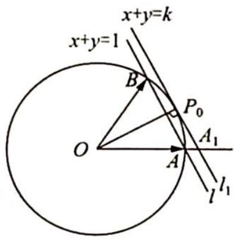
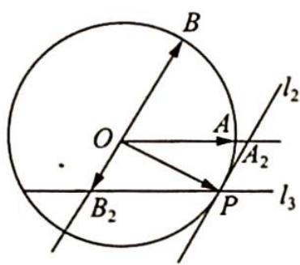

> [!faq]- 《高考数学培优40讲》参考答案
>
> > [!success]- **【答案】** BD
>
> > [!note]- **【分析】**
> > 本题未单列分析。
>
> > [!note]- **【解析】**
> > 解法一(向量运算,柯西不等式):根据题意可得条件 $|xe_{1}+ye_{2}|=1$ 等价于 $x^{2}+y^{2}+xy=1$ ,于是 $\left(y+\frac{x}{2}\right)^{2}+\left(\frac{\sqrt{3}}{2}x\right)^{2}=1$ ,则x的最大值为 $\frac{2\sqrt{3}}{3}$ ,选项A错误,选项B正确.
> > 再由柯西不等式可得 $x + y = 1 \times \left(y + \frac{x}{2}\right) + \frac{1}{\sqrt{3}} \times \frac{\sqrt{3}}{2} x \leqslant \sqrt{\left[1^2 + \left(\frac{1}{\sqrt{3}}\right)^2\right]\left[\left(y + \frac{x}{2}\right)^2 + \left(\frac{\sqrt{3}}{2}x\right)^2\right]} = \sqrt{\frac{4}{3}} = \frac{2\sqrt{3}}{3}$ , 当 $x = y = \frac{\sqrt{3}}{3}$ 时取得等号, 选项 C 错误, 选项 D 正确. 故选 BD.
> > 解法二(从几何入手):如图1所示,令 $\overrightarrow{OA}=e_{1},\overrightarrow{OB}=e_{2},\overrightarrow{OP}=xe_{1}+ye_{2}$ ,则 $|\overrightarrow{OP}|=1$ ,即点P是圆O上动点.
> > 由等和线平行差向量知,过P作 $l_{1}\parallel AB$ ,交射线OA于点 $A_{1},\overrightarrow{OA_{1}}=k\overrightarrow{OA},x+y$ 的最大值即为k的最大值.由图1可知,当 $l_{1}$ 过劣弧AB的中点 $P_{0}$ ,即与 $\odot O$ 相切时, $k_{max}=\frac{2}{\sqrt{3}}$ .故选项D正确.
> > 根据向量加法的平行四边形法则,过P作 $l_{2}\parallel OB$ ,交射线OA于 $A_{2}$ 点,过P作 $l_{3}\parallel OA$ ,交射线BO于 $B_{2}$ 点,则 $\overrightarrow{OA_{2}}=\lambda\overrightarrow{OA},x$ 的最大值即为 $\lambda$ 的最大值;由图2可知,当 $l_{2}$ 与圆O相切时, $\lambda_{max}=\frac{2}{\sqrt{3}}$ ,故选项B正确.
> > 综上,正确答案为BD.
> > 
> > 图1
> > 
> > 图2
> > $$
> > \overrightarrow {B A} \cdot \overrightarrow {C A} = \overrightarrow {A B} \cdot \overrightarrow {A C} = | \overrightarrow {A D} | ^ {2} - | \overrightarrow {B D} | ^ {2} = 4, \overrightarrow {B F} \cdot \overrightarrow {C F} = \overrightarrow {F B} \cdot \overrightarrow {F C} = | \overrightarrow {F D} | ^ {2} - | \overrightarrow {B D} | ^ {2} =
> > $$
> > $$
> > \frac {1}{9} | \overrightarrow {A D} | ^ {2} - | \overrightarrow {B D} | ^ {2} = - 1
> > $$
> > $$
> > \mid \overrightarrow {A D} \mid^ {2} = \frac {4 5}{8}, \mid \overrightarrow {B D} \mid^ {2} = \frac {1 3}{8}
> > $$
> > $$
> > \overrightarrow {B E} \cdot \overrightarrow {C E} = \overrightarrow {E B} \cdot \overrightarrow {E C} = | \overrightarrow {E D} | ^ {2} - | \overrightarrow {B D} | ^ {2} = \frac {4}{9} | \overrightarrow {A D} | ^ {2} - | \overrightarrow {B D} | ^ {2} = \frac {7}{8}
> > $$
> > 【评注】本题用坐标法(以 D 为原点, BC 所在的直线为 x 轴, 过点 D 且与 BC 垂直的直线为 y 轴)、基底法(选 $\overrightarrow{FD}, \overrightarrow{BC}$ 为基底)亦可求解, 两种解法具体过程略.
