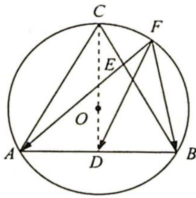

> [!faq]- 《高考数学培优40讲》参考答案
>
> > [!success]- **【答案】** 详见解析
>
> > [!note]- **【分析】**
> > 本题未单列分析。
>
> > [!note]- **【解析】**
> > 解法一(极化恒等式):如图1所示,过点C作 $CD\perp AB$ ,垂足为D,则点D是AB的中点,连接FD,所以 $AB=AC=BC=2\sqrt{3}$ .
> > 
> > 由极化恒等式得 $\overrightarrow{FA} \cdot \overrightarrow{FB} = |\overrightarrow{FD}|^2 - \frac{1}{4} |\overrightarrow{BA}|^2 = |\overrightarrow{FD}|^2 - 3$ ，因为点 $F$ 在劣弧 $\widehat{BC}$ 上，所以 $|\overrightarrow{FD}| \in [\sqrt{3}, 3]$ （点 $F$ 在点 $C$ 处达到最大，在点 $B$ 处最小），所以 $\overrightarrow{FA} \cdot \overrightarrow{FB} \in [0, 6]$ .
> > 图 1
> > 解法二(坐标法): 建立如图 2 所示的平面直角坐标系, 则 $A(-\sqrt{3}, -1)$ , $B(\sqrt{3}, -1)$ , $C(0, 2)$ .
> > 设 $F(2\cos \alpha, 2\sin \alpha), \alpha \in \left[-\frac{\pi}{6}, \frac{\pi}{2}\right]$ , 所以 $\overrightarrow{FA} \cdot \overrightarrow{FB} = (-\sqrt{3} - 2\cos \alpha, -1 - 2\sin \alpha) \cdot (\sqrt{3} - 2\cos \alpha, -1 - 2\sin \alpha) = -3 + 4\cos^2 \alpha + 1 + 4\sin \alpha + 4\sin^2 \alpha = 2 + 4\sin \alpha$ , 又 $\alpha \in \left[-\frac{\pi}{6}, \frac{\pi}{2}\right]$ , 所以 $\sin \alpha \in \left[-\frac{1}{2}, 1\right], \overrightarrow{FA} \cdot \overrightarrow{FB} \in [0, 6]$ .
