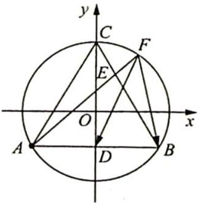
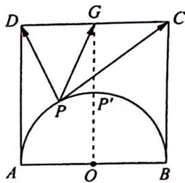

> [!faq]- 《高考数学培优40讲》参考答案
>
> > [!success]- **【答案】** 详见解析
>
> > [!note]- **【分析】**
> > 本题未单列分析。
>
> > [!note]- **【解析】**
> > 如图所示,取 CD 中点 G, 设 AB 中点为 O, 由极化恒等式得 $\overrightarrow{PD} \cdot \overrightarrow{PC} = |\overrightarrow{PG}|^{2}$
> > 
> > 图 2
> > $$
> > - \frac {1}{4} | \overrightarrow {C D} | ^ {2} = | \overrightarrow {P G} | ^ {2} - 4.
> > $$
> > 当 $O, P, G$ 三点共线时， $|\overrightarrow{PG}|$ 最小，此时 $P'G = 2$ ，且 $\left|\overrightarrow{PG}\right|_{\max} = BG = 2\sqrt{5}$ ，所以 $\left|\overrightarrow{PG}\right| \in [2, 2\sqrt{5}], \overrightarrow{PD} \cdot \overrightarrow{PC} = |\overrightarrow{PG}|^2 - 4 \in [0, 16]$ .
> > 
> > 角坐标系, 则 $C(2,4), D(-2,4), P(2\cos \alpha, 2\sin \alpha), \alpha \in [0, \pi]$ , 由向量坐标运算求出 $\overrightarrow{PD} \cdot \overrightarrow{PC}$ . 这里省略.
