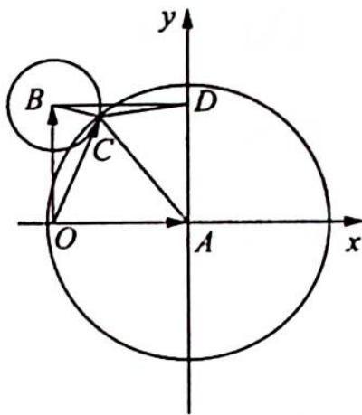

> [!faq]- 《高考数学培优40讲》参考答案
>
> > [!success]- **【答案】** 详见解析
>
> > [!note]- **【分析】**
> > 本题未单列分析。
>
> > [!note]- **【解析】**
> > 设 $\overrightarrow{OA}=a,\overrightarrow{OB}=b$ ，且 $OA\perp OB$ ，根据题目的条件，可知c的终点C应该落在以A为圆心，3为半径的圆和以B为圆心，1为半径的圆的交点上（如图所示），而 $|c-a-b|$ 即为线段CD的长度。
> > 由 $OC^{2} + CD^{2} = CA^{2} + CB^{2}$ 得到 $CD^{2} = 10 - OC^{2}$ ，因为 $OC = |c| \in [1, \sqrt{5}]$ ，所以 $|c - a - b| = CD \in [\sqrt{5}, 3]$ .
> > 
