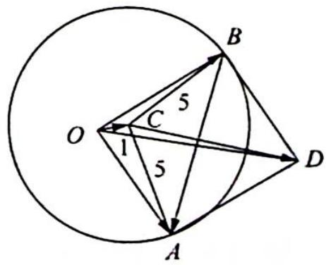

> [!faq]- 《高考数学培优40讲》参考答案
>
> > [!success]- **【答案】** 详见解析
>
> > [!note]- **【分析】**
> > 本题未单列分析。
>
> > [!note]- **【解析】**
> > 先依据条件进行构图, 设 $\overrightarrow{OC} = c$ , 那么根据题意, $a - c$ 和 $b - c$ 的终点 $A, B$ 落在以点 $C$ 为圆心, 5 为半径的一个圆上, 且 $OA \perp OB$ (如图所示). 以 $OA, OB$ 为邻边构造矩形 $OADB$ , 由 $OC^2 + CD^2 = CA^2 + CB^2$ , 计算可得 $CD = 7$ . 由 $|a - b| = |\overrightarrow{BA}| = |\overrightarrow{OD}|$ 可知, 问题的目标即求 $OD$ 长度的最大值. 由图易得 $OD \leqslant OC + CD = 8$ , 即 $|a - b|$ 的最大值为 8.
> > 
