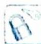

# 30.1 常值(等量)代换

研究密钥

有的问题表面上无法应用基本不等式,但通过观察条件和结论,结合二者特征,构造新的式子,然后对待求式通过常值或等量代换进行变形.通过代数式的变形,构造和式或积式为定值,形成使用基本不等式的条件.

此方法常适用于已知式和待求式一个是整式,一个是分式,或已知和式可以化为常数的情形。在构造式子或常值(等量)代换时,注意以结论为导向,条件与结论要互相关照,目的就是将待求式化为可使用基本不等式的形式。

1. 常值代换

![[高中/总复习/专题/高考数学培优40讲/高考数学培优40讲-03-三角、向量、数列、不等式与复数/第30讲_基本不等式/最值问题/30_1_常值_等量_代换/例题/Q00019922.md]]
![[高中/总复习/专题/高考数学培优40讲/高考数学培优40讲-03-三角、向量、数列、不等式与复数/第30讲_基本不等式/最值问题/30_1_常值_等量_代换/例题/Q00019923.md]]
![[高中/总复习/专题/高考数学培优40讲/高考数学培优40讲-03-三角、向量、数列、不等式与复数/第30讲_基本不等式/最值问题/30_1_常值_等量_代换/例题/Q00019924.md]]
![[高中/总复习/专题/高考数学培优40讲/高考数学培优40讲-03-三角、向量、数列、不等式与复数/第30讲_基本不等式/最值问题/30_1_常值_等量_代换/例题/Q00019925.md]]
![[高中/总复习/专题/高考数学培优40讲/高考数学培优40讲-03-三角、向量、数列、不等式与复数/第30讲_基本不等式/最值问题/30_1_常值_等量_代换/例题/Q00019926.md]]
![[高中/总复习/专题/高考数学培优40讲/高考数学培优40讲-03-三角、向量、数列、不等式与复数/第30讲_基本不等式/最值问题/30_1_常值_等量_代换/例题/Q00019927.md]]
