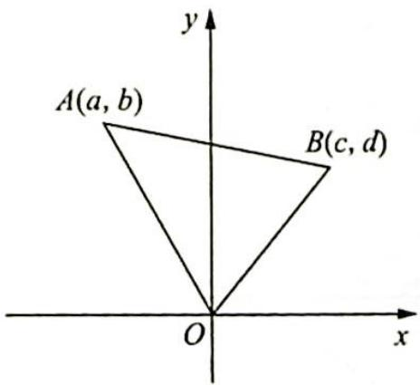
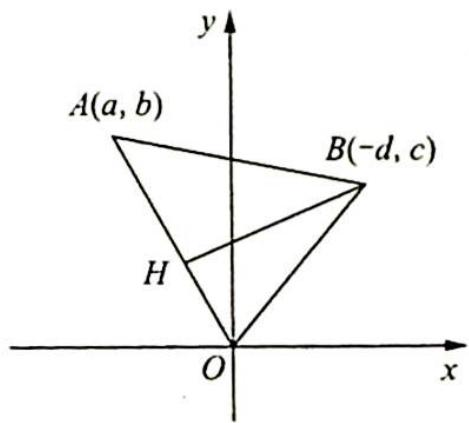
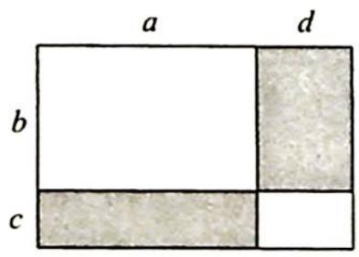
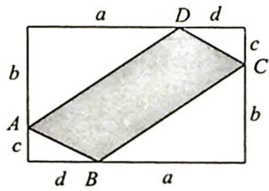

> [!faq]- 《高考数学培优40讲》例题解析
>
> > [!success]- **【答案】** 详见解析
>
> > [!note]- **【分析】**
> > 分析 ▶ 式①、式②的证明并不复杂,但其与中学数学内容的内在联系却非常广泛,可以根据其结构进行联想与构造,从诸多视角来认识,发现知识的内在联系.
>
> > [!note]- **【解析】**
> > 解析 ▶ 以下从多个视角提供二维柯西不等式的理解与证明. 由于 $(a^{2}+b^{2})(c^{2}+d^{2})=0$ 时不等式显然成立, 为了书写的方便, 下面的叙述均假定 $(a^{2}+b^{2})(c^{2}+d^{2})\neq0$ .
> > ## (1) 配方视角
> > 设 a, b, c, d 都是实数，且 $m = a^{2} + b^{2}, n = c^{2} + d^{2}$ ，则 m, n 可以表示为两个实数的平方和，即关于 a, b, c, d 的恒等式（由交换律还可以写出一些变形）： $(a^{2} + b^{2})(c^{2} + d^{2}) = (ac + bd)^{2} + (bc - ad)^{2}$ ③，去掉非负项 $(bc - ad)^{2}$ ，可得式①，当且仅当 bc - ad = 0，即 a = kc, b = kd 时等号成立。
> > 由此可见,初中阶段就已提供了认识二维柯西不等式的知识基础:全量大于它的任一部分,配平方提供非负项等.这里的式③可以反过来由式①用作差法得到(其推广就是n维柯西不等式的配方证明), 并且式①、式②、式③可以有广泛的数学理解.
> > ## (2)复数视角
> > 记 $z_{1} = a + bi, z_{2} = c - di$ , 则有 $z_{1}z_{2} = (a + bi)(c - di) = (ac + bd) + (bc - ad)i$ , 由此可见, 式③实质上就是复数运算“模的乘积等于乘积的模”: $|z_{1}| |z_{2}| = |z_{1}z_{2}|$ , 而式③的不等式形式就是复数的模不会小于它的实部: $|z_{1}| |z_{2}| = |z_{1}z_{2}| \geqslant \operatorname{Re}(|z_{1}z_{2}|)$ , 当且仅当 $bc - ad = 0$ , 即 $a = kc, b = kd$ 时等号成立.
> > “复数的模不会小于它的实部”其实也就是“直角三角形的斜边不会小于直角边”，考虑到复数有坐标形式、向量形式等，这就给我们打开了不等式的坐标视角、几何视角。
> > ## (3)向量视角
> > 记 $\boldsymbol{\alpha}=(a,b),\boldsymbol{\beta}=(c,d)$ ，由数量积的定义有 $\cos\langle\boldsymbol{\alpha},\boldsymbol{\beta}\rangle=\frac{\boldsymbol{\alpha}\cdot\boldsymbol{\beta}}{|\boldsymbol{\alpha}||\boldsymbol{\beta}|}=\frac{ac+bd}{\sqrt{a^{2}+b^{2}}\sqrt{c^{2}+d^{2}}}$ ④，但 $|\cos\langle\boldsymbol{\alpha},\boldsymbol{\beta}\rangle|\leqslant1$ ，故得式②。由此可得二维柯西不等式的向量形式 $|\alpha||\beta|\geqslant|\alpha\cdot\beta|$ ，当且仅当向量共线（线性相关）时等号成立。
> > 由此可见,二维柯西不等式又来源于余弦函数的有界性(利用这一点还可以改写为参数变换的形式),并且这里的式④还可以理解为余弦定理、点与直线的距离等.
> > ## (4)余弦定理视角
> > 在坐标平面上取点 $A(a, b), B(c, d)$ (如图1所示), 在 $\triangle OAB$ 中, 由余弦定理得 $\cos \angle AOB = \frac{OA^2 + OB^2 - AB^2}{2OA \cdot OB} = \frac{(a^2 + b^2) + (c^2 + d^2) - [(a - c)^2 + (b - d)^2]}{2\sqrt{a^2 + b^2}\sqrt{c^2 + d^2}} = \frac{ac + bd}{\sqrt{a^2 + b^2}\sqrt{c^2 + d^2}}$ .
> > 这正是式④, 变形可得式②, 当且仅当 $\cos \angle AOB = \pm 1 \Leftrightarrow A, O, B$ 三点共线时等号成立. 可见余弦定理在坐标系中与向量数量积的定义是相通的.
> > 
> > 图 1
> > 
> > 图2
> > ## (5) 距离视角
> > 在平面直角坐标系上取点 $A(a, b), B(-d, c)$ (如图2所示), 一般地, $OA$ 的直线方程为 $bx = ay$ , 由点 $B$ 到直线 $OA$ 的距离 $BH$ 不大于 $OB$ 可得 $\frac{|ac + bd|}{\sqrt{a^2 + b^2}} = |BH| \leqslant |OB| = \sqrt{c^2 + d^2}$ . 变形可得式②, 当且仅当 $OA \perp OB$ 时等号成立, 由此可见, 二维柯西不等式与“点到直线的垂直距离最短”又是相通的.
> > ## (6)方程视角
> > 不等式 $(a^{2}+b^{2})(c^{2}+d^{2})\geqslant(ac+bd)^{2}$ 的结构使我们联想到二次函数的判别式不大于0.
> > 作开口向上的二次函数 $f(x)=(ax+c)^{2}+(bx+d)^{2}=(a^{2}+b^{2})x^{2}+2(ac+bd)x+(c^{2}+d^{2})$ .
> > 由于 $f(x) \geqslant 0$ 对一切 $x \in \mathbb{R}$ 恒成立, 故有判别式不大于 0 , 即 $4(ac + bd)^2 - 4(a^2 + b^2)(c^2 + d^2) \leqslant 0$ , 即 $(a^2 + b^2)(c^2 + d^2) \geqslant (ac + bd)^2$ , 当且仅当 $ax + c = 0$ 时等号成立, 且 $bx + d = 0$ . 由这个方法推广可得 $n$ 维柯西不等式的简洁证明.
> > ## (7)基本不等式视角
> > 由基本不等式得 $\frac{ac}{\sqrt{a^2 + b^2}\sqrt{c^2 + d^2}} = \frac{a}{\sqrt{a^2 + b^2}}\cdot \frac{c}{\sqrt{c^2 + d^2}}\leqslant \frac{1}{2}\left(\frac{a^2}{a^2 + b^2} +\frac{c^2}{c^2 + d^2}\right),$ $\frac{bd}{\sqrt{a^2 + b^2}\sqrt{c^2 + d^2}} = \frac{b}{\sqrt{a^2 + b^2}}\cdot \frac{d}{\sqrt{c^2 + d^2}}\leqslant \frac{1}{2}\left(\frac{b^2}{a^2 + b^2} +\frac{d^2}{c^2 + d^2}\right).$
> > 以上两式相加,可得 $\frac{ac + bd}{\sqrt{a^2 + b^2}\sqrt{c^2 + d^2}} \leqslant 1$ , 变形即得式②.
> > ## (8) 参数变换视角
> > 将点 $A(a,b),B(c,d)$ 写成参数式，可得 $\left\{ \begin{array}{l}a = \sqrt{a^2 + b^2}\cos \alpha \\ b = \sqrt{a^2 + b^2}\sin \alpha \end{array} \right.$ ， $\left\{ \begin{array}{l}c = \sqrt{c^2 + d^2}\cos \beta \\ d = \sqrt{c^2 + d^2}\sin \beta \end{array} \right.$
> > $$
> > \begin{array}{r l} {\text {则} (a c + b d) ^ {2}} & {= \left(\sqrt {a ^ {2} + b ^ {2}} \cdot \sqrt {c ^ {2} + d ^ {2}} \cos \alpha \cos \beta + \sqrt {a ^ {2} + b ^ {2}} \cdot \sqrt {c ^ {2} + d ^ {2}} \sin \alpha \sin \beta\right) ^ {2}} \\ & {= (a ^ {2} + b ^ {2}) (c ^ {2} + d ^ {2}) (\cos \alpha \cos \beta + \sin \alpha \sin \beta) ^ {2}} \\ & {= (a ^ {2} + b ^ {2}) (c ^ {2} + d ^ {2}) \cos^ {2} (\alpha - \beta)} \\ & {\leqslant (a ^ {2} + b ^ {2}) (c ^ {2} + d ^ {2}), \text {当且仅当} \cos^ {2} (\alpha - \beta) = 1 \text {时等号成立}.} \end{array}
> > $$
> > ## (9)面积视角
> > 数学家高斯说过:几何学唯美的直观能够帮助我们了解自然界的基本问题.一位同学受到启发,借助图1、图2两个相同的矩形,按以下步骤给出了不等式 $(ac+bd)^{2}\leqslant(a^{2}+b^{2})\cdot(c^{2}+d^{2})$ 的一种“图形证明”.
> > 
> > 图1
> > 
> > 图 2
> > 证明思路：
> > a. 图 1 中白色区域面积等于图 2 中白色区域面积.
> > b. 图 1 中阴影区域的面积为 $ac + bd$ , 图 2 中, 设 $\angle BAD = \theta$ , 图 2 阴影区域的面积可表示为 (用含 $a, b, c, d, \theta$ 的式子表示).
> > c. 由图中阴影面积相等, 即可得出不等式 $(ac + bd)^{2} \leqslant (a^{2} + b^{2})(c^{2} + d^{2})$ , 当且仅当 $a, b, c, d$ 满足条件 \_\_\_\_ 时, 等号成立.
> > 根据勾股定理, $AB = CD = \sqrt{c^2 + d^2}$ , $AD = BC = \sqrt{a^2 + b^2}$ , 所以 $\triangle ABD \cong \triangle CDB$ , $S_{\triangle ABD} = S_{\triangle CDB} = \frac{1}{2}\sqrt{a^2 + b^2} \cdot \sqrt{c^2 + d^2} \cdot \sin \theta$ , 可得图中阴影部分的面积是 $S_{\triangle ABD} + S_{\triangle CDB} = \sqrt{a^2 + b^2} \cdot \sqrt{c^2 + d^2} \cdot \sin \theta$ .
> > 由 $(ac + bd)^2 = (a^2 + b^2)(c^2 + d^2)\sin^2\theta \leqslant (a^2 + b^2)(c^2 + d^2)$ ，可得 $a^2c^2 + 2abcd + b^2d^2 \leqslant a^2c^2 + a^2d^2 + b^2c^2 + b^2d^2, a^2d^2 - 2abcd + b^2d^2 = (ad - bc)^2 \geqslant 0, ad = bc$ ，所以当且仅当 $a, b, c, d$ 满足条件 $ad = bc$ 时，等号成立。
> > ## 评注
> > 二维形式的柯西不等式还可以找出更多的思路, 不过, 已有的认识告诉我们, 二维柯西不等式与代数配方、复数运算、向量数量积、余弦定理、点到直线距离、二次函数判别式、基本不等式、参数变换、矩形面积等很多知识都有内在的联系, 难怪各种形式的柯西不等式 (向量形式、积分形式、概率形式等) 能够成为诸多现代数学理论的出发点.
