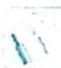

> [!faq]- 《高考数学培优40讲》例题解析
>
> > [!success]- **【答案】** 详见解析
>
> > [!note]- **【分析】**
> > 本题未单列分析。
>
> > [!note]- **【解析】**
> > 解析 (1) 根据题意可得 $S_{n} = \frac{b_{n}}{b_{n - 1}}$ , 所以 $\frac{2}{S_n} + \frac{1}{b_n} = \frac{2}{\frac{b_n}{b_{n - 1}}} + \frac{1}{b_n} = \frac{2b_{n - 1} + 1}{b_n} = 2.$
> > 
> > 则 $b_{n} - b_{n - 1} = \frac{1}{2} (n\geqslant 2,n\in \mathbf{N}^{*})$ ，故数列 $\{b_n\}$ 是等差数列.
> > (2)令 $n = 1$ ，可得 $\frac{2}{b_1} +\frac{1}{b_1} = 2$ ，解得 $b_{1} = \frac{3}{2}$ 所以 $b_{n} = b_{1} + \frac{1}{2} (n - 1) = \frac{n + 2}{2} (n\in \mathbf{N}^{*}),S_{n} = \frac{b_{n}}{b_{n - 1}} =$ $\frac{\frac{n + 2}{2}}{\frac{n + 1}{2}} = \frac{n + 2}{n + 1}(n\geqslant 2,n\in \mathbf{N}^{*}).$
> > 又 $S_{1} = b_{1} = \frac{3}{2}$ 也满足上式，所以 $S_{n} = \frac{n + 2}{n + 1} (n\in \mathbf{N}^{*})$
> > 由题意可得 $a_{n} = S_{n} - S_{n - 1} = \frac{n + 2}{n + 1} -\frac{n + 1}{n} = \frac{n(n + 2) - (n + 1)^{2}}{n(n + 1)} = \frac{-1}{n(n + 1)} (n\geqslant 2,n\in \mathbf{N}^{*})$ ， $a_1 = S_1 = \frac{3}{2}$ ，不满足上式，所以 $a_{n} = \left\{ \begin{array}{l} \frac{3}{2} (n = 1)\\ \frac{-1}{n(n + 1)} (n\geqslant 2,n\in \mathbf{N}^{*}) \end{array} \right.$
