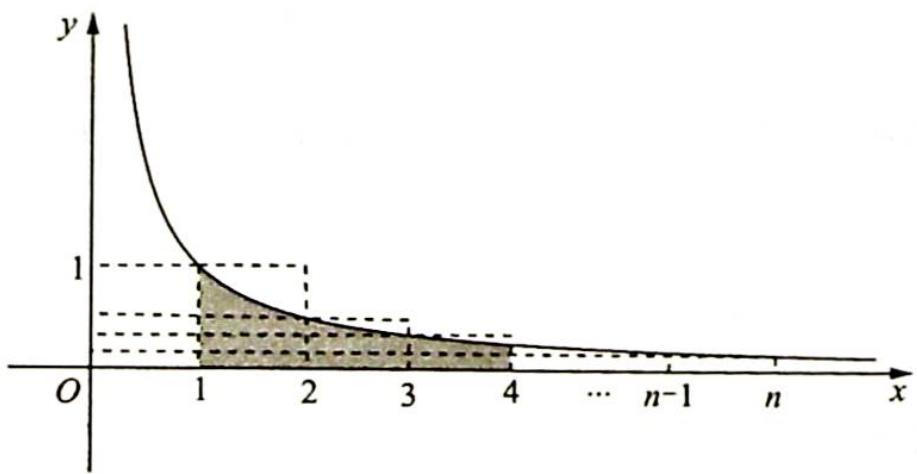

> [!faq]- 《高考数学培优40讲》例题解析
>
> > [!success]- **【答案】** 详见解析
>
> > [!note]- **【分析】**
> > 分析 求和比较明显不是最优解决办法,故考虑 $\ln n$ 是否可以拆项.观察式子结构可以发现, $\ln n$ 左右两边都是累加的形式,故考虑将 $\ln n$ 拆分成累加的形式,根据对数函数的运算性质 $\ln a + \ln b = \ln ab$ , 只需要将 $n$ 拆分成累乘的形式, 即 $\ln n = \ln \left( \frac{2}{1} \times \frac{3}{2} \times \frac{4}{3} \times \cdots \times \frac{n}{n-1} \right) = \ln \frac{2}{1} + \ln \frac{3}{2} + \cdots + \ln \frac{n}{n-1}$ , 只要证明通项 $\frac{1}{n} < \ln \frac{n}{n-1} < \frac{1}{n-1} (n \geqslant 2)$ 即可.
>
> > [!note]- **【解析】**
> > 解析 ▶ 证法一: 设 $\ln n = \sum_{i=1}^{n} b_i$ , 则 $b_n = \ln n - \ln (n-1) = \ln \left(1 + \frac{1}{n-1}\right) (n \geqslant 2, n \in \mathbb{N}^*)$ , 只要证明 $\frac{1}{n} < \ln \left(1 + \frac{1}{n-1}\right) < \frac{1}{n-1} (n \geqslant 2, n \in \mathbb{N}^*)$ 即可. 上式等价于 $\frac{1}{n+1} < \ln \left(1 + \frac{1}{n}\right) < \frac{1}{n} (n \in \mathbb{N}^*)$ . 令 $\frac{1}{n} = x \in (0,1]$ , 则上式转化为不等式 $\frac{x}{x+1} < \ln (x+1) < x$ . 令 $f(x) = \ln (x+1) - x, x \in (0,1], f'(x) = \frac{1}{x+1} - 1 = -\frac{x}{x+1} < 0$ . 所以函数 $f(x)$ 在区间 $(0,1]$ 上单调递减, 可得 $f(x) < f(0) = 0$ , 即 $\ln (x+1) < x$ .
> > <!-- source-part:2 pages:201-240 -->
> > $$
> > g (x) = \ln (x + 1) - \frac {x}{x + 1}, x \in (0, 1 ], g ^ {\prime} (x) = \frac {1}{x + 1} - \frac {x + 1 - x}{(x + 1) ^ {2}} = \frac {x + 1 - 1}{(x + 1) ^ {2}} = \frac {x}{(x + 1) ^ {2}} > 0,
> > $$
> > 所以函数 $g(x)$ 在区间 $(0,1]$ 上单调递增，得 $g(x) > g(0) = 0$ ，即 $\ln (x + 1) > \frac{x}{x + 1}$ .
> > 综上, $\frac{x}{x + 1} < \ln (x + 1) < x, x \in (0,1]$ , 即 $\frac{1}{n + 1} < \ln \left(1 + \frac{1}{n}\right) < \frac{1}{n} (n \in \mathbb{N}^*)$ , 亦即 $\frac{1}{n} < \ln \left(1 + \frac{1}{n - 1}\right) < \frac{1}{n - 1} (n \geqslant 2, n \in \mathbb{N}^*)$ .
> > 因此 $\frac{1}{2} +\frac{1}{3} +\dots +\frac{1}{n} <  \ln \frac{2}{1} +\ln \frac{3}{2} +\dots +\ln \frac{n}{n - 1} <  1 + \frac{1}{2} +\frac{1}{3} +\dots +\frac{1}{n - 1}$ ，即 $\frac{1}{2} +\frac{1}{3} +\dots +$ $\frac{1}{n} <  \ln n <   1 + \frac{1}{2} +\frac{1}{3} +\dots +\frac{1}{n - 1}(n\geqslant 2,n\in \mathbf{N}^{*}).$
> > 证法二: 因为 $\ln n = \ln\left(\frac{2}{1} \times \frac{3}{2} \times \frac{4}{3} \times \cdots \times \frac{n}{n-1}\right) = \ln \frac{2}{1} + \ln \frac{3}{2} + \cdots + \ln \frac{n}{n-1}$ $= (\ln 2 - \ln 1) + (\ln 3 - \ln 2) + \cdots + [\ln n - \ln (n-1)]$ $= \int_{1}^{2} \frac{1}{x} dx + \int_{2}^{3} \frac{1}{x} dx + \cdots + \int_{n-1}^{n} \frac{1}{x} dx.$
> > 如图所示,由定积分的几何意义可知在 $[1,2]$ 上, $\frac{1}{2} < \frac{1}{x} < 1$ , $\int_{1}^{2}\frac{1}{2}\mathrm{d}x < \int_{1}^{2}\frac{1}{x}\mathrm{d}x < \int_{1}^{2}1\mathrm{d}x,\cdots,$ $\int_{n - 1}^{n}\frac{1}{n}\mathrm{d}x < \int_{n - 1}^{n}\frac{1}{x}\mathrm{d}x < \int_{n - 1}^{n}\frac{1}{n - 1}\mathrm{d}x$ 即 $\frac{1}{2} < \int_{1}^{2}\frac{1}{x}\mathrm{d}x < 1,\frac{1}{3} < \int_{2}^{3}\frac{1}{x}\mathrm{d}x < \frac{1}{2},\dots ,\frac{1}{n} < \int_{n - 1}^{n}\frac{1}{x}\mathrm{d}x$ $< \frac{1}{n - 1}(n\geqslant 2,n\in \mathbf{N}^*)$ ，则 $\frac{1}{2} +\frac{1}{3} +\dots +\frac{1}{n} < \int_{1}^{2}\frac{1}{x}\mathrm{d}x + \int_{2}^{3}\frac{1}{x}\mathrm{d}x + \dots +\int_{n - 1}^{n}\frac{1}{x}\mathrm{d}x < 1 + \frac{1}{2}+$ $\frac{1}{3} +\dots +\frac{1}{n - 1}(n\geqslant 2,n\in \mathbf{N}^*)$ ，故 $\frac{1}{2} +\frac{1}{3} +\dots +\frac{1}{n} < \ln n <   1 + \frac{1}{2} +\frac{1}{3} +\dots +$ $\frac{1}{n - 1}(n\geqslant 2,n\in \mathbf{N}^*)$
> > 
> > 证法一在本质上体现了代数式在结构上的对称性. 将不等式的两端构造成对称的和式, 比较其通项, 即“同构思想”; 证法二运用了定积分的几何意义, 两种证法都通过拆分, 比较通项的大小来证明.
> > 在本题证明的过程中可以得到一个重要的不等式关系, 即 $\frac{1}{n+1} < \ln\left(1 + \frac{1}{n}\right) < \frac{1}{n}(n \in \mathbb{N}^*)$ , 这是经典不等式 $\frac{x}{x+1} \leqslant \ln(1+x) \leqslant x$ 的数列形式.
