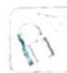

> [!faq]- 《高考数学培优40讲》例题解析
>
> > [!success]- **【答案】** 详见解析
>
> > [!note]- **【分析】**
> > 本题未单列分析。
>
> > [!note]- **【解析】**
> > 解析 (1) 当 $a = 1$ 时, $f(x) = x\mathrm{e}^{x} - \mathrm{e}^{x} = (x - 1)\mathrm{e}^{x}, f'(x) = x\mathrm{e}^{x}$ .
> > 当 $x < 0$ 时, $f'(x) < 0$ , $f(x)$ 在 $(- \infty, 0)$ 上单调递减; 当 $x > 0$ 时, $f'(x) > 0$ , $f(x)$ 在 $(0, +\infty)$ 上单调递增.
> > (2)解法一:当 x>0 时,不等式 $f(x)<-1$ 恒成立,等价于 $xe^{ax}<e^{x}-1$ , 即 $x<\mathrm{e}^{(1-a)x}-\mathrm{e}^{-ax}$ .
> > 构造函数 $g(x)=\mathrm{e}^{(1-a)x}-\mathrm{e}^{-ax}-x,x>0$ , $g(0)=0$ , $g'(x)=\mathrm{e}^{(1-a)x}(1-a)+a\mathrm{e}^{-ax}-1$ .
> > - **①**：当 $a = \frac{1}{2}$ 时， $g'(x) = \frac{1}{2} \mathrm{e}^{\frac{x}{2}} + \frac{1}{2} \mathrm{e}^{-\frac{x}{2}} - 1 > 0, g(x)$ 在 $(0, +\infty)$ 上单调递增，因此 $g(x) > g(0) = 0$ ，即 $f(x) < -1$ 成立.
> > - **②**：当 $a < \frac{1}{2}$ 时, $x\mathrm{e}^{ax} < x\mathrm{e}^{\frac{x}{2}}$ , $x\mathrm{e}^{\frac{x}{2}} - \mathrm{e}^{x} + 1 = 2\left(\frac{x}{2}\right) \cdot \mathrm{e}^{\frac{x}{2}} - (\mathrm{e}^{\frac{x}{2}})^{2} + 1$ . 令 $t = \frac{x}{2}(t > 0)$ . 设 $h(t) = 2te^{t} - (e^{t})^{2} + 1$ , $h'(t) = 2e^{t} + 2te^{t} - 2(e^{t})^{2} = 2e^{t}(1 + t - e^{t}) < 0$ , 所以 $h(t)$ 在 $(0, +\infty)$ 上单调递减, 则 $h(t) < h(0) = 0$ , 所以 $x\mathrm{e}^{\frac{x}{2}} - \mathrm{e}^{x} < -1$ 成立, 即 $f(x) < -1$ 成立.
> > - **③**：当 $a > \frac{1}{2}$ 时， $g''(x) = (1 - a)^2 e^{(1 - a)x} - a^2 e^{-ax} = e^{-ax}[(1 - a)^2 e^x - a^2]$ .
> > 令 $g''(x) = 0$ ，得 $\mathrm{e}^x = \frac{a^2}{(1 - a)^2}$ ，则 $x = \ln \left(\frac{a}{1 - a}\right)^2 >0.$
> > 因此当 $x \in \left(0, \ln \left(\frac{a}{1 - a}\right)^2\right)$ 时， $g''(x) < 0, g'(x)$ 单调递减；当 $x \in \left(\ln \left(\frac{a}{1 - a}\right)^2, +\infty\right)$ 时， $g''(x) > 0, g'(x)$ 单调递增.
> > 又 $g^{\prime}(0) = 0$ ，则当 $x\in \left(0,\ln \left(\frac{a}{1 - a}\right)^{2}\right)$ 时， $g^{\prime}(x) <   g^{\prime}(0) = 0$ ，即 $g(x)$ 在 $\left(0,\ln \left(\frac{a}{1 - a}\right)^2\right)$ 上单调递减，且 $g(0) = 0$ ，所以 $g(x) <   0$ ，这与题设不符，故舍去.
> > 综上所述，a 的取值范围是 $\left(-\infty, \frac{1}{2}\right]$ .
> > 解法二: 设 $g(x)=xe^{ax}-e^{x}+1$ , $g(0)=0$ , $g'(x)=e^{ax}+axe^{ax}-e^{x}=(ax+1)e^{ax}-e^{x}$ , $g'(0)=0,g''(x)=ae^{ax}+a(ax+1)e^{ax}-e^{x}=ae^{ax}(ax+2)-e^{x},g''(0)=2a-1.$
> > 若 $g''(0) \leqslant 0$ ，即 $a \leqslant \frac{1}{2}$ （这是不等式恒成立的必要条件），且当 $a \leqslant \frac{1}{2}$ 时， $g''(x) \leqslant \frac{1}{2} \mathrm{e}^{\frac{x}{2}}\left(\frac{x}{2} + 2\right) - \mathrm{e}^{x} = \mathrm{e}^{\frac{x}{2}}\left(\frac{x}{4} + 1 - \mathrm{e}^{\frac{x}{2}}\right) < 0$ ，因此 $g'(x)$ 在 $(0, +\infty)$ 上单调递减，则 $g'(x) < g'(0) = 0$ ，所以 $g(x)$ 在 $(0, +\infty)$ 上单调递减， $g(x) < g(0) = 0$ ，故不等式恒成立时 $a$ 的取值范围为 $\left(-\infty, \frac{1}{2}\right]$ .
> > (3)要证明 $\frac{1}{\sqrt{1^2 + 1}} + \frac{1}{\sqrt{2^2 + 2}} + \cdots + \frac{1}{\sqrt{n^2 + n}} > \ln (n + 1) (n \in \mathbb{N}^*)$ ，只需证明 $\frac{1}{\sqrt{n^2 + n}} > \ln (n + 1) - \ln n = \ln \left(1 + \frac{1}{n}\right) (n \in \mathbb{N}^*)$ ，即 $\frac{1}{\sqrt{n(n + 1)}} > \ln (n + 1) - \ln n \Leftrightarrow \sqrt{\frac{1}{n(n + 1)}} > \ln \left(1 + \frac{1}{n}\right) \Leftrightarrow \frac{1}{n(n + 1)} > \ln^2 \left(1 + \frac{1}{n}\right) (n \in \mathbb{N}^*)$ .
> > 令 $\frac{1}{n} = x \in (0, 1]$ ，则 $n = \frac{1}{x}$ ，所以 $\frac{1}{\frac{1}{x}\left(\frac{1}{x} + 1\right)} > \ln^2(1 + x)$ ，即 $\frac{x^2}{x + 1} > \ln^2(1 + x), x \in (0, 1] \Leftrightarrow \frac{x}{\sqrt{x + 1}} > \ln(1 + x), x \in (0, 1]$ .
> > 构造函数 $G(x) = \frac{x}{\sqrt{x + 1}} - \ln (1 + x), 0 < x \leqslant 1, G(0) = 0, G'(x) = \frac{\sqrt{x + 1} - x \cdot \frac{1}{2} \cdot \frac{1}{\sqrt{x + 1}}}{x + 1} - \frac{1}{x + 1} = \frac{\frac{2(x + 1) - x}{2\sqrt{x + 1}} - 1}{x + 1} = \frac{\frac{x + 2}{2\sqrt{x + 1}} - 1}{x + 1} = \frac{x + 2 - 2\sqrt{x + 1}}{2\sqrt{x + 1}(x + 1)} = \frac{(\sqrt{x + 1} - 1)^2}{2\sqrt{x + 1}(x + 1)} > 0$ ，函数 $G(x)$ 在 $(0,1]$ 上单调递增，因此 $G(x) > G(0) = 0$ .
> > 
