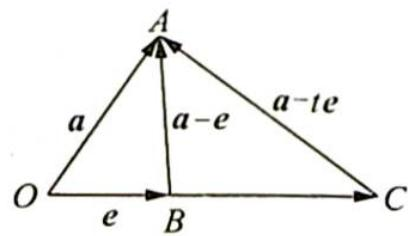

> [!faq]- 《高考数学培优40讲》例题解析
>
> > [!success]- **【答案】** C
>
> > [!note]- **【分析】**
> > 分析 ▶ 思路一: 代数角度考虑, 将 $|a - te| \geqslant |a - e|$ 两边平方展开, 整理得一个关于 $t$ 的一元二次不等式恒成立, 再由 $\Delta \leqslant 0$ 得出 $a$ 与 $e$ 的关系式.
> >
> > 思路二:几何角度考虑,利用向量加减的几何意义.已知 $|a-te|\geqslant|a-e|$ ,根据点到直线的距离中垂线段最短,构造符合此不等式的图形,在图形上看 $a,e,a+e,a-e$ 的位置关系.
> >
> > 思路三:构造辅助函数,根据函数的性质求解.
>
> > [!note]- **【解析】**
> > 解析 ▶ 解法一(代数角度): 因为 $t \in R$ , 恒有 $|a - te| \geqslant |a - e|$ , 等价于 $|a - te|^{2} \geqslant |a - e|^{2}$ 恒成立, 展开整理得 $t^{2} - 2a \cdot et + (2a \cdot e - 1) \geqslant 0$ 对任意 $t \in R$ 均成立.
> > 则需方程的判别式 $\Delta = (-2a \cdot e)^2 - 4(2a \cdot e - 1) \leqslant 0$ ，整理得 $(a \cdot e)^2 - 2a \cdot e + 1 \leqslant 0$ ，即 $(a \cdot e - 1)^2 \leqslant 0$ ，所以 $a \cdot e = 1$ .
> > 对四个选项进行验证, 易得 $e \cdot (a - e) = a \cdot e - e^{2} = 0$ , 故选 C.
> > 解法二(几何角度): 构造图形, 如图所示, 设 $\overrightarrow{OA} = a, \overrightarrow{OB} = e, \overrightarrow{OC} = te$ , 则 $\overrightarrow{BA} = a - e, \overrightarrow{CA} = a - te$ .
> > 
> > 因为对任意 t 恒有 $\left|a-te\right|\geqslant\left|a-e\right|$ ，故无论点 C 在直线 OB 上何处恒有 $\left|\overrightarrow{CA}\right|\geqslant\left|\overrightarrow{BA}\right|$ 成立，则只有 $\overrightarrow{BA}\perp\overrightarrow{OB}$ 时满足，即 $e\perp(a-e)$ 成立，故选 C.
> > 解法三(函数角度): 设 $f(t)=|a-te|=\sqrt{t^{2}-2a\cdot et+a^{2}}$ ，由 $f(t)\geqslant f(1)$ 得 $-\frac{-2a\cdot e}{2\times1}=1$ ，
> > 即 $a \cdot e = e^{2}$ ，可得 $e \cdot (a - e) = 0$ 。
> > 因此 $e \perp (a - e)$ , 故选 C.
> > 在解法一中我们对其两边平方,这是处理向量模的一般方法,应熟练掌握;解法二利用了向量的几何意义.这两种解法充分体现了向量兼有代数和几何的双重属性.
