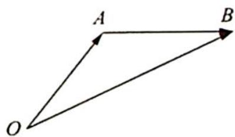
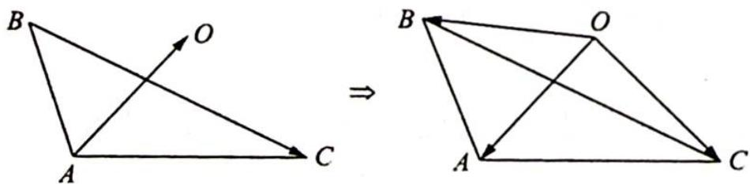
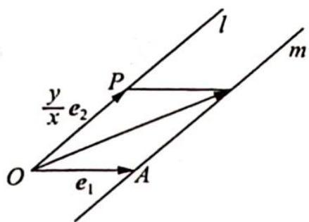

> [!faq]- 《高考数学培优40讲》例题解析
>
> > [!success]- **【答案】** 详见解析
>
> > [!note]- **【分析】**
> > 本题未单列分析。
>
> > [!note]- **【解析】**
> > ## 解析 ▶ 解法一(坐标运算角度):从坐标入手,借助配方法求最值.
> > 设 $e_1 = (1,0), e_2 = \left(\frac{\sqrt{3}}{2}, \frac{1}{2}\right)$ ，则 $b = \left(x + \frac{\sqrt{3}}{2}y, \frac{1}{2}y\right)$ ，当 $x = 0$ 时， $\frac{|x|}{|b|} = 0$ .
> > 当 $x \neq 0$ 时， $\frac{|x|}{|b|} = \sqrt{\frac{x^2}{x^2 + y^2 + \sqrt{3}xy}} = \sqrt{\frac{1}{\left(\frac{y}{x}\right)^2 + \sqrt{3}\left(\frac{y}{x}\right) + 1}} = \sqrt{\frac{1}{t^2 + \sqrt{3}t + 1}} = \sqrt{\frac{1}{t^2 + \sqrt{3}t + 1}} = \sqrt{\frac{1}{t^2 + \sqrt{3}t + 1}} = \sqrt{\frac{1}{t^2 + \sqrt{3}t + 1}} = \sqrt{\frac{1}{t^2 + \sqrt{3}t + 1}} = \sqrt{\frac{1 - x}{t^2 + \sqrt{3}t + 1}} = \sqrt{\frac{1 - x}{t^2 + \sqrt{3}t + 1}} = \sqrt{\frac{1 - x}{t^2 + \sqrt{3}t + 1}} = \sqrt{\frac{1 - x}{t^2 + \sqrt{3}t + 1}} = \sqrt{\frac{1 - x}{t^4 + \sqrt{3}t + 1}} = \sqrt{\frac{1 - x}{t^4 + \sqrt{3}t + 1}} = \sqrt{\frac{1 - x}{t^4 + \sqrt{3}t + 1}} = \sqrt{\frac{1 - x}{t^4 + \sqrt{3}t + 1}} = \sqrt{\frac{1 - x}{t^4 + \sqrt {3} t + 1}} = \sqrt{\frac{1 - x}{t^4 + \sqrt {3} t + 1}} = \sqrt{\frac{1 - x}{t^4 + \sqrt {3} t + 1}} = \sqrt{\frac{1 - x}{t^4 + \sqrt {3} t + 1}} = \sqrt{\frac{1 - x}{t^4 + \sqrt {3} t + 1}},$ 综上所述， $\frac{|x|}{|b|}$ 的最大值为 2.
> > 解法二(方程角度):从方程的角度,运用判别式法.
> > 设 $\frac{|x|}{|b|} = t, |b| = |xe_1 + ye_2|$ ，可得 $|b|^2 = x^2 + y^2 + \sqrt{3}xy, x^2 = t^2(x^2 + y^2 + \sqrt{3}xy)$ ；当 $x = 0$ 时， $\frac{|x|}{|b|} = 0$ ；当 $x \neq 0$ 时， $t^2\left(\frac{y}{x}\right)^2 + \sqrt{3}t^2\left(\frac{y}{x}\right) + (t^2 - 1) = 0$ ，有 $\Delta = (\sqrt{3}t^2)^2 - 4t^2(t^2 - 1) \geqslant 0$ ，解得 $t \in (0,2]$ .
> > 综上所述， $t \in [0,2]$ ，即 $\frac{|x|}{|b|}$ 的最大值为 2.
> > 解法三(几何角度):如图1所示,不妨设 $xe_{1}=\overrightarrow{OA},ye_{2}=\overrightarrow{AB}$ ,则 $b=xe_{1}+ye_{2}=\overrightarrow{OB}$ .
> > 在 $\triangle OAB$ 中， $\frac{|x|}{|b|}=\frac{|\overrightarrow{OA}|}{|\overrightarrow{OB}|}=\frac{\sin\angle OBA}{\sin\angle OAB}$ ，又 $\langle e_1,e_1\rangle=\frac{\pi}{6}$ ，所以 $\angle OAB=\frac{\pi}{6}$ 或 $\frac{5\pi}{6}$ ，即 $\sin\angle OAB=\frac{1}{2}$ .
> > 
> > 图1
> > 所以 $\frac{|x|}{|b|} = 2\sin \angle OBA \leqslant 2$ ，即 $\frac{|x|}{|b|}$ 的最大值为 2.
> > 解法四(从点到直线的距离这一角度入手): 要求 $\frac{|x|}{|b|}$ 的最大值, 只需求 $\frac{|b|}{|x|} = \left| e_1 + \frac{y}{x} e_2 \right|$ 的最小值. 构造共起点 O 的两个向量 $e_1, \frac{y}{x} e_2$ , 如图 2 所示.
> > 设 $e_1$ 的终点为 $A$ , 则 $\frac{y}{x} e_2$ 的终点 $P$ 的轨迹为一条经过点 $O$ 的直线, 记为 $l$ .
> > 由题意知，OA 与 l 的夹角为 $\frac{\pi}{6}$ ，则 A 到 l 的距离为 $1 \cdot \sin \frac{\pi}{6} = \frac{1}{2}$ ，又由向量加法的平行四边形法则可知 $e_1 + \frac{y}{x} e_2$ 的终点在过 $A$ 且与 $l$ 平行的直线 $m$ 上, 则 $\left|e_1 + \frac{y}{x} e_2\right|$ 就是 $m$ 上的一动点与 $O$ 点的距离, 其最小值为 $O$ 到直线 $m$ 的距离, 也就是点 $A$ 到 $l$ 的距离, 即 $\frac{1}{2}$ . 此即为 $\frac{|b|}{|x|}$ 的最小值, 因此 $\frac{|x|}{|b|}$ 的最大值为 2.
> > 
> > 图2
> > 
> > 图 2
> > 解法五(直接求解): 因为 $e_{1}, e_{2}$ 为单位向量且 $e_{1}, e_{2}$ 的夹角为 $\frac{\pi}{6}, b = xe_{1} + ye_{2}$ ，则 $|b| = \sqrt{x^{2} + y^{2} + \sqrt{3}xy}$ .
> > 当 $x \neq 0$ 时，有 $\frac{|x|}{|b|} = \sqrt{\frac{x^2}{x^2 + y^2 + \sqrt{3}xy}} = \sqrt{\frac{1}{\left(\frac{y}{x}\right)^2 + \sqrt{3}\left(\frac{y}{x}\right) + 1}} \leqslant 2.$
> > 故 $\frac{|x|}{|b|}$ 的最大值为2.
> > 本题表述简洁清晰,灵活考查了平面向量基本定理、平面向量坐标表示、平面向量的数量积、平面向量的几何意义等知识,渗透了多种数学思想方法,因此我们可以从以上多个视角来解决.
