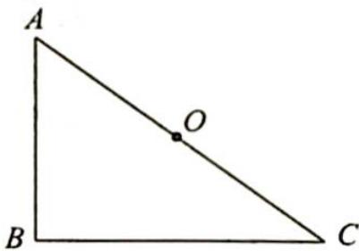
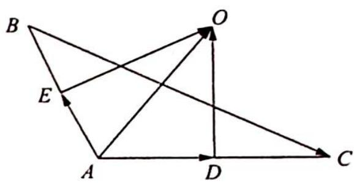

> [!faq]- 《高考数学培优40讲》例题解析
>
> > [!success]- **【答案】** 详见解析
>
> > [!note]- **【分析】**
> > 分析 ▶ 本题可从多个角度入手解答. 思路一: 特殊化思想, 考虑特殊情形; 思路二: 作一般性的向量加减、数量积运算; 思路三: 将 $\overrightarrow{AO} \cdot \overrightarrow{BC}$ 转化求 $\overrightarrow{OA}, \overrightarrow{OB}, \overrightarrow{OC}$ 之间的关系; 思路四: 由于 $O$ 为 $\triangle ABC$ 的外心, 即三边的垂直平分线的交点, 因此构造垂直向量参与运算.
>
> > [!note]- **【解析】**
> > 解析 ▶ 解法一(特殊化角度): 如图 1 所示, 考虑特殊情形, 作 Rt△ABC, 使得 B=90°, AB=3, AC=5, 则 $\overrightarrow{AO} \cdot \overrightarrow{BC} = \frac{5}{2} \times 4 \times \cos C = 10 \times \frac{4}{5} = 8$ .
> > 
> > 图1
> > 解法二(向量运算:数量积):记△ABC外接圆半径为R,作一般性计算,如图2所示,有 $\overrightarrow{AO}\cdot\overrightarrow{BC}=\overrightarrow{AO}\cdot(\overrightarrow{OC}-\overrightarrow{OB})=\overrightarrow{OA}\cdot\overrightarrow{OB}-\overrightarrow{OA}\cdot\overrightarrow{OC}=R^{2}(\cos\angle AOB-\cos\angle AOC)=R^{2}\left(\frac{2R^{2}-AB^{2}}{2R^{2}}-\frac{2R^{2}-AC^{2}}{2R^{2}}\right)=\frac{1}{2}(AC^{2}-AB^{2})=8.$
> > 解法三(向量运算:向量平方): 对 $\overrightarrow{AC} = \overrightarrow{OC} - \overrightarrow{OA}$ 向量等式两边平方, 可得 $2R^{2} - 2\overrightarrow{OC} \cdot \overrightarrow{OA} = 25$ ; 对 $\overrightarrow{AB} = \overrightarrow{OB} - \overrightarrow{OA}$ 向量等式两边平方, 得 $2R^{2} - 2\overrightarrow{OA} \cdot \overrightarrow{OB} = 9$ .
> > 所以,两式相减得 $2 \overrightarrow{OA} \cdot \overrightarrow{OB} - 2 \overrightarrow{OA} \cdot \overrightarrow{OC} = 16$ .
> > 故 $\overrightarrow{AO} \cdot \overrightarrow{BC} = \overrightarrow{OA} \cdot \overrightarrow{CB} = \overrightarrow{OA} \cdot (\overrightarrow{OB} - \overrightarrow{OC}) = \frac{2\overrightarrow{OA} \cdot \overrightarrow{OB} - 2\overrightarrow{OA} \cdot \overrightarrow{OC}}{2} = 8.$
> > 解法四(向量运算:构造垂直向量):如图3所示,分别取AC,AB的中点D,E,则
> > $$
> > \begin{array}{r l} \overrightarrow {A O} \cdot \overrightarrow {B C} & = \overrightarrow {A O} \cdot \overrightarrow {A C} - \overrightarrow {A O} \cdot \overrightarrow {A B} \\ & = (\overrightarrow {A D} + \overrightarrow {D O}) \cdot \overrightarrow {A C} - (\overrightarrow {A E} + \overrightarrow {E O}) \cdot \overrightarrow {A B} \\ & = \overrightarrow {A D} \cdot \overrightarrow {A C} - \overrightarrow {A E} \cdot \overrightarrow {A B} = \frac {A C ^ {2}}{2} - \frac {A B ^ {2}}{2} = 8. \end{array}
> > $$
> > 
> > 图 3
> > ## 评注
> > 虽然课程不断改革,理念不断更新,题目不断出奇,但是数学探究思维方式是不变的.广泛地经历向量运算与平面图形的几何性质的交汇,就能体会到一个题目可以常做常新——解题无止境,反思出新解.
