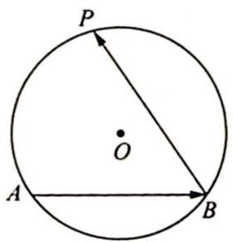
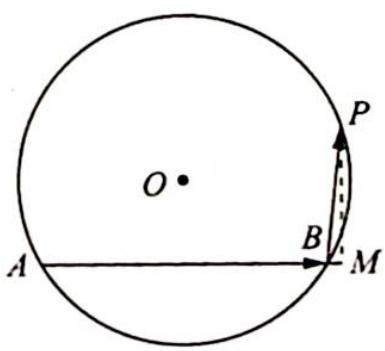
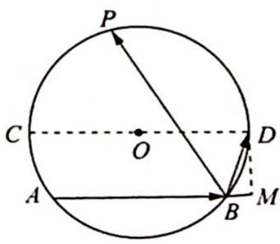

> [!faq]- 《高考数学培优40讲》例题解析
>
> > [!success]- **【答案】** D
>
> > [!note]- **【分析】**
> > 本题未单列分析。
>
> > [!note]- **【解析】**
> > ## 解析 如图 1 所示, 应用射影处理.
> > 为使 $f=\overrightarrow{AB}\cdot\overrightarrow{BP}$ 最大， $\langle\overrightarrow{BP},\overrightarrow{AB}\rangle$ 必须为锐角，此时 $f=\overrightarrow{AB}\cdot\overrightarrow{BP}=4\cdot\overrightarrow{BP}\cdot\frac{\overrightarrow{AB}}{4}=4\cdot|\overrightarrow{BP}|\cos\langle\overrightarrow{BP},\overrightarrow{AB}\rangle$ ，即 f 为 $4\overrightarrow{BP}$ 在 $\overrightarrow{AB}$ 方向上的投影.
> > 如图2所示，作 $PM \perp AB$ 于 $M$ ，则 $f = 4|\overrightarrow{BM}|, f_{\max} = 4|\overrightarrow{BM}|_{\max}$
> > 如图3所示,作直径 $CD \parallel AB$ , 则当 $P$ 与点 $D$ 重合时, 得到最大值 $f_{\max} = 4 \left| \overrightarrow{BM} \right|_{\max} = 4 \times (3 - 2) = 4$ , 故选 D.
> > 
> > 图 1
> > 
> > 图 2
> > 
> > 图 3
