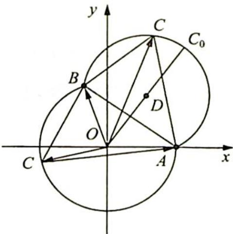

> [!faq]- 《高考数学培优40讲》例题解析
>
> > [!success]- **【答案】** A
>
> > [!note]- **【分析】**
> > 分析 ▶ 思路一:通过平面向量的运算,借助均值不等式解关于 $|c|$ 的不等式;思路二:构造满足条件的几何图形直观求解.
>
> > [!note]- **【解析】**
> > 解析 ▶ 解法一(向量运算): 基于向量自身运算, 构建目标.
> > 因为 $a \cdot b = -\frac{1}{2}$ , 所以 $(c + a - c) \cdot (c + b - c) = -\frac{1}{2}$ , 展开得 $c^2 + (a + b - 2c) \cdot c + (a - c) \cdot (b - c) = -\frac{1}{2}$ , 所以 $2c^2 - 2(a + b) \cdot c - 1 = |a - c||b - c| \leqslant \frac{(a - c)^2 + (b - c)^2}{2} = 1 + c^2 - (a + b) \cdot c$ , $|c|^2 - 2 \leqslant (a + b) \cdot c \leqslant |a + b||c| = \sqrt{(a + b)^2} |c| = |c|$ .
> > 故 $|c|\leqslant2$ ，其中“=”成立的条件是 $\left\{\begin{aligned}c&=\lambda(a+b)(\lambda>0)\\ |a-c|=|b-c|\end{aligned}\right.$
> > 由此可计算得 $|a - b| = |(a - c) - (b - c)| = \sqrt{|a - c|^2 - 2(a - c) \cdot (b - c) + |b - c|^2} = |a - c|$ .
> > 将 $c = \lambda (a + b)$ 代入 $|a - c| = |a - b|$ 得 $\left|(1 - \lambda)a - \lambda b\right| = \sqrt{3},\sqrt{(1 - \lambda)^2 + \lambda^2 + \lambda(1 - \lambda)} = \sqrt{3},$ $\lambda^2 -\lambda -2 = 0\Rightarrow \lambda = 2$ 或 $\lambda = -1$ （舍去）， $c = 2(a + b)$
> > 则 $|c|_{\max}=2$ ，故选A.
> > 很明显,上述解法展示了向量自身运算的灵活性,但缺乏几何的直观性,致使解题过程很烦琐.
> > 解法二(选择恰当的坐标系, 坐标化, 实现运算求解): 由 $|a| = |b| = 1$ 以及 $a \cdot b = -\frac{1}{2}$ 得 $\langle a, b \rangle = 120^{\circ}$ , 如果选择 $a, b$ 作为基向量, 实现运算转化, 其过程将十分烦琐, 通常取正交的单位向量作基底较为简单.
> > 如图所示,建立平面直角坐标系,以坐标原点 O 为起点作向量 $\overrightarrow{OA} = a, \overrightarrow{OB} = b$ 以及 $\overrightarrow{OC} = c$ , 则条件 $\langle a - c, b - c \rangle = 60^{\circ}$ 转化为 $\angle ACB = 60^{\circ}$ , 动
> > 
> > 点 C 的轨迹是两段以线段 AB 为公共弦的弧, 圆心分别是原点 O 与 $D\left(\frac{1}{2}, \frac{\sqrt{3}}{2}\right)$ , 作简单几何计算, 即得 $\left|c\right|_{\max} = \left|\overrightarrow{OC_{0}}\right| = 2$ , 此时 $c = 2(a + b)$ , 故选 A.
> > 挖掘向量条件的几何性质,探究相应的几何计算,能构建出简洁明快的解法.通过训练,逐步提升探究思维能力.
