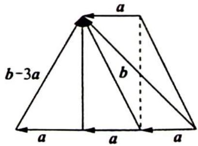

> [!faq]- 《高考数学培优40讲》例题解析
>
> > [!success]- **【答案】** 详见解析
>
> > [!note]- **【分析】**
> > 分析 ▶ 本题入手点较多,可设角后进行向量运算或引入参数或坐标来进行向量运算,还可结合向量加减的几何意义得出向量 a 与 b 的关系式,并以此设坐标进行向量运算.
>
> > [!note]- **【解析】**
> > 解析 ▶ 解法一(直接设角运算): 设 $\alpha$ 为向量 $e_{1}, e_{2}$ 的夹角.
> > 因为 $a = e_1 + e_2, b = 3e_1 + e_2$ ，所以 $a \cdot b = 4 + 4e_1 \cdot e_2 = 4 + 4\cos \alpha$ .
> > 又 $|2e_1 - e_2| \leqslant \sqrt{2}$ , 所以 $5 - 4e_1 \cdot e_2 \leqslant 2$ , $\cos \alpha \geqslant \frac{3}{4}$ , 因为 $|a|^2 = 2 + 2\cos \alpha$ , $|b|^2 = 10 + 6\cos \alpha$ , 所以 $\cos \theta = \frac{a \cdot b}{|a||b|} = \frac{4 + 4\cos \alpha}{\sqrt{2 + 2\cos \alpha} \cdot \sqrt{10 + 6\cos \alpha}}$ .
> > 故 $\cos^2\theta = \frac{4(1 + \cos\alpha)}{5 + 3\cos\alpha} = \frac{4}{3}\left(1 - \frac{2}{5 + 3\cos\alpha}\right) \geqslant \frac{28}{29}$ , 即 $\cos^2\theta$ 的最小值为 $\frac{28}{29}$ .
> > 解法二(设参数转化运算): 设 $e_{1} \cdot e_{2} = t$ ，因为 $\left|2e_{1} - e_{2}\right| \leqslant \sqrt{2}$ ，两边平方可得 $\frac{3}{4} \leqslant t \leqslant 1$ .
> > 因为 $a = e_1 + e_2, b = 3e_1 + e_2$ ，所以 $e_1 = \frac{b - a}{2}, e_2 = \frac{3a - b}{2}$ ，则 $|b - a| = 2, |b - 3a| = 2$ .
> > 由 $|b - a|^2 = |b - 3a|^2$ ，化简得 $2a^2 = a \cdot b$ ，故 $\cos \theta = \frac{a \cdot b}{|a||b|} = \frac{2|a|^2}{|a||b|} = \frac{2|a|}{|b|}$ ，所以 $\frac{|b|}{|a|} = \sqrt{\frac{5 + 3t}{1 + t}} = \sqrt{3 + \frac{2}{1 + t}} \leqslant \sqrt{\frac{29}{7}}$ ，则 $\frac{|a|}{|b|} \geqslant \sqrt{\frac{7}{29}}$ .
> > 所以 $\cos^2\theta = 4\left(\frac{|a|}{|b|}\right)^2 \geqslant \frac{28}{29}$ , 即 $\cos^2\theta$ 的最小值为 $\frac{28}{29}$ .
> > 解法三(借助坐标运算): 设 $e_{1}=(1,0)$ , $e_{2}=(x,y)$ ，则 $x^{2}+y^{2}=1$ , $a=(x+1,y)$ , $b=(x+3,y)$ .
> > 由 $\left|2e_{1}-e_{2}\right|\leqslant\sqrt{2}$ 得 $(x-2)^{2}+y^{2}\leqslant2$ ，将 $y^{2}=1-x^{2}$ 代入 $(x-2)^{2}+y^{2}\leqslant2$ ，得 $\frac{3}{4}\leqslant x\leqslant1$
> > $\cos^2\theta = \left(\frac{a \cdot b}{|a||b|}\right)^2 = \left[\frac{(x + 1)(x + 3) + y^2}{\sqrt{(x + 1)^2 + y^2} \cdot \sqrt{(x + 3)^2 + y^2}}\right]^2 = \frac{4(x + 1)^2}{(x + 1)(3x + 5)} = \frac{4(x + 1)}{3x + 5} = 4\left[\frac{1}{3} - \frac{2}{3(3x + 5)}\right].$
> > 所以当 $x=\frac{3}{4}$ 时， $\cos^{2}\theta$ 取最小值 $\frac{28}{29}$ .
> > 解法四(结合几何意义):由解法二知 $|b-a|=|b-3a|$ ，如图所示.
> > 结合向量加减的几何意义, 可知 $(b-2a) \cdot a = 0$ , 又 $b - a = 2e_{1}$ , 所以 $|b - a| = 2$ .
> > 
> > 不妨设 $a = (x_0, 0), b = (2x_0, t)$ ，且 $x_0^2 + t^2 = 4$ ，由已知可得 $e_1 = \frac{b - a}{2} =$ $\left(\frac{x_0}{2}, \frac{t}{2}\right), e_2 = \frac{3a - b}{2} = \left(\frac{x_0}{2}, -\frac{t}{2}\right), 2e_1 - e_2 = \left(\frac{x_0}{2}, \frac{3t}{2}\right)$ ，又 $|2e_1 - e_2| \leqslant \sqrt{2}$ ，可得 $x_0^2 + 9t^2 \leqslant 8$ 。于是 $x_0^2 + 9(4 - x_0^2) \leqslant 8$ ，所以 $x_0^2 \geqslant \frac{7}{2}$ ，故 $\cos \theta = \frac{a \cdot b}{|a||b|} = \frac{2x_0^2}{|x_0|\sqrt{4x_0^2 + t^2}} = \frac{2|x_0|}{\sqrt{4x_0^2 + t^2}}, \cos^2\theta = \frac{4x_0^2}{4x_0^2 + t^2} = \frac{4x_0^2}{4x_0^2 + 4 - x_0^2} = \frac{4}{3 + \frac{4}{x_0^2}} \geqslant \frac{28}{29}$ .
> > 故 $\cos^{2}\theta$ 的最小值为 $\frac{28}{29}$ .
