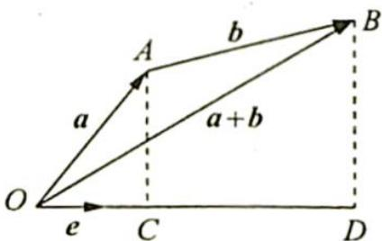

> [!faq]- 《高考数学培优40讲》例题解析
>
> > [!success]- **【答案】** 详见解析
>
> > [!note]- **【分析】**
> > 分析 ▶ 结合条件进行一般的向量运算或设角后进行向量运算,也可构造符合题意的几何图形,通过图形直观求解.
>
> > [!note]- **【解析】**
> > 解析 ▶ 解法一: $|(a+b)\cdot e|=|a\cdot e+b\cdot e|\leqslant|a\cdot e|+|b\cdot e|\leqslant\sqrt{6}\Rightarrow|a+b|\leqslant\sqrt{6}\Rightarrow$ $|a|^2+|b|^2+2a\cdot b\leqslant 6 \Rightarrow a\cdot b\leqslant \frac{1}{2}$ , 则 $a\cdot b$ 的最大值为 $\frac{1}{2}$ .
> > 解法二: 设 $\langle a, e \rangle = \alpha, \langle a, b \rangle = \beta$ ，则 $\langle b, e \rangle = \alpha - \beta. (\langle b, e \rangle = \alpha - \beta, \text{或} \langle b, e \rangle = \alpha + \beta \text{ 同理})$
> > $$
> > \begin{array}{r l} \text {所以} | \pmb {a} \cdot \pmb {e} + \pmb {b} \cdot \pmb {e} | & = \cos \alpha + 2 \cos (\alpha - \beta) = \cos \alpha + 2 \cos \alpha \cos \beta + 2 \sin \alpha \sin \beta \\ & = (2 \cos \beta + 1) \cos \alpha + 2 \sin \beta \sin \alpha \\ & = \sqrt {(2 \cos \beta + 1) ^ {2} + (2 \sin \beta) ^ {2}} \sin (\alpha + \varphi) \\ & \leqslant \sqrt {(2 \cos \beta + 1) ^ {2} + (2 \sin \beta) ^ {2}} = \sqrt {5 + 4 \cos \beta} \leqslant \sqrt {6}. \end{array}
> > $$
> > 则 $\cos \beta \leqslant \frac{1}{4}, a \cdot b = |a||b|\cos \beta = 2\cos \beta \leqslant \frac{1}{2}$ , 故 $a \cdot b$ 的最大值为 $\frac{1}{2}$ .
> > 解法三:如图所示,设 $\overrightarrow{OA}=a,\overrightarrow{AB}=b,\overrightarrow{OA},\overrightarrow{AB}$ 在向量e上投影分别为 $\overrightarrow{OC},\overrightarrow{CD}$ ,则由已知 $|a\cdot e|+|b\cdot e|\leqslant\sqrt{6}$ 得 $|\overrightarrow{OD}|\leqslant\sqrt{6}$ .
> > $$
> > \overrightarrow {O B} = \overrightarrow {O A} + \overrightarrow {A B} = a + b
> > $$
> > $$
> > | \overrightarrow {O D} | =
> > $$
> > 
> > $|(a + b) \cdot e| = |a + b| \leqslant \sqrt{6}$ , 所以 $a^2 + 2a \cdot b + b^2 \leqslant 6$ , 则 $a \cdot b \leqslant \frac{1}{2}$ , 故 $a \cdot b$ 的最大值是 $\frac{1}{2}$ .
> > ## 评注
> > 这个图形的本质其实和绝对值一样就是用到了绝对值的定义 $|a \cdot e| + |b \cdot e| = |(a \pm b) \cdot e|$ . 从这里可以看出正常情况下的多解本质一样, 只是视角不一样.
