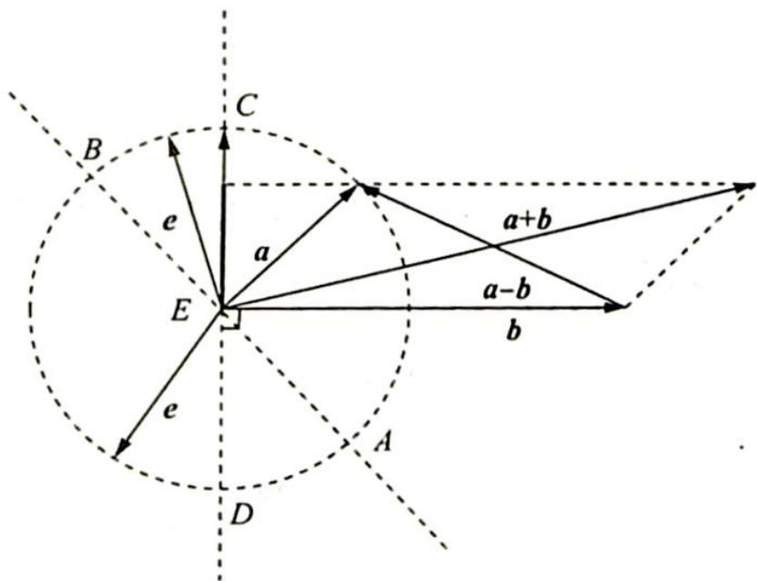
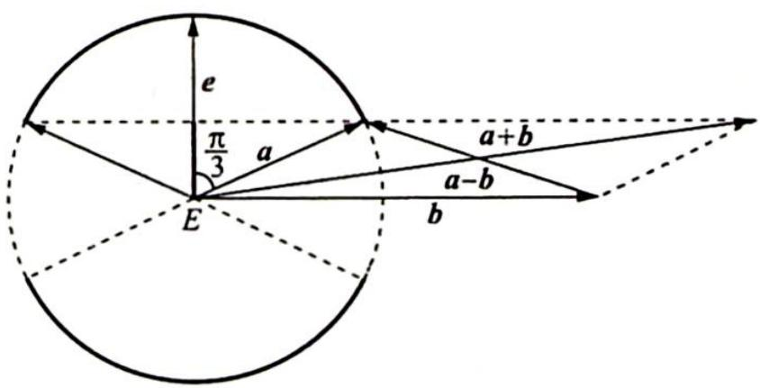

> [!faq]- 《高考数学培优40讲》例题解析
>
> > [!success]- **【答案】** 详见解析
>
> > [!note]- **【分析】**
> > 本题未单列分析。
>
> > [!note]- **【解析】**
> > 解析 ▶ 解法一: 先建系, 设 $a, b$ 当中有一个的纵坐标为零. 现在有两种选择, 第一种设 $a$ , 第二种设 $b$ . 如果设 $b$ 的纵坐标为零, 为保证所求绝对值最小, 不妨先试一下 $a = (1,0)$ , $b = (x,y)$ , $e = (\cos \theta, \sin \theta)$ , 则 $|a \cdot e| + |b \cdot e| = |\cos \theta| + |x \cos \theta + y \sin \theta| = |(x+1) \cos \theta + y \sin \theta|$ 或 $|(x-1) \cos \theta + y \sin \theta|$ . 这个时候最小值要么是 0 , 要么根据辅助角是 $|x+1|$ , $|x-1|$ 或者 $|y|$ . 要比较这三个需要讨论, 可以换一种设法: $b = (2,0)$ , $a = (x,y)$ , $e = (\cos \theta, \sin \theta)$ , 这样的话就会出现 $|a \cdot e| + |b \cdot e| = |2 \cos \theta| + |x \cos \theta + y \sin \theta| = |(x+2) \cos \theta + y \sin \theta|$ 或 $|(x-2) \cos \theta + y \sin \theta|$ . 这个时候最小值要么是 0 , 要么根据辅助角是 $|x+2|$ , $|x-2|$ 或者 $|y|$ . 因为 $x^2 + y^2 = 1 \Rightarrow \begin{cases} |x+2| \geqslant 1 \geqslant |y| \\ |x-2| \geqslant 1 \geqslant |y| \end{cases}$ , 所以最小值为 $|y| \geqslant \frac{1}{2} \Rightarrow y^2 = 1 - x^2 \geqslant \frac{1}{4} \Rightarrow -\frac{\sqrt{3}}{2} \leqslant x \leqslant \frac{\sqrt{3}}{2} \Rightarrow a \cdot b = 2x \in [-\sqrt{3},\sqrt{3}]$ .
> > 解法二:如图1所示画出 $a, b, a + b, a - b$ , 向量 $e$ 的起点是 $E$ , 终点在圆 $E$ 上运动, $CD$ 垂直 $b, AB$ 垂直 $a$ .
> > 此时 $|a \cdot e| + |b \cdot e| = \begin{cases} |(a + b) \cdot e|, & e \text{ 在扇形 } ACE \text{ 与扇形 } BED \text{ 内} \\ |(a - b) \cdot e|, & e \text{ 在扇形 } BCE \text{ 与扇形 } AED \text{ 内} \end{cases}$ ，无论在哪个扇形区域运动，投影的绝对值最小，即当 $e$ 与 $CD$ 重合即可，即 $e \perp b$ （原因 $|b| > |a|$ ）。
> > 所以 $(|a\cdot e| + |b\cdot e|)_{\min} = |a\cdot e| = |\cos \langle a,e\rangle |\geqslant \frac{1}{2}\Rightarrow \langle a,e\rangle \in \left[0,\frac{\pi}{3}\right]\cup \left[\frac{2\pi}{3},\pi \right]$ ，如图2所示， $e\bot b,a$ 的终点在加粗的圆弧上运动，则此时 $\langle a,b\rangle \in \left[\frac{\pi}{6},\frac{5\pi}{6}\right]$ ，故 $a\cdot b = |a||b|\cos \langle a,$ $b\rangle \in [-\sqrt{3},\sqrt{3} ]$
> > 
> > 图1
> > 
> > 图2
