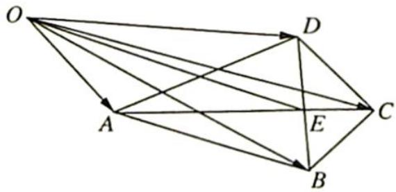

<!-- question-source:start -->
4. 如图所示, 已知在四边形 $ABCD$ 中, $AC$ 是 $BD$ 的垂直平分线, 垂足为 $E, O$ 为直线 $BD$ 外一点, 设向量 $|\overrightarrow{OB}| = 5$ , $|\overrightarrow{OD}| = 3$ . 求 $(\overrightarrow{OA} + \overrightarrow{OC}) \cdot (\overrightarrow{OB} - \overrightarrow{OD})$ 的值.

<!-- question-source:end -->

![[Q00019837A1]]
