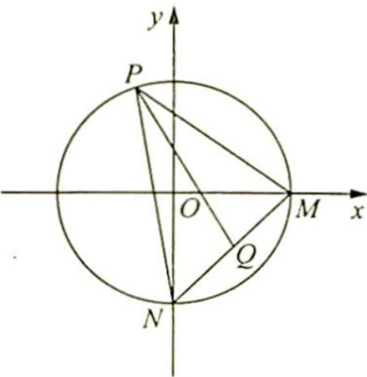

<!-- question-source:start -->
10. 如图所示, 在平面直角坐标系 $xOy$ 中, 圆 $C: x^{2} + y^{2} = 4$ 分别交 $x$ 轴正半轴及 $y$ 轴负半轴于 $M, N$ 两点, 点 $P$ 为圆 $C$ 上任意一点, 求 $\overrightarrow{PM} \cdot \overrightarrow{PN}$ 的最大值.

<!-- question-source:end -->

![[Q00019843A1]]
