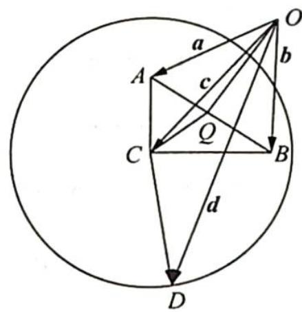

> [!faq]- 《高考数学培优40讲》参考答案
>
> > [!success]- **【答案】** 详见解析
>
> > [!note]- **【分析】**
> > 本题未单列分析。
>
> > [!note]- **【解析】**
> > 解法一:设 $a=(1,0)$ ，则由 $ab=\frac{1}{2}$ 和 $|b|=1$ 得 $b=\left(\frac{1}{2},\frac{\sqrt{3}}{2}\right)$ ，则 $c=(x,y)$ 符合 $\left(x-\frac{3}{4}\right)^{2}+\left(y-\frac{\sqrt{3}}{4}\right)^{2}=$ $\left(\frac{1}{2}\right)^{2}$ ，故 c 的终点的轨迹为一个圆，其半径为 $r_{1}=\frac{1}{2}$ ，设其圆心为 C.
> > 又因 $|c - d| = 1$ ，向量 $\pmb{d}$ 的终端也在一个圆上，其半径 $r_2 = 1$ ，故 $|\pmb {d}|_{\max} = OC + r_1 + r_2 = \frac{\sqrt{3}}{2} +\frac{1}{2} +1 = \frac{\sqrt{3} + 3}{2}.$
> > 解法二:如图所示,设 $\overrightarrow{OA}=a,\overrightarrow{OB}=b,\overrightarrow{OC}=c,\overrightarrow{OD}=d.$
> > 因为 $|a| = |b| = 1, ab = \frac{1}{2}$ , 所以 $\angle AOB = \frac{\pi}{3}$ , 即 $\triangle AOB$ 为等边三角形, 边长为 1.
> > 又 $(a-c)\cdot(b-c)=0$ ，所以 $CA\perp CB$ ，即 $\triangle ACB$ 为直角三角形，斜边长为1，又 $|c-d|=1$ ，所以 $|CD|=1,D$ 在以C为圆心，1为半径的圆上.
> > 
> > 设 $AB$ 中点为 $Q$ , 则 $|\overrightarrow{OC}| \leqslant |\overrightarrow{OQ}| + |\overrightarrow{CQ}| = \frac{\sqrt{3}}{2} + \frac{1}{2}$ .
> > 所以 $|d| = |\overrightarrow{OD}| \leqslant |\overrightarrow{OC}| + |\overrightarrow{CD}| \leqslant \frac{\sqrt{3}}{2} + \frac{1}{2} + 1 = \frac{3 + \sqrt{3}}{2}$ , 即 $|d|$ 的最大值为 $\frac{3 + \sqrt{3}}{2}$ .
