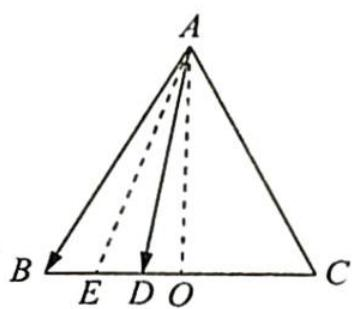

> [!faq]- 《高考数学培优40讲》参考答案
>
> > [!success]- **【答案】** 详见解析
>
> > [!note]- **【分析】**
> > 本题未单列分析。
>
> > [!note]- **【解析】**
> > 如图所示, 设 $BD, BC$ 的中点分别为 $E, O$ , 则由极化恒等式 (三角形模式), 可知 $\overrightarrow{AB} \cdot \overrightarrow{AD} = \overrightarrow{AE}^2 - \frac{1}{4}\overrightarrow{BD}^2 = \overrightarrow{AO}^2 + \overrightarrow{EO}^2 - \frac{1}{4}\overrightarrow{BD}^2 = \left(\frac{3\sqrt{3}}{2}\right)^2 + 1 - \frac{1}{4} = \frac{15}{2}$ . 故 $\overrightarrow{AB} \cdot \overrightarrow{AD}$ 的值为 $\frac{15}{2}$ .
> > 
