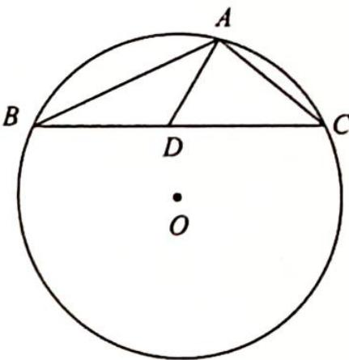

> [!faq]- 《高考数学培优40讲》参考答案
>
> > [!success]- **【答案】** 详见解析
>
> > [!note]- **【分析】**
> > 本题未单列分析。
>
> > [!note]- **【解析】**
> > 如图所示,取 $BC$ 的中点 $D$ . 由极化恒等式知 $\overrightarrow{AB} \cdot \overrightarrow{AC} = AD^{2} - DC^{2} = AD^{2}-1$ , 而 $\triangle ABC$ 内接于圆 $O$ , 其中 $\angle BOC = \frac{2\pi}{3}$ , 点 $A$ 在劣弧 $\widehat{BC}$ 上运动, 所以当 $AD \perp BC$ 时, $AD$ 有最小值, 为 $\frac{\sqrt{3}}{3}$ , 故 $\overrightarrow{AB} \cdot \overrightarrow{AC}$ 的最小值为 $-\frac{2}{3}$ .
> > 
