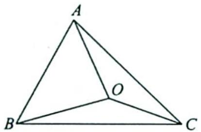
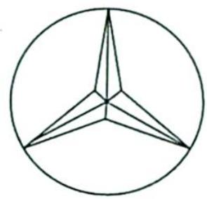

## 28.1 “四心”定理及其推论

## 研究密钥

1. 三角形的“四心”定理的平面向量表达式

定理 1 点 O 是 $\triangle ABC$ 的重心 $\Leftrightarrow \overrightarrow{OA} + \overrightarrow{OB} + \overrightarrow{OC} = 0$ .

定理 2 点 O 是 $\triangle ABC$ 的垂心 $\Leftrightarrow \overrightarrow{OA} \cdot \overrightarrow{OB} = \overrightarrow{OB} \cdot \overrightarrow{OC} = \overrightarrow{OC} \cdot \overrightarrow{OA}$ .

定理 3 点 O 是 $\triangle ABC$ 的外心 $\Leftrightarrow |\overrightarrow{OA}| = |\overrightarrow{OB}| = |\overrightarrow{OC}|$ .

定理 4 点 O 是 $\triangle ABC$ 的内心 $\Leftrightarrow a\overrightarrow{OA} + b\overrightarrow{OB} + c\overrightarrow{OC} = 0$ (其中 a, b, c 为三边长).

## 2.奔驰定理

为了系统、深刻地理解三角形“四心”的性质,我们先证明“奔驰定理”.

“奔驰定理”是平面向量中一个非常优美的结论,因为这个定理对应的图形与“奔驰”轿车(Mercedes-Benz)的 logo 很相似(如图 1 与图 2),故形象地称其为“奔驰定理”.

图1

图 2

奔驰定理:已知 O 是 $\triangle ABC$ 内的一点, $\triangle BOC, \triangle AOC, \triangle AOB$ 的面积分别为 $S_{A}, S_{B}$ , $S_{C}$ , 则 $S_{A} \cdot \overrightarrow{OA} + S_{B} \cdot \overrightarrow{OB} + S_{C} \cdot \overrightarrow{OC} = 0$ .

从这个定理中我们看到,每个向量和它下面所对应的三角形是一组,每个向量前的系数与所对应的三角形面积相关.奔驰定理是一个二级结论,常用于解答与三角形内任意一点有关的三角形面积问题.在解决相关问题时,利用平面向量运算将已知条件进行变形,然后应用奔驰定理将非常快捷.

![[高中/总复习/专题/高考数学培优40讲/高考数学培优40讲-03-三角、向量、数列、不等式与复数/第_28_讲_三角形的四心/奔驰定理及其应用/28_1__四心_定理及其推论/例题/Q00019844.md]]
