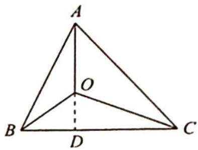

> [!faq]- 《高考数学培优40讲》例题解析
>
> > [!success]- **【答案】** 详见解析
>
> > [!note]- **【分析】**
> > 分析 ▶ 分析 $S_{A} \cdot \overrightarrow{OA} + S_{B} \cdot \overrightarrow{OB} + S_{C} \cdot \overrightarrow{OC} = 0$ 这个式子, 出现 $S_{A}, S_{B}, S_{C}$ 预示着需将面积比转化为边长比. 由于是轮换式, 不妨从 $BC$ 边入手, 延长 $AO$ 与 $BC$ 边相交于点 $D$ , 由 $\overrightarrow{BD} = \lambda \overrightarrow{DC}$ , 即 $-(1 + \lambda) \overrightarrow{OD} + \overrightarrow{OB} + \lambda \overrightarrow{OC} = 0$ , 再将 $\overrightarrow{OD}$ 用 $\overrightarrow{OA}$ 表示, 将向量模长比用面积比表示, 最后整理得待求式.
> >
> > ## 证明 如图所示,延长 AO 与 BC 边相交于点 D.
> >
> > 记 $\frac{|\overrightarrow{BD}|}{|\overrightarrow{DC}|} = \lambda$ ，则 $\overrightarrow{BD} = \lambda \overrightarrow{DC}$ ，所以 $\frac{|\overrightarrow{BD}|}{|\overrightarrow{DC}|} = \frac{S_{\triangle ABD}}{S_{\triangle ACD}} = \frac{S_{\triangle BOD}}{S_{\triangle COD}} = \frac{-S_{\triangle BOD}}{-S_{\triangle COD}} = \frac{S_{\triangle ABD} - S_{\triangle BOD}}{S_{\triangle ACD} - S_{\triangle COD}} = \frac{S_C}{S_B}$ . 因为 $\overrightarrow{OD} - \overrightarrow{OB} = \lambda (\overrightarrow{OC} - \overrightarrow{OD})$ ，即 $-(1 + \lambda) \overrightarrow{OD} + \overrightarrow{OB} + \lambda \overrightarrow{OC} = 0$ .
> >
> > 
> >
> > 又 $\overrightarrow{OD} = -\frac{|\overrightarrow{OD}|}{|\overrightarrow{OA}|}\cdot \overrightarrow{OA} = -\frac{S_A}{S_B + S_C}\cdot \overrightarrow{OA}$ ，所以 $\frac{S_A}{S_B + S_C}\left(1 + \frac{S_C}{S_B}\right)\overrightarrow{OA} +\overrightarrow{OB} +\frac{S_C}{S_B}\cdot \overrightarrow{OC} = 0$ ，故 $S_{A}\cdot \overrightarrow{OA} +S_{B}\cdot \overrightarrow{OB} +S_{C}\cdot \overrightarrow{OC} = 0.$
> >
> > 解后小结
> >
> > ## 有关三角形四心定理的证明与推论
> >
> > 由奔驰定理可得下列推论.
> >
> > 推论1 若 $O$ 是 $\triangle ABC$ 内的一点, 且 $x\overrightarrow{OA} + y\overrightarrow{OB} + z\overrightarrow{OC} = 0$ , 则 $S_{\triangle BOC}: S_{\triangle COA}: S_{\triangle AOB} = x: y: z$ .
> >
> > 【证明】由奔驰定理知 $S_{\triangle BOC} \cdot \overrightarrow{OA} + S_{\triangle AOC} \cdot \overrightarrow{OB} + S_{\triangle AOB} \cdot \overrightarrow{OC} = 0$ ，又知 $x \overrightarrow{OA} + y \overrightarrow{OB} + z \overrightarrow{OC} = 0$ ，所以可得 $S_{\triangle BOC} : S_{\triangle COA} : S_{\triangle AOB} = x : y : z$ 。
> >
> > 定理 1 点 O 是 $\triangle ABC$ 的重心 $\Leftrightarrow \overrightarrow{OA} + \overrightarrow{OB} + \overrightarrow{OC} = 0$ . 证明如下.
> >
> > 【证明】由奔驰定理可得点 O 是 $\triangle ABC$ 的重心 $\Leftrightarrow S_{\triangle BOC} = S_{\triangle AOC} = S_{\triangle AOB} \Leftrightarrow S_A = S_B = S_C \Leftrightarrow \overrightarrow{OA} + \overrightarrow{OB} + \overrightarrow{OC} = 0.$
> >
> > 【评注】由定理1还可进一步得到推论2.
> >
> > 推论2 $P$ 是 $\triangle ABC$ 所在平面内任意点, $\overrightarrow{PG} = \frac{1}{3} (\overrightarrow{PA} + \overrightarrow{PB} + \overrightarrow{PC}) \Leftrightarrow G$ 是 $\triangle ABC$ 的重心.
> >
> > 【证明】G 是 $\triangle ABC$ 的重心 $\Leftrightarrow \overrightarrow{GA} + \overrightarrow{GB} + \overrightarrow{GC} = 0 \Leftrightarrow \overrightarrow{PA} - \overrightarrow{PG} + \overrightarrow{PB} - \overrightarrow{PG} + \overrightarrow{PC} - \overrightarrow{PG} = 0 \Leftrightarrow \overrightarrow{PG} = \frac{1}{3} (\overrightarrow{PA} + \overrightarrow{PB} + \overrightarrow{PC})$ .
> >
> > 【评注】在推论2中, 若 $P$ 为坐标原点, $\triangle ABC$ 的三顶点坐标分别为 $A(x_{1}, y_{1}), B(x_{2}, y_{2}), C(x_{3}, y_{3})$ , 则 $\triangle ABC$ 的重心坐标为 $G\left(\frac{x_{1} + x_{2} + x_{3}}{3}, \frac{y_{1} + y_{2} + y_{3}}{3}\right)$ .
> >
> > 定理2 点 $O$ 是 $\triangle ABC$ 的垂心 $\Leftrightarrow \overrightarrow{OA} \cdot \overrightarrow{OB} = \overrightarrow{OB} \cdot \overrightarrow{OC} = \overrightarrow{OC} \cdot \overrightarrow{OA}$ . 证明如下.
> >
> > 【证明】 $\overrightarrow{OA}\cdot\overrightarrow{OB}=\overrightarrow{OB}\cdot\overrightarrow{OC}\Leftrightarrow\overrightarrow{OB}\cdot(\overrightarrow{OA}-\overrightarrow{OC})=0\Leftrightarrow\overrightarrow{OB}\cdot\overrightarrow{CA}=0\Leftrightarrow\overrightarrow{OB}\perp\overrightarrow{CA}.$
> >
> > 同理, 由 $\overrightarrow{OB} \cdot \overrightarrow{OC} = \overrightarrow{OC} \cdot \overrightarrow{OA}$ 可证 $\overrightarrow{OC} \perp \overrightarrow{AB}$ , 故点 $O$ 是 $\triangle ABC$ 的垂心.
> >
> > 反之，亦然（证略）.
> >
> > 推论3 $O$ 是 $\triangle ABC$ (非直角三角形) 的垂心 $\Leftrightarrow \tan A \cdot \overrightarrow{OA} + \tan B \cdot \overrightarrow{OB} + \tan C \cdot \overrightarrow{OC} = 0$ . 【证明】 $O$ 是 $\triangle ABC$ (非直角三角形) 的垂心 $\Leftrightarrow \overrightarrow{OA} \cdot \overrightarrow{OB} = \overrightarrow{OB} \cdot \overrightarrow{OC} = \overrightarrow{OC} \cdot \overrightarrow{OA} \Leftrightarrow |\overrightarrow{OA}| |\overrightarrow{OB}| \cos (\pi - C) = |\overrightarrow{OB}| |\overrightarrow{OC}| \cos (\pi - A) = |\overrightarrow{OC}| |\overrightarrow{OA}| \cos (\pi - B) \Leftrightarrow |\overrightarrow{OA}| |\overrightarrow{OB}| (-\cos C) = |\overrightarrow{OB}| |\overrightarrow{OC}| (-\cos A) = |\overrightarrow{OC}| |\overrightarrow{OA}| (-\cos B)$ , 即 $|\overrightarrow{OA}| |\overrightarrow{OB}| \cos C = |\overrightarrow{OB}| |\overrightarrow{OC}| \cos A = |\overrightarrow{OC}| |\overrightarrow{OA}| \cos B$ , 且 $S_{C} = \frac{1}{2} |OA||OB| \sin \angle AOB = \frac{1}{2} |OA||OB| \sin (\pi - C) = \frac{1}{2} |OA||OB| \sin C$ .
> >
> > 同理 $S_{B} = \frac{1}{2} |OA||OC|\sin B, S_{A} = \frac{1}{2} |OB||OC|\sin A$ ，则 $S_{A}: S_{B}: S_{C} = \frac{\frac{1}{2} |OB||OC|\sin A}{|\overrightarrow{OB}||\overrightarrow{OC}|\cos A}$ ：
> >
> > $$
> > \frac {\frac {1}{2} | O A | | O C | \sin B}{| \overrightarrow {O A} | | \overrightarrow {O C} | \cos B}: \frac {\frac {1}{2} | O A | | O B | \sin C}{| \overrightarrow {O A} | | \overrightarrow {O B} | \cos C} = \tan A: \tan B: \tan C.
> > $$
> >
> > 再由奔驰定理 $S_{A}\overrightarrow{OA} + S_{B}\overrightarrow{OB} + S_{C}\overrightarrow{OC} = 0$ ，则 $\tan A\overrightarrow{OA} + \tan B\overrightarrow{OB} + \tan C\overrightarrow{OC} = 0$ (O 为 $\triangle ABC$ 的垂心).
> >
> > 【评注】推论3的变式如下(仿推论2可证).
> >
> > 设 $P$ 是 $\triangle ABC$ (非直角三角形) 所在平面上任意一点, $O$ 是 $\triangle ABC$ (非直角三角形) 的垂心 $\Leftrightarrow \overrightarrow{PO} = \frac{\tan A \cdot \overrightarrow{PA} + \tan B \cdot \overrightarrow{PB} + \tan C \cdot \overrightarrow{PC}}{\tan A + \tan B + \tan C}$ .
> >
> > 定理 3 点 O 是 $\triangle ABC$ 的外心 $\Leftrightarrow |\overrightarrow{OA}| = |\overrightarrow{OB}| = |\overrightarrow{OC}|$ .
> >
> > 【证明】此定理由三角形外心的定义直接可得.
> >
> > 由定理 3 和奔驰定理可得推论 4 如下.
> >
> > 推论4 点 $O$ 是锐角 $\triangle ABC$ 的外心 $\Leftrightarrow \sin 2A \cdot \overrightarrow{OA} + \sin 2B \cdot \overrightarrow{OB} + \sin 2C \cdot \overrightarrow{OC} = 0$ .
> >
> > 【证明】由点 O 是锐角 $\triangle ABC$ 的外心知 $\left|\overrightarrow{OA}\right|=\left|\overrightarrow{OB}\right|=\left|\overrightarrow{OC}\right|$ ， $\angle AOB=2\angle C,\angle BOC=2\angle A,\angle COA=2\angle B$ ，于是 $S_{\triangle BOC}:S_{\triangle AOC}:S_{\triangle AOB}=\sin2A:\sin2B:\sin2C$ ，根据奔驰定理得到 $\sin2A\cdot\overrightarrow{OA}+\sin2B\cdot\overrightarrow{OB}+\sin2C\cdot\overrightarrow{OC}=0$ 。
> >
> > 反之，亦然（证略）.
> >
> > 【评注】推论 4 的变式如下: 已知 P 是 $\triangle ABC$ 所在平面内任意一点, $\overrightarrow{PO} = \frac{\sin 2A \cdot \overrightarrow{PA} + \sin 2B \cdot \overrightarrow{PB} + \sin 2C \cdot \overrightarrow{PC}}{\sin 2A + \sin 2B + \sin 2C} \Leftrightarrow O$ 是锐角 $\triangle ABC$ 的外心.
> >
> > 定理4 点 $O$ 是 $\triangle ABC$ 的内心 $\Leftrightarrow a \cdot \overrightarrow{OA} + b\overrightarrow{OB} + c\overrightarrow{OC} = 0$ (其中 $a, b, c$ 为三边长)证明如下.
> >
> > 【证明】点 O 是 $\triangle ABC$ 的内心, 设 $\triangle ABC$ 的内切圆半径为 r, 则 $S_{\triangle BOC}: S_{\triangle AOC}: S_{\triangle AOB} = \frac{ra}{2}: \frac{rb}{2}: \frac{rc}{2} = a:b:c$ .
> >
> > 根据奔驰定理可得点 O 是 $\triangle ABC$ 的内心 $\Leftrightarrow a \overrightarrow{OA} + b \overrightarrow{OB} + c \overrightarrow{OC} = 0$ .
> >
> > 由定理 4 可得推论 5.
> >
> > 推论 5 设 P 是 $\triangle ABC$ 平面内任意一点，O 是 $\triangle ABC$ 的内心 $\Leftrightarrow \overrightarrow{PO} = \frac{a \overrightarrow{PA} + b \overrightarrow{PB} + c \overrightarrow{PC}}{a + b + c}$ . 推论 5 可仿推论 2 证明.
>
> > [!note]- **【解析】**
> > 本题未单列解析。
