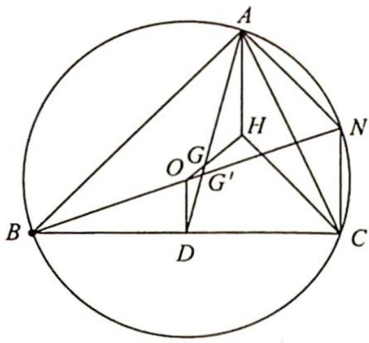
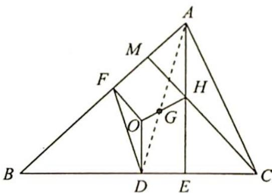

> [!faq]- 《高考数学培优40讲》例题解析
>
> > [!success]- **【答案】** 详见解析
>
> > [!note]- **【分析】**
> > 分析 ▶ 由外心和重心联想三边的中点,由垂心和外心联想高和垂直,因此添加辅助线寻找边的位置关系和数量关系。思路可分为几何法与向量法。几何法可令 $O, H$ 确定直线，通过同一法证明 $G$ 也在其上；向量法可将寻找到的平行关系和等量关系转化为共线向量来表示，从而通过向量的线性运算加以解决。
>
> > [!note]- **【解析】**
> > 解析 ▶ 证法一(几何证法): 如图 1 所示, 连接 BO 并延长交圆 O 于点 N, 而 O 是圆心, 则 O 是直径 BN 的中点. 设 BC 中点为 D, 连接 OD, 便得 NC = 2OD.
> > 再连接 AN, HC. 由 $NA \perp AB, CH \perp AB$ 及 $NC \perp BC, AH \perp BC$ 而形成平行四边形 ANCH，即有 NC = AH，于是 AH = 2OD.
> > 
> > 连接 $OH$ , 设交中线 $AD$ 于 $G'$ , 因为 $AH \parallel OD$ , 所以 $\triangle AG'H \sim \triangle DG'O$ , $\frac{AG'}{G'D} = \frac{AH}{OD} = 2$ .
> > 图1
> > 而 $\frac{AG}{GD}=2$ ，所以重心G与 $G'$ 重合。故O,G,H三点共线，且 $\frac{OG}{GH}=\frac{1}{2}$ 。
> > 证法二(向量证法:利用平面向量基本定理)如图2所示,设D,F分别为BC,AB的中点.
> > 连接 $OD, OF$ , 则 $OD \perp BC$ , 且 $OF \perp AB$ . 连接 $AH, CH$ 并延长,分别交 $BC, AB$ 于 $E, M$ , 则 $AE \perp BC, CM \perp AB$ , 所以 $AH \parallel OD, CH \parallel OF$ .
> > 
> > 图2
> > 所以设 $\overrightarrow{AH}=\lambda\overrightarrow{OD},\overrightarrow{CH}=\mu\overrightarrow{OF}$ ，即 $\overrightarrow{AC}+\overrightarrow{CH}=\lambda(\overrightarrow{OF}+\overrightarrow{FD})$ 。因为
> > D,F 为中点,故 $\overrightarrow{AC}=2\overrightarrow{FD}$ ,则 $2\overrightarrow{FD}+\mu\overrightarrow{OF}=\lambda(\overrightarrow{OF}+\overrightarrow{FD})$ ,即 $(2-\lambda)\overrightarrow{FD}+(\mu-\lambda)\overrightarrow{OF}=0$ .
> > 又 $\overrightarrow{FD},\overrightarrow{OF}$ 不共线，由平面向量基本定理得 $\left\{\begin{aligned}&2-\lambda=0\\ &\mu-\lambda=0\end{aligned}\right.$ ，所以 $\lambda=\mu=2$ ，即 $\overrightarrow{AH}=2\overrightarrow{OD},\overrightarrow{CH}=2\overrightarrow{OF}.$
> > 因为 G 为重心, 于是 $\overrightarrow{DG} = \frac{1}{2}\overrightarrow{GA}$ , 所以 $\overrightarrow{OG} = \overrightarrow{OD} + \overrightarrow{DG} = \frac{1}{2}\overrightarrow{AH} + \frac{1}{2}\overrightarrow{GA} = \frac{1}{2} (\overrightarrow{GA} + \overrightarrow{AH}) = \frac{1}{2}\overrightarrow{GH}$ .
> > 因为 $\overrightarrow{OG},\overrightarrow{GH}$ 有公共点,所以O,G,H三点共线,且OG:GH=1:2.
> > 证法三(向量证法:利用平面向量线性运算)如图2所示,在 $\triangle ABC$ 中,外心为O,重心为G,垂心为H,BC中点为D. 因为AG=2GD,所以AH=2OD,故 $\overrightarrow{AH}=2\overrightarrow{OD}$ .
> > 则 $\overrightarrow{OH}-\overrightarrow{OA}=\overrightarrow{AH}=2\overrightarrow{OD}=\overrightarrow{OB}+\overrightarrow{OC},\overrightarrow{OH}=\overrightarrow{OA}+\overrightarrow{OB}+\overrightarrow{OC}$ ，所以 $\overrightarrow{OH}=\overrightarrow{OA}+\overrightarrow{OB}+\overrightarrow{OC}=\overrightarrow{OG}+\overrightarrow{GA}+\overrightarrow{OG}+\overrightarrow{GB}+\overrightarrow{OG}+\overrightarrow{GC}=3\overrightarrow{OG}+(\overrightarrow{GA}+\overrightarrow{GB}+\overrightarrow{GC})$ .
> > 因为 G 为重心, 所以 $\overrightarrow{GA} + \overrightarrow{GB} + \overrightarrow{GC} = 0$ , 则 $\overrightarrow{OH} = 3\overrightarrow{OG}$ .
> > 故 O, G, H 三点共线，且 $\frac{OG}{GH} = \frac{1}{2}$ .
