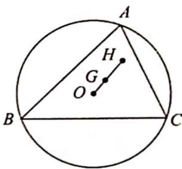

> [!faq]- 《高考数学培优40讲》例题解析
>
> > [!success]- **【答案】** 详见解析
>
> > [!note]- **【分析】**
> > 分析 ▶ 由式子 $\overrightarrow{OH} = m (\overrightarrow{OA} + \overrightarrow{OB} + \overrightarrow{OC})$ 联想到奔驰定理推论 2: $\overrightarrow{PG} = \frac{1}{3} (\overrightarrow{PA} + \overrightarrow{PB} + \overrightarrow{PC})$ (其中 G 是 $\triangle ABC$ 的重心, P 是 $\triangle ABC$ 所在平面内任意点), 那么就令 P 为 O, 即有 $\overrightarrow{OG} = \frac{1}{3} (\overrightarrow{OA} + \overrightarrow{OB} + \overrightarrow{OC})$ , 而通过欧拉线定理知 $\overrightarrow{OG} = \frac{1}{3} \overrightarrow{OH}$ , 则 m 可求.
>
> > [!note]- **【解析】**
> > 解析 如图所示, 因为 $G$ 为重心, 所以 $\overrightarrow{GA} + \overrightarrow{GB} + \overrightarrow{GC} = 0$ , 即 $\overrightarrow{OA} - \overrightarrow{OG} + \overrightarrow{OB} - \overrightarrow{OG} + \overrightarrow{OC} - \overrightarrow{OG} = 0$ , 整理得 $\overrightarrow{OG} = \frac{1}{3} (\overrightarrow{OA} + \overrightarrow{OB} + \overrightarrow{OC})$ .
> > 
> > 根据欧拉线定理有 $\overrightarrow{OG} = \frac{1}{3}\overrightarrow{OH}$ ，所以 $\frac{1}{3}\overrightarrow{OH} = \frac{1}{3} (\overrightarrow{OA} +\overrightarrow{OB} +\overrightarrow{OC})$ ，即 $\overrightarrow{OH} = \overrightarrow{OA} +\overrightarrow{OB} +\overrightarrow{OC}$ ，故 $m = 1$
