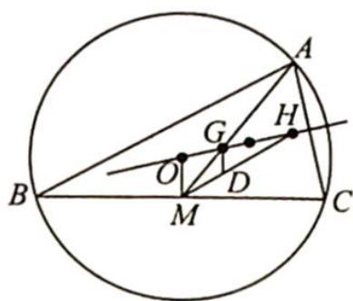

> [!faq]- 《高考数学培优40讲》例题解析
>
> > [!success]- **【答案】** D
>
> > [!note]- **【分析】**
> > 本题未单列分析。
>
> > [!note]- **【解析】**
> > 解析 如图所示,由欧拉线定理可得 $\overrightarrow{OH}=3\overrightarrow{OG}$ ,将MH三等分,设与M相近的三等
> > 分点为 $D$ .
> > 所以 $\overrightarrow{MG} = \overrightarrow{DG} +\overrightarrow{MD} = \frac{2}{3}\overrightarrow{MO} +\frac{1}{3}\overrightarrow{MH}$ ，即 $\overrightarrow{GM} = \frac{2}{3}\overrightarrow{OM} +\frac{1}{3}\overrightarrow{HM}$ ，则有 $\overrightarrow{AB} +\overrightarrow{AC} = 2\overrightarrow{AM} = 6\overrightarrow{GM} = 6\left(\frac{2}{3}\overrightarrow{OM} +\frac{1}{3}\overrightarrow{HM}\right) = 4\overrightarrow{OM} +2\overrightarrow{HM}.$
> > 
> > 故选D.
> > ## 2. 应用欧拉线定理求数量积
