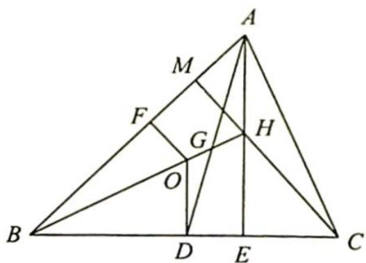

> [!faq]- 《高考数学培优40讲》例题解析
>
> > [!success]- **【答案】** 详见解析
>
> > [!note]- **【分析】**
> > 本题未单列分析。
>
> > [!note]- **【解析】**
> > 解析 如图所示,取 BC 的中点 D, AB 的中点 F, 连接 OD, OF, 延长 AH, CH 分别与 BC, AB 交于 E, M.
> > 由 $\overrightarrow{AG} = \frac{2}{3}\overrightarrow{AD} = \frac{1}{3} (\overrightarrow{AB} +\overrightarrow{AC})$ ，可得 $\overrightarrow{AG}^2 = \frac{1}{9} (\overrightarrow{AB} +\overrightarrow{AC})^2 =$ $\frac{1}{9}\left(c^2 +b^2 +2cb\bullet \frac{c^2 + b^2 - a^2}{2bc}\right) = \frac{1}{9} (2c^2 +2b^2 -a^2).$
> > 
> > $$
> > \begin{array}{r l} & {\text {又} \overrightarrow {A H} ^ {2} = 4 \overrightarrow {O D} ^ {2} = 4 \left(R ^ {2} - \frac {1}{4} a ^ {2}\right) = 4 R ^ {2} - a ^ {2}, A E = A B \sin \angle A B C = A B \frac {b}{2 R} = \frac {b c}{2 R}.} \\ & {\overrightarrow {G H} ^ {2} = (\overrightarrow {A H} - \overrightarrow {A G}) ^ {2} = \overrightarrow {A H} ^ {2} + \overrightarrow {A G} ^ {2} - 2 \overrightarrow {A H} \cdot \overrightarrow {A G} = \overrightarrow {A H} ^ {2} + \overrightarrow {A G} ^ {2} - 2 | \overrightarrow {A H} | | \overrightarrow {A G} | \frac {| \overrightarrow {A E} |}{| \overrightarrow {A D} |}} \\ & {\qquad = \overrightarrow {A H} ^ {2} + \overrightarrow {A G} ^ {2} - \frac {4}{3} | \overrightarrow {A H} | | \overrightarrow {A E} | = \overrightarrow {A H} ^ {2} + \overrightarrow {A G} ^ {2} - \frac {8}{3} | \overrightarrow {O D} | | \overrightarrow {A E} |} \\ & {\qquad = (4 R ^ {2} - a ^ {2}) + \frac {1}{9} (2 c ^ {2} + 2 b ^ {2} - a ^ {2}) - \frac {8}{3} \sqrt {R ^ {2} - \frac {1}{4} a ^ {2}} \cdot \frac {b c}{2 R}} \end{array}
> > $$
> > $$
> > = \frac {2}{9} c ^ {2} + \frac {2}{9} b ^ {2} - \frac {1 0}{9} a ^ {2} + 4 R ^ {2} - \frac {2 b c}{3 R} \sqrt {4 R ^ {2} - a ^ {2}}.
> > $$
> > 所以 $OH^{2}=\frac{9}{4}GH^{2}=\frac{9}{4}\left(\frac{2}{9}c^{2}+\frac{2}{9}b^{2}-\frac{10}{9}a^{2}+4R^{2}-\frac{2bc}{3R}\sqrt{4R^{2}-a^{2}}\right)$ $=\frac{1}{2}c^{2}+\frac{1}{2}b^{2}-\frac{5}{2}a^{2}+9R^{2}-\frac{3bc}{2R}\sqrt{4R^{2}-a^{2}}.$
