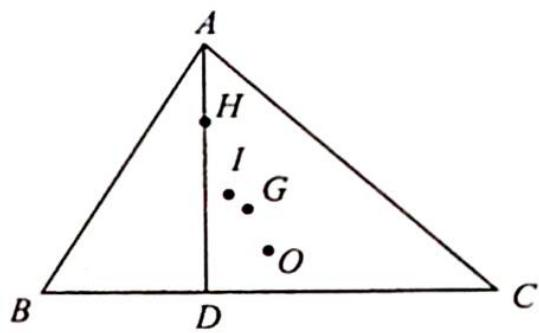
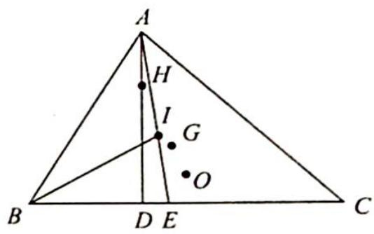

> [!faq]- 《高考数学培优40讲》例题解析
>
> > [!success]- **【答案】** 详见解析
>
> > [!note]- **【分析】**
> > 本题未单列分析。
>
> > [!note]- **【解析】**
> > 
> > 解析 如图所示, 连接 $AI$ 并延长交 $BC$ 于点 $E$ , 根据角平分线定理可知 $\frac{AB}{AC} = \frac{BE}{CE} = \frac{4}{5}$ , 即 $\overrightarrow{BE} = \frac{4}{5}\overrightarrow{EC}$ , 则 $\overrightarrow{AE} - \overrightarrow{AB} = \frac{4}{5} (\overrightarrow{AC} - \overrightarrow{AE})$ , 所以 $\overrightarrow{AE} = \frac{5}{9}\overrightarrow{AB} + \frac{4}{9}\overrightarrow{AC}$ .
> > 
> > 又在 $\triangle ABE$ 中， $BI$ 平分 $B$ ，根据角平分线定理可知 $\frac{BA}{BE}=\frac{AI}{IE}=\frac{4}{6\times\frac{4}{9}}=\frac{3}{2},\overrightarrow{AI}=\frac{3}{5}\overrightarrow{AE}=$ $\frac{3}{5}\left(\frac{5}{9}\overrightarrow{AB}+\frac{4}{9}\overrightarrow{AC}\right)=\frac{1}{3}\overrightarrow{AB}+\frac{4}{15}\overrightarrow{AC}$ ，由欧拉线定理知 $G,O,H$ 三点共线， $|OH|=3|OG|$ ，所以 $\overrightarrow{OH}=3\overrightarrow{OG},\overrightarrow{AG}=\frac{2}{3}\times\frac{1}{2}(\overrightarrow{AB}+\overrightarrow{AC})=\frac{1}{3}(\overrightarrow{AB}+\overrightarrow{AC})$ ，则 $\overrightarrow{AH}=\overrightarrow{AO}+\overrightarrow{OH}=\overrightarrow{AO}+3\overrightarrow{OG}=\overrightarrow{AO}+$ $3(\overrightarrow{OA}+\overrightarrow{AG})=-2\overrightarrow{AO}+3\overrightarrow{AG}=-2\overrightarrow{AO}+\overrightarrow{AB}+\overrightarrow{AC}$ ，故 $\overrightarrow{AH}\cdot\overrightarrow{AI}=[-2\overrightarrow{AO}+(\overrightarrow{AB}+\overrightarrow{AC})]\cdot$ $\overrightarrow{AI}=-2\overrightarrow{AO}\cdot\overrightarrow{AI}+(\overrightarrow{AB}+\overrightarrow{AC})\cdot\overrightarrow{AI}$ .
> > 而 $\overrightarrow{AO} \cdot \overrightarrow{AI} = \overrightarrow{AO} \cdot \left( \frac{1}{3} \overrightarrow{AB} + \frac{4}{15} \overrightarrow{AC} \right) = \frac{1}{3} \times \frac{1}{2} \overrightarrow{AB}^2 + \frac{4}{15} \times \frac{1}{2} \overrightarrow{AC}^2 = \frac{1}{3} \times 8 + \frac{4}{15} \times \frac{25}{2} = 6, \overrightarrow{AB} \cdot \overrightarrow{AC} = |\overrightarrow{AB}| |\overrightarrow{AC}| \cos A = 4 \times 5 \times \frac{1}{8} = \frac{5}{2}, (\overrightarrow{AB} + \overrightarrow{AC}) \cdot \overrightarrow{AI} = (\overrightarrow{AB} + \overrightarrow{AC}) \cdot \left( \frac{1}{3} \overrightarrow{AB} + \frac{4}{15} \overrightarrow{AC} \right) = \frac{1}{3} \overrightarrow{AB}^2 + \frac{4}{15} \overrightarrow{AC}^2 + \frac{3}{5} \overrightarrow{AB} \cdot \overrightarrow{AC} = \frac{1}{3} \times 16 + \frac{4}{15} \times 25 + \frac{3}{5} \times \frac{5}{2} = \frac{27}{2}$ , 故 $\overrightarrow{AH} \cdot \overrightarrow{AI} = -2 \times 6 + \frac{27}{2} = \frac{3}{2}$ .
> > ## 3. 欧拉线定理联手解析法解题
