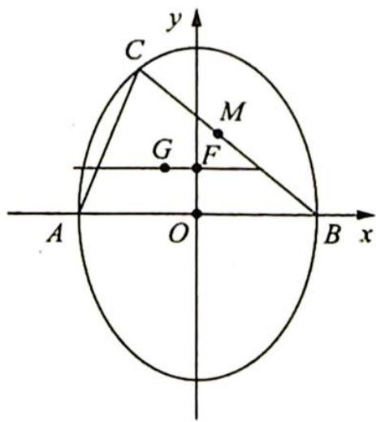

> [!faq]- 《高考数学培优40讲》例题解析
>
> > [!success]- **【答案】** 详见解析
>
> > [!note]- **【分析】**
> > 本题未单列分析。
>
> > [!note]- **【解析】**
> > 解析 ▶ 证明:如图所示,设 BC 边的中点为 M, $\triangle ABC$ 的外心为 F,重心为 G.则经过 F,G 两点的直线为欧拉线,M 点、G 点坐标分别为 $M\left(\frac{x+a}{2},\frac{y}{2}\right)$ , $G\left(\frac{x}{3},\frac{y}{3}\right)$ ,求得 $F\left(0,\frac{x^{2}+y^{2}-a^{2}}{2y}\right)$ .
> > 
> > 因此欧拉线的斜率为 $k_{FG} = -\frac{3x^2 + y^2 - 3a^2}{2xy}$ , 要使欧拉线平行于 $AB$ 边, 即 $k = 0$ 的充要条件是 $3x^2 + y^2 - 3a^2 = 0$ , 且 $xy \neq 0$ , 此即 $\frac{x^2}{a^2} + \frac{y^2}{3a^2} = 1$ , 且 $xy \neq 0$ .
> > ## 评注
> > 由本题证明过程,可继续推导出两个结论:
> > (1) 当 $C$ 点落在 $y$ 轴上时, 欧拉线与 $y$ 轴重合, 斜率 $k$ 不存在.
> > (2) 当 $C$ 点落在上述椭圆外的第 2、第 4 象限或椭圆内的第 1、第 3 象限时, 欧拉线的斜率 $k > 0$ ; 当 $C$ 点落在上述椭圆外的第 1、第 3 象限或椭圆内的第 2、第 4 象限时, 欧拉线的斜率 $k < 0$ .
