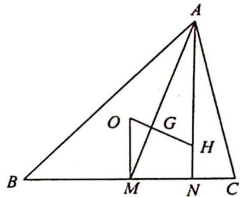
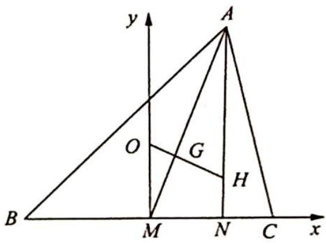

> [!faq]- 《高考数学培优40讲》例题解析
>
> > [!success]- **【答案】** 详见解析
>
> > [!note]- **【分析】**
> > 本题未单列分析。
>
> > [!note]- **【解析】**
> > 
> > 解析 以 M 为坐标原点, 建立平面直角坐标系, 如图所示.
> > 因为 OM=1, 故 O 点的坐标为 $(0,1)$ . 设 A 点坐标为 $(3x,3y)$ , 则 N 点坐标为 $(3x,0)$ , 因为 $\triangle ABC$ 中, AB>AC, 故 x>0, y>0.
> > 又 G 为 $\triangle ABC$ 的重心, 故 G 点坐标为 $(x,y)$ , 则 $\overrightarrow{OG} = (x, y - 1)$ .
> > 由欧拉线定理知 $\overrightarrow{OG} = \frac{1}{3} \overrightarrow{OH}$ ，所以 $\overrightarrow{OH} = (3x, 3y - 3)$ ，故 H 点的坐标是 $(3x, 3y - 2)$ ，则 $\overrightarrow{HN} = (0, 2 - 3y)$ ，则 $\overrightarrow{OG} \cdot \overrightarrow{HN} = (x, y - 1)$ 。
> > 
> > $$
> > (0, 2 - 3 y) = - 3 y ^ {2} + 5 y - 2 = - 3 \left(y - \frac {5}{6}\right) ^ {2} + \frac {1}{1 2}.
> > $$
> > 故当 $y=\frac{5}{6}$ 时， $\overrightarrow{OG}\cdot\overrightarrow{HN}$ 取最大值 $\frac{1}{12}$ .
> > ## 4. 认识欧拉圆
