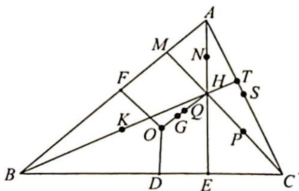

> [!faq]- 《高考数学培优40讲》例题解析
>
> > [!success]- **【答案】** 详见解析
>
> > [!note]- **【分析】**
> > 分析 ▶ 证明九点共圆,思路之一便是找到圆心,圆心到九点距离为定值。由于条件中出现三个边的中点、三个垂足、三个顶点与垂足间的中点,它们地位对等,相对应的结论只需证明一个,另两个同理。观察各线段, ${OH}$ 处于中心地位,各相关线段均以 ${OH}$ 的中点为中点,猜测此点(设为点 $Q$ )为圆心.根据中点条件以及 $\overrightarrow{AH} = 2\overrightarrow{OD}$ ，以 $OH$ 为对角线，可以获得平行四边形 $NODH$ ；以 $DN$ 为边，可以获得平行四边形 $AODN.$ 不妨以 $ND$ 作为代表，求 $QN, QD$ 为定值，其余点同理.
>
> > [!note]- **【解析】**
> > 解析 如图所示,由外心和垂心知 $NH \parallel OD$ , $NH = OD$ , 四边形 $NODH$ 为平行四边形, 从而 $DN, OH$ 互相平分.
> > 设 ${OH}$ 的中点为 $Q$ ,即 ${DN}$ 经过 $Q$ 且被 $Q$ 平分.
> > 
> > 由 $AN \parallel OD, AN = OD$ 得四边形 $AODN$ 为平行四边形, 设 $\triangle ABC$ 的外接圆的半径为 $R$ , 所以 $DN = OA = R$ , 则 $QD = QN = \frac{1}{2} R$ .
> > 同理可证, ${QF} = {QP} = {QK} = {QS} = \frac{1}{2}R$ . 在 Rt△NDE 中, ${QE} = \frac{1}{2}{DN} = \frac{1}{2}R,{QM} = {QT} = \frac{1}{2}R$ . 综上所述,D,F,S,E,M,T,N,P,K 九点共圆.
> > ## 评注
> > 本题结论中的九点共圆的圆叫作欧拉圆或九点圆, 圆心 $Q$ 是 $OH$ 的中点. 欧拉线实际上是外心 $O$ 、重心 $G$ 、欧拉圆圆心 $Q$ 、垂心 $H$ 四点共线. 其中重心 $G$ 是 $OH$ 的三等分点, $Q$ 是 $OH$ 的中点.
