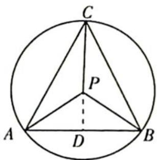

> [!faq]- 《高考数学培优40讲》参考答案
>
> > [!success]- **【答案】** 详见解析
>
> > [!note]- **【分析】**
> > 本题未单列分析。
>
> > [!note]- **【解析】**
> > 解法一:由于 P 为 $\triangle ABC$ 的外心,故由推论 4 知 $\sin2A\cdot\overrightarrow{OA}+\sin2B\cdot\overrightarrow{OB}+\sin2C\cdot\overrightarrow{OC}=0$ ,又据题设知 $\overrightarrow{PA}+\overrightarrow{PB}=\lambda\overrightarrow{PC}$ , 即 $\overrightarrow{PA}+\overrightarrow{PB}-\lambda\overrightarrow{PC}=0$ , 比较两式可知 $\sin2A:\sin2B:\sin2C=1:1:(-\lambda)$ , 得到 $\sin2A=\sin2B$ , 所以 $2\angle A=2\angle B$ 或 $2\angle A=\pi-2\angle B$ .
> > 若 $2\angle A = \pi - 2\angle B$ ，则 $\angle A + \angle B = \frac{\pi}{2}$ ，此时 $\triangle ABC$ 为直角三角形，点 $P$ 在 $AB$ 的中点处， $\angle C = \frac{\pi}{2}$ ，与 $\tan \angle C = \frac{12}{5}$ 矛盾。
> > 若 $2\angle A = 2\angle B$ ，则 $\angle A = \angle B$ ，由 $\angle A + \angle B + \angle C = \pi$ 知， $2\angle A = \pi -\angle C,\sin 2A = \sin (\pi -\angle C) = \sin C.$
> > 由 $\sin 2A: \sin 2B: \sin 2C = 1:1:(-\lambda)$ 可得 $\lambda = -\frac{\sin 2C}{\sin 2A} = -\frac{\sin 2C}{\sin C} = -2\cos C.$
> > 由 $\tan \angle C = \frac{12}{5}$ 可得 $\cos C = \frac{5}{13},\lambda = -\frac{10}{13}.$
> > 解法二:如图所示,设 AB 的中点为 D, 因为 P 为 $\triangle ABC$ 的外心, 故 $\overrightarrow{PA} + \overrightarrow{PB} = 2\overrightarrow{PD}$ .
> > 又 $\overrightarrow{PA} +\overrightarrow{PB} = \lambda \overrightarrow{PC}$ ，故 $2\overrightarrow{PD} = \lambda \overrightarrow{PC},\overrightarrow{PD} = \frac{\lambda}{2}\overrightarrow{PC}$ ，由此知 $P,D,C$ 三点共线，且 $PD\bot AB$
> > $$
> > \frac {\lambda}{2} = - \frac {| \overrightarrow {P D} |}{| \overrightarrow {P C} |} = - \frac {| \overrightarrow {P D} |}{| \overrightarrow {P A} |} = - \cos \angle A P D = - \cos C.
> > $$
> > 
> > 由 $\tan \angle C = \frac{12}{5}$ 可得 $\cos C = \frac{5}{13},\lambda = -2\cos C = -\frac{10}{13}.$
