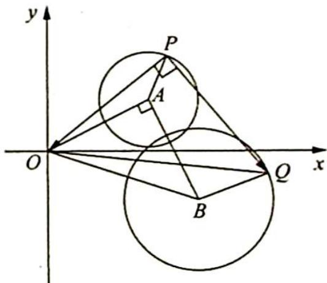

> [!faq]- 《高考数学培优40讲》例题解析
>
> > [!success]- **【答案】** 详见解析
>
> > [!note]- **【分析】**
> > 本题未单列分析。
>
> > [!note]- **【解析】**
> > 解析 ▶ 解法一: 设 $P(2 + \cos \theta, 1 + \sin \theta), \overrightarrow{PO}$ 对应复数为 $z_{\overrightarrow{PO}} = -(2 + \cos \theta) - (1 + \sin \theta)\mathrm{i}$ .
> > 由复数的几何意义可得, $\overrightarrow{PQ}$ 对应的复数为 $[-(2+\cos\theta)-(1+\sin\theta)i]i=(1+\sin\theta)-(2+\cos\theta)i,Q$ 点对应的复数为 $(3+\cos\theta+\sin\theta)+(\sin\theta-\cos\theta-1)i.$
> > 令 $\left\{\begin{aligned}x&=3+\cos\theta+\sin\theta\\ y&=\sin\theta-\cos\theta-1\end{aligned}\right.$ ，平方相加后消去 $\theta$ 得 $(x-3)^{2}+(y+1)^{2}=2$ .
> > 本题求轨迹的过程是求出点 $Q$ 对应的复数, 得出一个参数方程, 通过消参求出轨迹.
> > 解法二: 瓜豆原理(位似+旋转): 依题意可得△OPQ为等腰直角三角形.
> > 如图所示,由于 $P, Q$ 两动点到原点 $O$ 的距离之比为 $1: \sqrt{2}$ (定值),夹角是定角,根据瓜豆原理可知动点 $Q$ 的轨迹也为一个圆.
> > 
> > 设已知圆的圆心为 A，动点 Q 的轨迹圆的圆心为 B， $\triangle OPA \sim \triangle OQB, \angle POA = \angle QOB$ ，所以 $\angle AOB = \angle POQ = \frac{\pi}{4}$ .
> > 设 A, B 对应的复数分别为 $z_{1}, z_{2}$ ，则 $z_{2} = z_{1} \cdot \sqrt{2} \left[ \cos \left( -\frac{\pi}{4} \right) + i \sin \left( -\frac{\pi}{4} \right) \right] = (2 + i)(1 - i) = 3 - i$ ，所以必有旋转后圆心为 $(3, -1)$ ，半径为 $\sqrt{2}$ .
> > 故 Q 点的轨迹方程为 $(x-3)^{2}+(y+1)^{2}=2$ .
> > 解法三:(等价转化):向量 $\overrightarrow{PO}$ 绕P点逆时针旋转90°,即向量 $\overrightarrow{OP}$ 绕O点顺时针旋转45°再伸长到 $\sqrt{2}$ 倍.
> > $$
> > z _ {Q} = \left(x _ {P} + \mathrm{i} y _ {P}\right) \cdot \sqrt {2} [ \cos (- 4 5 ^ {\circ}) + \mathrm{i} \sin (- 4 5 ^ {\circ}) ], x _ {Q} + \mathrm{i} y _ {Q} = \left(x _ {P} + y _ {P}\right) + \mathrm{i} \left(y _ {P} - x _ {P}\right),
> > $$
> > $\left\{ \begin{array} { l } { x _ { Q } = x _ { P } + y _ { P } } \\ { y _ { Q } = y _ { P } - x _ { P } } \end{array} \right. \Rightarrow \left\{ \begin{array} { l } { x _ { P } = \frac { x _ { Q } - y _ { Q } } { 2 } } \\ { y _ { P } = \frac { x _ { Q } + y _ { Q } } { 2 } } \end{array} \right.$ ，则 $\left( \frac{x_{Q}-y_{Q}}{2}-2 \right)^{2}+\left( \frac{x_{Q}+y_{Q}}{2}-1 \right)^{2}=1$ ，即 $Q$ 点的轨迹方程为 $(x _ { Q } - 3 ) ^ { 2 } + ( y _ { Q } + 1 ) ^ { 2 } = 2 .$
> > 解后拓展
> > ## 瓜豆原理
> > 若两动点到某定点的距离比是定值,夹角是定角,则两动点的运动路径形态相同.瓜豆原理是主从联动轨迹问题,主动点叫作瓜,从动点叫作豆,瓜在直线上运动,豆的运动轨迹也是直线;瓜在圆周上运动,豆的运动轨迹也是圆.
> > 种瓜得瓜,种豆得豆,这个原理把主动点和从动点的关系很形象地描述出来.
