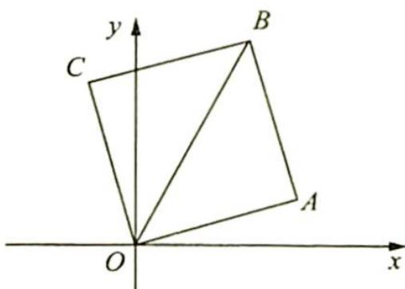

> [!faq]- 《高考数学培优40讲》例题解析
>
> > [!success]- **【答案】** 详见解析
>
> > [!note]- **【分析】**
> > 分析 ▶ 本题可以用直线的“到角公式”求出邻边直线的斜率. 另外根据题目条件可以联想到复数三角形式乘法的几何意义. 因此可建立复平面的直角坐标系, 将复数对应向量, 然后利用复数三角形式乘法的几何意义求出旋转后的复数所对应的向量, 再进一步求得斜率.
>
> > [!note]- **【解析】**
> > 解析 在正方形 OABC 中, 对角线 OB 所在直线的斜率为 2, 在复平面上建立如图所示的直角坐标系, 不妨设 B(1,2), 点 B 对应的复数为 $1 + 2i$ , 则点 C 对应的复数为 $(1 + 2i) \cdot \frac{\sqrt{2}}{2} \left( \cos \frac{\pi}{4} + i \sin \frac{\pi}{4} \right) = (1 + 2i) \left( \frac{1}{2} + \frac{1}{2}i \right) = -\frac{1}{2} + \frac{3}{2}i$ , 即 $C \left( -\frac{1}{2}, \frac{3}{2} \right)$ , 所以 $k_{oc} = -3$ .
> > 
> > 则点 A 对应的复数为 $(1+2\mathrm{i})\cdot\frac{\sqrt{2}}{2}\left[\cos\left(-\frac{\pi}{4}\right)+\mathrm{i}\sin\left(-\frac{\pi}{4}\right)\right]=(1+2\mathrm{i})\left(\frac{1}{2}-\frac{1}{2}\mathrm{i}\right)=\frac{3}{2}+\frac{1}{2}\mathrm{i}$ ，即 $A\left(\frac{3}{2},\frac{1}{2}\right)$ ，所以 $k_{OA}=\frac{1}{3}$ .
> > 综上所述,两条邻边所在直线的斜率分别为-3和 $\frac{1}{3}$ .
