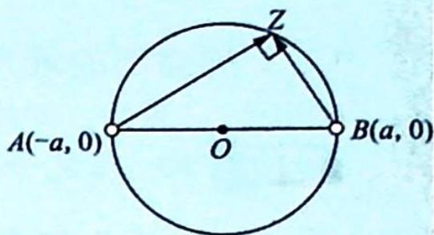

> [!faq]- 《高考数学培优40讲》例题解析
>
> > [!success]- **【答案】** 详见解析
>
> > [!note]- **【分析】**
> > 本题未单列分析。
>
> > [!note]- **【解析】**
> > 解析 $\frac{z - 1}{z + 1}$ 是纯虚数 $\Leftrightarrow \frac{\overline{z - 1}}{z + 1} = -\frac{z - 1}{z + 1}$ 且 $z \neq \pm 1 \Leftrightarrow \frac{\overline{z - 1}}{\overline{z + 1}} = -\frac{z - 1}{z + 1} \Leftrightarrow z\overline{z} = 1$ 且 $z \neq \pm 1$ , 故 $|z^2 + z + 3| = |z^2 + z + 3z\overline{z}| = |z(z + 1 + 3\overline{z})| = |z + 1 + 3\overline{z}|$ .
> > 设 $z=\cos\theta+i\sin\theta$ ，则 $\left|z+1+3\overline{z}\right|=\left|\left(\cos\theta+1+3\cos\theta\right)-2\sin\theta i\right|=\sqrt{(4\cos\theta+1)^{2}+(2\sin\theta)^{2}}=\sqrt{12\left(\cos\theta+\frac{1}{3}\right)^{2}+\frac{11}{3}}\geqslant\sqrt{\frac{11}{3}}=\frac{\sqrt{33}}{3}.$
> > 当 $\cos\theta=-\frac{1}{3}$ 时取得最小值, 最小值为 $\frac{\sqrt{33}}{3}$ .
> > 解后反思
> > $\frac{z - a}{z + a} (a > 0$ ，为常数)是纯虚数的代数与几何意义
> > 代数意义: $\frac{z-a}{z+a}$ 是纯虚数 $\Rightarrow z-a=k\mathrm{i}(z+a),z=\frac{a(k\mathrm{i}+1)}{1-k\mathrm{i}}=$ $\frac{a(1-k^{2}+2ki)}{1+k^{2}}\Rightarrow|z|=a.$
> > 
> > 几何意义:如图所示, $\frac{z-a}{z+a}=ki\Leftrightarrow\overrightarrow{AZ}\perp\overrightarrow{BZ}\Leftrightarrow z$ 在复平面对应的点的轨迹是以O为圆心,以a为半径的圆,但要挖掉左右端点.
