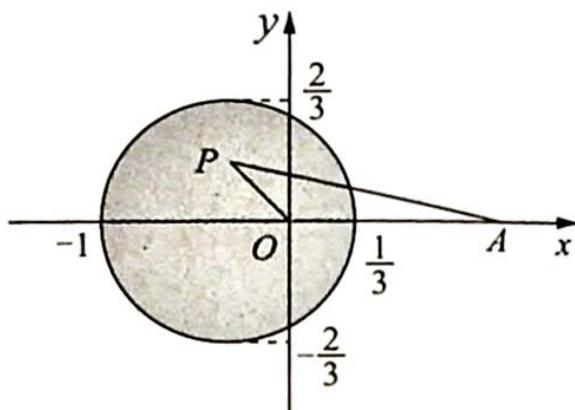

> [!faq]- 《高考数学培优40讲》例题解析
>
> > [!success]- **【答案】** ACD
>
> > [!note]- **【分析】**
> > 本题未单列分析。
>
> > [!note]- **【解析】**
> > 解析 在复平面上设点 $A(1,0)$ , 复数 $z$ 对应的点为 $P$ , 由 $2|z| \leqslant |z-1|$ 的几何意义知, 复数 $z$ 对应的点满足阿波罗尼斯圆的条件. 则经过计算可得点 $P$ 在以 $\left(\frac{1}{3}, 0\right), (-1,0)$ 为直径端点的圆 $\left(x + \frac{1}{3}\right)^2 + y^2 = \frac{4}{9}$ 内部 (包括圆周), 如图所示.
> > 
> > 由图可知, ACD 选项中的说法正确, 而 $|z|$ 的最小值为 0, B 错误.
> >
> > 故选 **ACD**.
