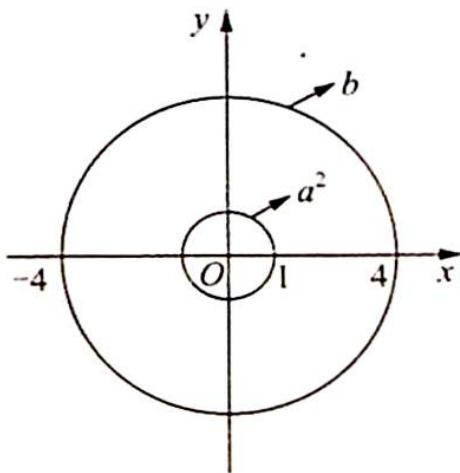

> [!faq]- 《高考数学培优40讲》例题解析
>
> > [!success]- **【答案】** BC
>
> > [!note]- **【分析】**
> > 本题未单列分析。
>
> > [!note]- **【解析】**
> > 解析 ▶ 解法一(复数运算):根据题意可得 $4=|(z+w)^{2}-2zw|\leqslant|z+w|^{2}+2|wz|=1+2|wz|$ ，于是 $|wz|\geqslant\frac{3}{2}$ ，当 z,w 是关于 x 的方程 $x^{2}-x-\frac{3}{2}=0$ 的两根时，有 $z+w=1, z^{2}+w^{2}=4, zw=-\frac{3}{2}$ .
> > 上述不等式可以取得等号,因此 $|wz|$ 有最小值 $\frac{3}{2}$ .
> > 又 $|wz| = \frac{1}{2} |(z + w)^2 - (z^2 + w^2)| \leqslant \frac{1}{2} |z + w|^2 + \frac{1}{2} |z^2 + w^2| = \frac{5}{2}$ , 当 $z, w$ 是关于 $x$ 的方程 $x^2 - x + \frac{5}{2} = 0$ 的两根时, 有 $z + w = 1, z^2 + w^2 = -4, zw = \frac{5}{2}$ .
> > 上述不等式可以取得等号,因此 $|wz|$ 有最大值 $\frac{5}{2}$ .
> > 综上所述,故选 BC.
> > 解法二(直观形象): 令 $\left\{ \begin{array}{l} a = w + z \\ b = w^2 + z^2 \end{array} \right.$ , 得 $|a^2| = 1, |b| = 4$ , 则 $2wz = a^2 - b$ .
> > 
> > 如图所示, 显然 $\left|2wz\right|\in\left[4-1,4+1\right]$ , 所以 $\left|wz\right|\in\left[\frac{3}{2},\frac{5}{2}\right]$ , 故选 BC.
> > 双变量变换的启发来源:直角坐标与极坐标之间的互化.(普通换元的升级版)
