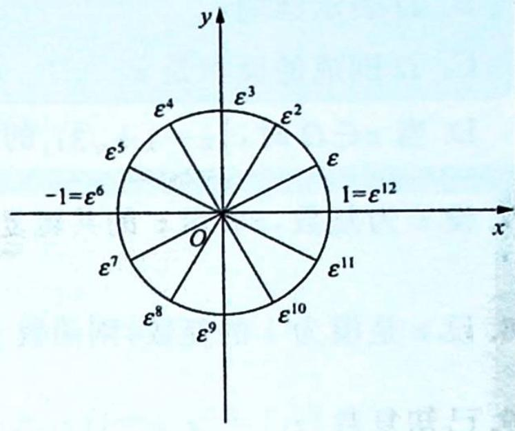

> [!faq]- 《高考数学培优40讲》例题解析
>
> > [!success]- **【答案】** 详见解析
>
> > [!note]- **【分析】**
> > 分析 $\triangleright z^{2m} - 1$ 分解为一次因式的乘积，将互为共轭的根的一次因式合并.
>
> > [!note]- **【解析】**
> > 解析 ▶ 记 $\varepsilon=\cos\frac{2\pi}{n}+\mathrm{i}\sin\frac{2\pi}{n}, n$ 个不同的单位根为 $\varepsilon^{0}=1, \varepsilon, \varepsilon^{2}, \cdots, \varepsilon^{n-1}$ ，则由单位根的性质知 $\varepsilon^{n-k}=\overline{\varepsilon^{k}}, 0 \leqslant k \leqslant n.$
> > $$
> > (z - \varepsilon^ {k}) (z - \varepsilon^ {n - k}) = (z - \varepsilon^ {k}) (z - \overline {{\varepsilon^ {k}}}) = z ^ {2} - z (\varepsilon^ {k} + \overline {{\varepsilon^ {k}}}) + \varepsilon^ {k} \overline {{\varepsilon^ {k}}} = z ^ {2} - 2 z \cos \frac {2 k \pi}{n} + 1.
> > $$
> > 令 $n = 2m$ ，有 $z^{2m} - 1 = (z - 1)(z - \varepsilon)(z - \varepsilon^2)\dots (z - \varepsilon^{m - 1})(z - \varepsilon^m)(z - \varepsilon^{m + 1})\dots (z - \varepsilon^{2m - 1})$ 由于 $\varepsilon^m = -1,z^{2m} - 1 = [(z - 1)(z + 1)][(z - \varepsilon)(z - \varepsilon^{2m - 1})][(z - \varepsilon^2)(z - \varepsilon^{2m - 2})]\dots$ $[ ( z - \varepsilon ^{m - 1})(z - \varepsilon^{m + 1}) ] = (z ^ {2} - 1)\left(z ^ {2} - 2 z \cos \frac {2 \pi}{2 m} +1\right)\dots \left[z ^ {2} - 2 z \cos \frac {2 ( m - 1 )}{2 m}\pi +1\right] = (z ^ {2} -$ 1) $\prod_{k = 1}^{m - 1}\left(z^2 -2z\cos \frac{k\pi}{m} +1\right).$
> > 
> > ## 解后小结
> > ## $n$ 次单位根的直观理解
> > 在单位根问题中,经常用到将互为共轭根合并的思想,可以先举一个特例,方便理解,直观形象,如图所示.
> > $$
> > \begin{array}{r l} z ^ {1 2} - 1 & = (z - 1) (z - \varepsilon) (z - \varepsilon^ {2}) (z - \varepsilon^ {3}) \dots (z - \varepsilon^ {1 1}) \\ & = [ (z - 1) (z - \varepsilon^ {6}) ] [ (z - \varepsilon) (z - \varepsilon^ {1 1}) ] \cdot \\ & [ (z - \varepsilon^ {2}) (z - \varepsilon^ {1 0}) ] [ (z - \varepsilon^ {3}) (z - \varepsilon^ {9}) ] \cdot \\ & [ (z - \varepsilon^ {4}) (z - \varepsilon^ {8}) ] [ (z - \varepsilon^ {5}) (z - \varepsilon^ {7}) ] \\ & = (z ^ {2} - 1) \prod_ {k = 1} ^ {5} \left(z ^ {2} - 2 z \cos \frac {k \pi}{6} + 1\right). \end{array}
> > $$
> > 
