<!-- source-part:1 pages:1-194 -->

# 高考数学 培优40讲

立体几何与概率统计

## 内容简介

《高考数学培优 40 讲》针对高考数学中的重难点内容,分为四个分册:函数与导数;解析几何;三角、向量、数列、不等式与复数;立体几何与概率统计.全套书用高观点的视角、联系变化的眼光分析问题,洞悉问题背后的本质,达到“万理归一,大道至简”的境界.

本书为“立体几何与概率统计”分册,重点从空间与平面、动与静的视角研究立体几何中的截面问题、折叠展开等动态问题以及几何体与球切接的模型. 概率统计部分在常用模型的基础上转化演绎出各样计算、计数、决策等问题. 丰富的方法和技巧贯穿始末,精彩纷呈. 本书适合数学成绩优秀的学生挑战高分甚至满分使用,也适合高中数学教师、高考数学研究者以及广大数学爱好者参考使用.

本书封面贴有清华大学出版社防伪标签、封底贴有刮刮卡，无标签和刮刮卡者不得销售。

版权所有，侵权必究.举报：010-62782989,beiqinquan@tup.tsinghua.edu.cn.

图书在版编目(CIP)数据

高考数学培优 40 讲. 立体几何与概率统计 / 张永辉主编. — 北京: 清华大学出版社, 2023.5
ISBN 978-7-302-63515-4

I. ①高… II. ①张… III. ①中学数学课—高中—升学参考资料 IV. ①G634.603

中国国家版本馆 CIP 数据核字(2023)第 085382 号

责任编辑: 汪 操

封面设计:常雪影

责任校对:王淑云

责任印制: 沈露

出版发行:清华大学出版社
网 址:http://www.tup.com.cn,http://www.wqbook.com
地 址:北京清华大学学研大厦A座 邮 编:100084
社 总 机:010-83470000 邮 购:010-62786544
投稿与读者服务:010-62776969,c-service@tup.tsinghua.edu.cn
质量反馈:010-62772015,zhiliang@tup.tsinghua.edu.cn

印 装 者:三河市龙大印装有限公司
经 销:全国新华书店
开 本:210mm×285mm 印 张:12.25 字 数:257千字
版 次:2023年5月第1版 印 次:2023年5月第1次印刷
定 价:59.00元

# 《高考数学培优 40 讲》编委会

主 编

张永辉

副主编

张宏卫 余臣

## 编 委

彭剑平 章世骏 蒋新峰 高艳山 张喜金 李拴柱

何龙 董家兴 周逸飞 于明辉 孙光磊 黄垠超

袁 志 颜亚冰 张 潇 李明红 赵晓翠 李艳丽

## 前言

《高考数学培优 40 讲》是一套诞生于新高考时代,面向数学培优的教辅作品.

自 2017 年教育部实行新课程标准以来,我国高中数学的教学和考试发生了根本性的变化.新课程标准明确提出将“学科素养”作为培养人、选拔人的最重要指标,无论是教学还是考试都贯穿“基础性、综合性、创新性和应用性”四大特征,这意味着未来的数学考题,将从偏重经验归纳,转向加强思维品质考查,加强考查思维的灵活性,发挥数学学科的高考选拔功能.如何在教学中渗透对数学思维的培养?这对广大教师和学生提出了新的要求.

2019 年起新教材在部分省市被陆续使用. 由于各地教学规划不同, 近几年出现了新教材新高考、老教材老高考、新教材老高考等多种教学现状, 这无疑进一步增加了教学备考的复杂度. 与此同时, 数学高考也从过去的多省市独自命题, 逐步转向教育部统一命题. 随着山东省、江苏省、浙江省等一大批高考强省陆续加入全国卷的队伍, 高考大军竞争异常激烈.

在过去的两年中,我们团队的老师们深入全国10多个省份,陆续为接近100所重点高中作了300多场数学培优讲座.在与广大一线师生的交流中,很多教师最关心的问题就是:“未来高考会怎么考,我们的数学课堂该如何教,高考培优应该讲什么?”由此可见,在新的时代背景下,如何能组织好教学过程,真正的培养出国家需要的人才让学生具备较高的数学素养进而在高考中脱颖而出,成为了最核心的问题.

这套书最大的亮点就是完全出自教学实践。由于我们的课程是面向数学功底较好的学生开展进行，所以在300多场讲座中经历了无数次教师和学生之间、学生和学生之间的思想交锋。甚至在一些互动交流过程中，出现了学生和老师分成不同阵营，相互辩论的场面。而每一次的交流辩论都让我们更加接近数学解题的本质，更加明白数学培优课程应该讲什么、怎么讲。所以书中的内容既包含了团队老师的辛勤付出，也包含了很多一线教师和数学尖子生的集体智慧。综上所述，本套图书的内容不是一蹴而就的，它经历了原创研发——教学实践——反思优化，再教学实践——反思优化……这样一个又一个的轮回，在这样螺旋式上升的迭代过程中，内容的质量与实用性都达到了我们前所未有的高度。

本套图书的另一大亮点便是其深邃的思想性,主要体现在以下几个方面:

1. 启迪智慧, 知所以然

好的教育永远都不是告知,而是启发引导.在本套讲义的编写过程中充分尊重了这一规律,例如通过分而治之的策略拆分函数实现不等式证明时,我们没有止步于题目本身的解答,而是设置了一系列的问题进行反思,甚至陪同读者一起走过错路与弯路,在知识的探索与内化过程中,这些都是必经之路,通过抛出一系列的问题,引导学生的思维步步深入,达到知其然也知其所以然的境界.

## 2. 深入本质, 返璞归真

比勤奋更重要的是深度思考的能力,在纷繁复杂的题目背后抽丝剥茧或追本溯源以接近问题的本质,这是数学精神,也是在书中带领并帮助读者习得的一项能力.例如在解析几何的开篇,讲义一针见血地点明了数与形的辩证关系,即以形助数和以数化形,抓住这一本源如同获取一把钥匙.大道至简,衍化至繁,本套图书一直在通往“道”的层面上前进不息.

## 3. 引申触类, 远见卓识

在学习过程中,有纵向的“深”与横向的“伸”两个维度,本书兼顾这两个维度并加以挖掘和拓展.在许多例题后面设置了探究总结等版块,引申出了更多的定理与推论,它们将带领读者进入一个更广阔的领域.

## 4. 高数视角, 知己知彼

会当凌绝顶,一览众山小.当我们身处高一级的层面,再反观原有的层面时,我们会发现问题的布局或背景等原来看不到的事物.本书中有的内容,例如泰勒展开、极点极线等专题就是在高等数学的视角下来俯视问题,进入命题人的思维,这样真是知己知彼,百战不殆.

《高考数学培优 40 讲》共含《函数与导数》《解析几何》《三角、向量、数列、不等式与复数》以及《立体几何与概率统计》四本分册。从初稿到出版，我们不断在教学实践中调整、完善，历经了四个版本的迭代，积极采纳各方意见，数易其稿。同时，为了满足部分尖子生的学习需要，我们在内容编写的过程中，有选择的加入了一定比例的清北强基考试题目。这部分题目与高考题目相结合，呈现出更加完整且富于变化的知识体系，对培养数学思维能力和综合能力大有裨益。

在本书的创作过程中,团队的老师们付出了很多,感谢张宏卫、余臣、孙光磊、李艳丽、张潇等各位老师的不懈努力,也感谢清华大学出版社给予的大力支持.

路漫漫其修远兮，吾将上下而求索。

在追求教学创新和培优精进的道路上,注定没有尽头.限于编写水平有限,书中错漏难免.欢迎各位读者帮我们纠正错误,我们也将在后续版本中不断修订、调整.

张永辉

2023年3月

## 目录

第34讲 立体几何中的截面及空间轨迹问题 …… 1
34.1 截面问题 …… 2
34.2 空间轨迹问题 …… 7
训练 34 …… 20

第35讲 立体几何中的折展问题及空间动态最值问题 …… 22
35.1 折叠问题 …… 23
35.2 展开问题 …… 26
35.3 动态几何量的变化趋势 …… 30
训练 35 …… 36

第36讲 球体及几何体模型应用 …… 38
柱体外接球问题 …… 39
36.1 长方体模型 …… 39
36.2 汉堡模型 …… 40
锥体外接球问题 …… 41
36.3 墙角模型 …… 41
36.4 对棱相等模型 …… 42
36.5 切瓜模型 …… 43
36.6 垂面模型 …… 45
36.7 折叠问题 …… 46
内切球问题 …… 49
36.8 内切球相关量的计算 …… 49
几何体模型应用问题 …… 51
36.9 几何体模型的应用 …… 51
训练 36 …… 57

第37讲 四大计数原理的应用 …… 58
加法原理与乘法原理 …… 59
37.1 代数计数 …… 59

37.2 几何计数 …… 63
37.3 涂色问题 …… 65
容斥原理 …… 68
37.4 客斥原理的应用 …… 69
37.5 筛法公式的应用 …… 70
抽屉原理 …… 72
37.6 代数问题 …… 75
37.7 同色三角形模型 …… 78
训练 37 …… 81
第38讲 排列组合中的转化与化归思想 …… 83
38.1 错位排列 …… 84
38.2 圆排列与项链排列 …… 88
38.3 相异元素的可重组合 …… 92
训练 38 …… 99
第39讲 概率统计中的决策问题 …… 101
39.1 小概率事件原理 …… 102
39.2 依据概率、期望、方差决策 …… 105
39.3 正态分布决策 …… 113
39.4 构造新统计量做出决策 …… 116
39.5 比赛中的决策问题 …… 119
训练 39 …… 123
第40讲 概率统计核心概念与数学建模思想在高考中的应用 …… 129
概率统计中的核心概念和性质 …… 130
40.1 通过严谨量化判断独立性 …… 130
40.2 条件概率的计算 …… 132
40.3 事件互斥性的判断 …… 137
40.4 等可能性的深度理解 …… 139
40.5 抽样方法与数字特征 …… 143
概率中的数学建模思想 …… 148
40.6 概率中的函数思想 …… 148
40.7 概率中的数列思想 …… 155
训练 40 …… 163
参考答案 …… 166

![[高中/总复习/专题/高考数学培优40讲/高考数学培优40讲-04-立体几何与概率统计/第34讲_立体几何中的截面及空间轨迹问题/第34讲_立体几何中的截面及空间轨迹问题.md]]
![[高中/总复习/专题/高考数学培优40讲/高考数学培优40讲-04-立体几何与概率统计/第35讲_立体几何中的折展问题及空间动态最值问题/第35讲_立体几何中的折展问题及空间动态最值问题.md]]
![[高中/总复习/专题/高考数学培优40讲/高考数学培优40讲-04-立体几何与概率统计/第36讲_球体及几何体模型应用/第36讲_球体及几何体模型应用.md]]
![[高中/总复习/专题/高考数学培优40讲/高考数学培优40讲-04-立体几何与概率统计/第37讲_四大计数原理的应用/第37讲_四大计数原理的应用.md]]
![[高中/总复习/专题/高考数学培优40讲/高考数学培优40讲-04-立体几何与概率统计/第38讲_排列组合中的转化与化归思想/第38讲_排列组合中的转化与化归思想.md]]
![[高中/总复习/专题/高考数学培优40讲/高考数学培优40讲-04-立体几何与概率统计/第39讲_概率统计中的决策问题/第39讲_概率统计中的决策问题.md]]
![[高中/总复习/专题/高考数学培优40讲/高考数学培优40讲-04-立体几何与概率统计/第40讲_概率统计核心概念与数学建模思想在高考中的应用/第40讲_概率统计核心概念与数学建模思想在高考中的应用.md]]
![[高中/总复习/专题/高考数学培优40讲/高考数学培优40讲-04-立体几何与概率统计/参考答案/参考答案.md]]

## 训练 34

1.【解析】由题意将直三棱柱 $ABC-A_{1}B_{1}C_{1}$ 补成一个直四棱柱 $ABNC-A_{1}B_{1}MC_{1}$ ，如图所示，取 $B_{1}M$ 中点 H，

连接 BH, 显然 $BH \parallel AE$ ; 取 $B_{1}H$ 中点 F, 连接 DF, 则 $DF \parallel BH \parallel AE$ , 所以 A, D, F, E 四点共平面.

连接 EF 与 $B_{1}C_{1}$ 的交点为 G，连接 DG，所以过点 A, D, F, E 的截面与三棱柱的侧面 $BCC_{1}B_{1}$ 的交线为 DG，因为 $\triangle B_{1}FG \sim \triangle C_{1}EG$ ，且 $B_{1}F = \frac{1}{2}EC_{1}$ ，所以点 G 为线段 $B_{1}C_{1}$ 的靠近 $B_{1}$ 的三等分点，因为 $B_{1}C_{1} = 2$ ，所以 $B_{1}G = \frac{2}{3}$ ，又 D 为 $BB_{1}$

中点，所以 $DB_{1} = 1$ ，因为 $BB_{1}\bot$ 平面 $A_{1}B_{1}C_{1}$ ，所以 $BB_{1}\bot B_{1}C_{1}$ ，则 $DG = \sqrt{1 + \left(\frac{2}{3}\right)^2} = \frac{\sqrt{13}}{3}$

2.【分析】过点 M 作平面 PAC 的垂面有无数个,但与平面 PAC 交线段长为 2 的只有 3 种情况,即平面 $\alpha$ 与平面 PAC 的交线段恰好为 $\triangle PAC$ 中线过重心 M 的垂线.

【解析】①当 $\alpha \parallel AC$ 时，设截面 $\alpha$ 为正方形 $A_{1}B_{1}C_{1}D_{1}$ ，则 $A_{1}C_{1}=2$ 。如图 1 所示，此时，该正方形边长为 $\sqrt{2}$ ，面积为 2。

②由对称性知, 当 $\alpha // PA$ 或 $\alpha // PC$ 时, 截面 $\alpha$ 的面积一样大. 如图2所示, 此时截面 $\alpha$ 为五边形 $QGHEF$ , 因为 $\frac{ON}{NC} = \frac{DE}{EC} = \frac{1}{2}$ , 所以 $\frac{EF}{PC} = \frac{DE}{DC} = \frac{1}{3}$ , 故 $EF = \frac{1}{3} PC = 1$ , 如图3所示, $S = S_{\text{矩形 } EFGH} + S_{\triangle QGF} = 1 \times 2 + \frac{1}{2} \times 2 \times 1 = 3$ .

综上所述，①③符合题意.

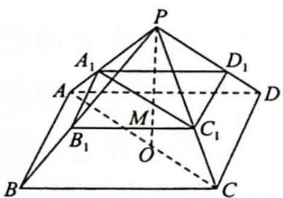
图1

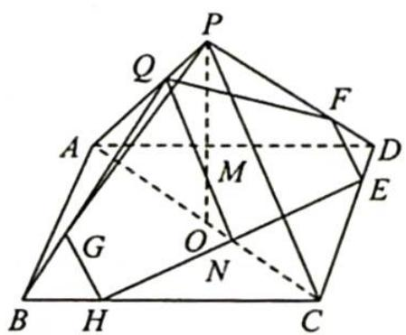
图 2

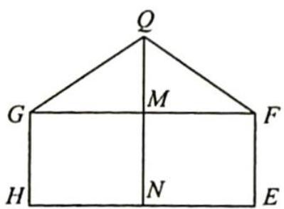
图 3

3.【分析】本题涉及动点 P 对应的截面变化,可以从特殊位置入手,再推广到一般情况.

【解析】由 $P \in BC_{1}$ 得 $PD \subset$ 平面 $BC_{1}D$ ，易知 $A_{1}C \perp$ 平面 $BC_{1}D$ ，故 $A_{1}C \subset$ 平面 $\alpha$ .

找两个特例, ①当 $P$ 与 $B$ 重合, $AC \perp BD$ , 则平面 $\alpha$ 即为平面 $ACC_{1}A_{1}$ ; ②当 $P$ 与 $C_{1}$ 重合, $CD_{1} \perp C_{1}D$ , 则平

面 $\alpha$ 即为平面 $BCD_{1}A_{1}$ ; 此时, $\alpha$ 的面积为 $\sqrt{2}$ .

再选一特例:③如图所示,当 P 为 $BC_{1}$ 的中点,取 $AB, C_{1}D_{1}$ 的中点为 M, N, 则 $PD \perp$ 平面 $A_{1}MCN$ , 此时,平面 $\alpha$ 即为平面 $A_{1}MCN$ , 易知 $\alpha$ 的面积为 $\frac{\sqrt{6}}{2}$ .

结合选项及图形变化, 易知点 $P$ 从 $B$ 到 $C_{1}$ 移动的过程, 截面 $\alpha$ 是从矩形 $ACC_{1}A_{1}$ 到平行四边形 $A_{1}MCN$ , 再到矩形 $BCD_{1}A_{1}$ 的变化过程, 由对称性易知截面 $\alpha$ 面积最小值为 $\frac{\sqrt{6}}{2}$ . 故选 C.

【评注】由分析知截面 $\alpha$ 是平行四边形 $A_{1}MCN$ ，且 $M \in AB, N \in C_{1}D_{1}$ ，则平行四边

形 $A_{1}MCN$ 即为所求. 所以截面 $\alpha$ 的面积 $S = S_{\triangle MA_1C} + S_{\triangle NA_1C}$ . 设 $M$ 到 $A_{1}C$ 的距离为 $d$ , 则 $S = 2 \times \frac{1}{2} \times |A_{1}C| \cdot d = \sqrt{3} d$ . 当 $P$ 在 $BC_{1}$ 上移动, $M$ 在 $AB$ 上移动, 故 $d$ 的最小值即为异面直线 $A_{1}C$ 与 $AB$ 间的距离, 所以 $d_{\min} = \frac{\sqrt{2}}{2}$ , 则 $S = \frac{\sqrt{6}}{2}$ . 故选 C.

4.【分析】首先要作出截面,得到四棱锥 $A_{1}-EFGH$ 的底面与高的函数表示,进而求解相关函数的最值.

【解析】如图所示，连接 $A_{1}C_{1}, BD$ ，设截面为 $\alpha$ ，则 $\alpha // A_{1}C_{1}, \alpha // BD$ ，故 $EF // GH // BD, FG // EH // A_{1}C_{1}$ 因为正方体 $ABCD - A_{1}B_{1}C_{1}D_{1}$ 的棱长为3，所以 $A_{1}C_{1} = BD = 3\sqrt{2}$ 设点 $A_{1}$ 到平面 $\alpha$ 的距离 $h = 3x$ ，即 $\frac{h}{3} = x, x \in (0,1)$ ，则在 $\triangle A_{1}BD$ 中， $\frac{EF}{BD} = x$ ，所以 $EF = 3\sqrt{2}x$ ；在 $\triangle A_{1}BC_{1}$ 中， $\frac{FG}{A_{1}C_{1}} = 1 - x$ ，所以 $FG = 3\sqrt{2}(1 - x)$ 。

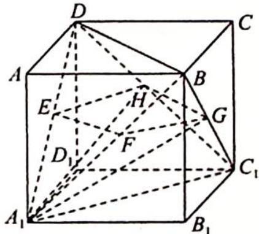

所以四棱锥 $A_{1} - EFGH$ 的体积为 $f(x) = \frac{1}{3} S_{EFGH} \cdot h = \frac{1}{3} \times 3\sqrt{2} x \cdot 3\sqrt{2}(1 - x) \cdot 3x = 18x^{2}(1 - x) = -18x^{3} + 18x^{2}, x \in (0,1)$ , $f'(x) = -54x^{2} + 36x$ , 令 $f'(x) = 0$ , 解得 $x = \frac{2}{3}$ , 所以 $f(x)$ 在 $\left(0, \frac{2}{3}\right)$ 上单调递增, 在 $\left(\frac{2}{3}, 1\right)$ 上单调递减.

则当 $x = \frac{2}{3}$ 时， $f(x)$ 有最大值为 $f\left(\frac{2}{3}\right) = 18 \times \left(\frac{2}{3}\right)^2 \times \frac{1}{3} = \frac{8}{3}$ ，即四棱锥 $A_1 - EFGH$ 的体积的最大值为 $\frac{8}{3}$ .

5.【解析】因为 $AD \perp$ 平面 PAB, $AD \subset$ 平面 ABCD, 所以平面 $PAB \perp$ 平面 ABCD, 故动点 P 在过 AB 且与平面 ABCD 垂直的平面内.

因为 $AD \perp$ 平面 PAB, BC ⊥ 平面 PAB, 所以 $AD \parallel BC$ , 且 $\angle CBP = \angle DAP = 90^{\circ}$ , 又 $\angle APD = \angle CPB$ , 故 $\triangle CBP \sim \triangle DAP$ , 则 $\frac{PA}{PB} = \frac{AD}{BC} = \frac{1}{2}$ .

在平面 PAB 内, 以 AB 所在直线为 x 轴, AB 的中点为坐标原点, 建立如图所示的直角坐标系, 则 A(-3,0), B(3,0).

设 $P(x, y)$ , 则 $\frac{\sqrt{(x + 3)^2 + y^2}}{\sqrt{(x - 3)^2 + y^2}} = \frac{1}{2}$ , 化简得 $x^2 + y^2 + 10x + 9 = 0$ , 注意到点 $P$ 不在直线 $AB$ 上, 因为点 $P$ 的轨迹方程为 $x^2 + y^2 + 10x + 9 = 0 (y \neq 0)$ , 所以点的轨迹为一个不完整的圆, 故选 B.

【评注】本题为选择题,当得到 $\frac{PA}{PB} = \frac{1}{2}$ 以后就可以根据“阿波罗尼斯圆”定义得到轨迹为圆的一部分.

6.【分析】本题可看作以 P 为球心,5 为半径的球与底面 ABC 的截面面积的求解.

【解析】如图所示, 设顶点 $P$ 在底面上的投影为 $O$ , 连接 $BO$ , 则 $O$ 为三角形 $ABC$ 的中心, 且 $BO = \frac{2}{3} \times 6 \times \frac{\sqrt{3}}{2} = 2\sqrt{3}$ , 故 $PO = \sqrt{36 - 12} = 2\sqrt{6}$ . 因为 $PQ = 5$ , 故 $OQ = 1$ , 而 $\triangle ABC$ 内切圆的圆心为 $O$ , 半径为 $\sqrt{3} > 1$ , 所以 $T$ 表示的区域为以 $O$ 为圆心, 1 为半径的圆及其内部, 则其面积为 $\pi$ . 故选 B.

7.【分析】画出轴截面的图像. 根据选项可判断出①正确; 解直角三角形计算出 AO 的

长以及长轴 $AB$ 的长, 由此可判断出②正确, 排除 D 选项; 由于曲线是连续不断的, 故任意两点间没有最短距离, 故③错误, 排除 B, C 选项; 由此得出正确结论.

【解析】根据截面性质可知①正确,即曲线形状为椭圆.

画出轴截面的图像如图1所示,由于 $\angle AMO=\angle BMO=30^{\circ},MA\perp AB,MO=1$ ,所以 $AO=\frac{1}{2}MO=\frac{1}{2},\angle OMB=\angle OBM=30^{\circ}$ ,即 $BO=MO=1$ ,所以 $\frac{AO}{BO}=\frac{1}{2}$ ,而曲线上任意两点之间的最长距离为 $AB$ ,故点 $O$ 为该曲线上任意两点之间最长距离的三等分点,由此可判断出②正确,排除D选项.

图1

由于曲线是连续不断的,故任意两点间没有最短距离,③错误,排除 B,C 选项.

由②可知 $AB = \frac{1}{2} + 1 = \frac{3}{2}$ , 如图2所示, 设 $AB$ 中点为 $O_{1}, AO_{1} = \frac{3}{4}, OO_{1} = \frac{3}{4} - \frac{1}{2} = \frac{1}{4}$ .

在椭圆平面上, 过 $O_{1}$ 作 $CD \perp AB$ 交圆锥的母线于点 $C, D$ , 过 $O_{1}, C, D$ 作垂直于 $MO$ 的平面交 $MO$ 于点 $O_{2}, O_{1}O_{2} = OO_{1}\cos 30^{\circ} = \frac{\sqrt{3}}{8}, OO_{2} = OO_{1}\sin 30^{\circ} = \frac{1}{8}, O_{2}C = MO_{2} \cdot \tan 30^{\circ} = (MO + OO_{2})\tan 30^{\circ} = \left(1 + \frac{1}{8}\right) \cdot \frac{\sqrt{3}}{3} = \frac{3\sqrt{3}}{8}$ .

由勾股定理得 $O_{1}C = \sqrt{O_{2}C^{2} - O_{1}O_{2}^{2}} = \sqrt{\left(\frac{3\sqrt{3}}{8}\right)^{2} - \left(\frac{\sqrt{3}}{8}\right)^{2}} = \frac{\sqrt{6}}{4}\cdot CD = 2O_{1}C = \frac{\sqrt{6}}{2},$

所以在椭圆中， $2a = AB = \frac{3}{2}, 2b = CD = \frac{\sqrt{6}}{2}$ ，则 $a = \frac{3}{4}, b = \frac{\sqrt{6}}{4}$ .

图 2

所以离心率 $e = \frac{c}{a} = \frac{\sqrt{a^2 - b^2}}{a} = \frac{\sqrt{3}}{3}$ , 故④正确. 故选 A.

【评注】“Dandelin 双球模型”椭圆离心率等于截面与轴的夹角的余弦 $\cos\beta$ 与圆锥母线与轴的夹角的余弦 $\cos\alpha$ 之比, 即 $e=\frac{\cos\beta}{\cos\alpha}=\frac{\sqrt{3}}{3}$ .

8.【解析】如图1所示,平面 $\alpha$ 与正方体表面相交形成的多边形为三角形或六边形.

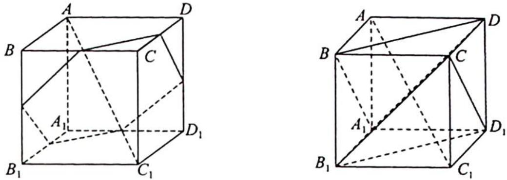
图1

平面 ABCD 与平面 $\alpha$ 的夹角的余弦值为 $\frac{\sqrt{3}}{3}$ ，所以平面 ABCD 与平面 $\alpha$ 的夹角为定值。
M 的面积在例 34.4 中已分析，当且仅当 O 为对角线 $AC_{1}$ 的中点时，M 的面积最大.

M 的周长: 当 O 点位于正方体的体对角线 $AC_{1}$ 的两个三等分点之间时, 截面 M 的周长保持不变.

如图 2 所示, 将侧面 ABCD 和 $BCC_{1}B_{1}$ 沿 BC 展开, 因为 $MS \parallel BD, MN \parallel B_{1}C$ , 且 $BD \parallel B_{1}C$ , 所以 S, M, N 三点共线, $NS = MS + MN = \sqrt{2}$ (正方形对角线的长度).

同理: $PN + PQ = \sqrt{2}, QR + RS = \sqrt{2}$ , 因此, 当截面 $M$ 为六边形时, 其周长保持不变.

综上所述,故选 C.

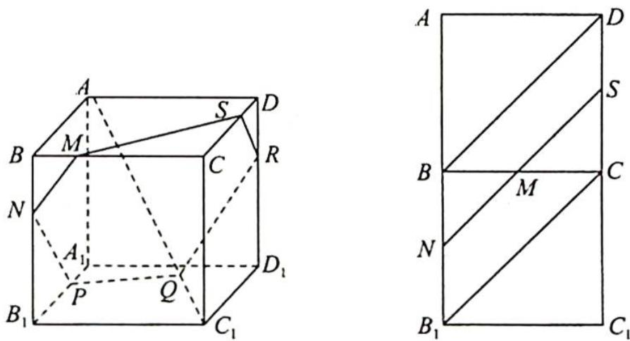
图2

9.【分析】思路一(向量法): 建立空间直角坐标系, 用三角函数表示点的坐标, 转化为三角函数的最值问题.
思路二(几何法): 把 $\triangle P_{1}P_{2}P_{3}$ 看作该正方体的棱切球的某截面圆的内接三角形, 而圆的内接三角形周长最大值在其为等边三角形时取得.

【解析】解法一(向量法):以正方体的中心 $O_{1}$ 为原点, $\overrightarrow{DA}, \overrightarrow{DC}, \overrightarrow{DH}$ 的方向分别为 x 轴、y 轴、z 轴的正方向, 建立空间直角坐标系 $O_{1}-xyz$ .

根据条件, 可设 $P_{1}(1, \cos \alpha_{1}, \sin \alpha_{1}), P_{2}(\sin \alpha_{2}, 1, \cos \alpha_{2}), P_{3}(\cos \alpha_{3}, \sin \alpha_{3}, 1)$ , 约定 $P_{4} = P_{1}, \alpha_{4} = \alpha_{1}$ , 记 $d_{i} = |P_{i}P_{i+1}| (i = 1, 2, 3)$ , 则 $d_{i}^{2} = (1 - \sin \alpha_{i+1})^{2} + (1 - \cos \alpha_{i})^{2} + (\sin \alpha_{i} - \cos \alpha_{i+1})^{2}$ ①. 记 $f = |P_{1}P_{2}| + |P_{2}P_{3}| + |P_{3}P_{1}|$ .

先求 f 的最小值: 对 i = 1, 2, 3, 根据式①与平均值不等式得 $d_{i}^{2} \geqslant (1 - \sin \alpha_{i+1})^{2} +$

$(1 - \cos \alpha_{i})^{2} \geqslant \frac{1}{2} ((1 - \sin \alpha_{i+1}) + (1 - \cos \alpha_{i}))^{2}$ , 故 $d_{i} \geqslant \frac{\sqrt{2}}{2} (2 - \sin \alpha_{i+1} - \cos \alpha_{i})$ . 于是 $f = d_{1} + d_{2} + d_{3} \geqslant \frac{\sqrt{2}}{2} \sum_{i=1}^{3} (2 - \sin \alpha_{i+1} - \cos \alpha_{i}) = 3\sqrt{2} - \frac{\sqrt{2}}{2} \sum_{i=1}^{3} (\sin \alpha_{i} + \cos \alpha_{i}) = 3\sqrt{2} - \sum_{i=1}^{3} \sin (\alpha_{i} + \frac{\pi}{4}) \geqslant 3\sqrt{2} - 3$ .

当 $\alpha_{i} = \frac{\pi}{4} (i = 1,2,3)$ 时， $f$ 可取到最小值 $3\sqrt{2} - 3$ .

再求 $f$ 的最大值: 由式①知 $d_{i}^{2} = 4 - 2\cos \alpha_{i} - 2\sin \alpha_{i + 1} - 2\sin \alpha_{i}\cos \alpha_{i + 1}$ , 注意到 $\sin \alpha_{i} \geqslant -1, \cos \alpha_{i} \geqslant -1 (i = 1, 2,3)$ , 有

$$
\begin{array}{r l} \sum_ {i = 1} ^ {3} d _ {i} ^ {2} & = 1 2 - 2 \left(\sum_ {i = 1} ^ {3} \sin \alpha_ {i + 1} + \sum_ {i = 1} ^ {3} \cos \alpha_ {i} + \sum_ {i = 1} ^ {3} \sin \alpha_ {i} \cos \alpha_ {i + 1}\right) \\ & = 1 2 - 2 \left(\sum_ {i = 1} ^ {3} \sin \alpha_ {i} + \sum_ {i = 1} ^ {3} \cos \alpha_ {i + 1} + \sum_ {i = 1} ^ {3} \sin \alpha_ {i} \cos \alpha_ {i + 1}\right) \\ & = 1 8 - 2 \sum_ {i = 1} ^ {3} (1 + \sin \alpha_ {i}) (1 + \cos \alpha_ {i + 1}) \leqslant 1 8. \end{array}
$$

由柯西不等式知 $f^2 \leqslant 3(d_1^2 + d_2^2 + d_3^2) = 54$ ，故 $f \leqslant 3\sqrt{6}$ ，当 $\alpha_i = \frac{3\pi}{2}$ 或者 $\alpha_i = \pi (i = 1, 2, 3)$ 时， $f$ 可取到最大值 $3\sqrt{6}$ 。综上所述， $f$ 的最小值为 $3\sqrt{2} - 3$ ，最大值为 $3\sqrt{6}$ 。

解法二(几何法):由题意可知, $P_{1},P_{2},P_{3}$ 三点所在圆恰好是正方体三个侧面与其棱切球的球面形成的截面圆,故 $\left|P_{1}P_{2}\right|+\left|P_{2}P_{3}\right|+\left|P_{3}P_{1}\right|$ 可看作是正方体的棱切球的球面上三点的距离和.(需满足一定条件)又因为不共线三点确定一个平面,所以 $\triangle P_{1}P_{2}P_{3}$ 可看作该正方体某截面圆的内接三角形.

①由“圆的内接三角形为等边三角形时周长最大”知， $|P_{1}P_{2}| + |P_{2}P_{3}| + |P_{3}P_{1}|$ 的最大值为 $2R\sin \frac{\pi}{3}\cdot$ $3 = 3\sqrt{3} R = 3\sqrt{3}\times \frac{\sqrt{2}}{2} a = 3\sqrt{6}$ （ $R$ 为正方体棱切球半径， $a$ 为正方体棱长）.

②由球体的性质得 $R^2 = r^2 + d^2$ ( $R$ 为球的半径, $r$ 为截面小圆的半径, $d$ 为球心到截面圆的距离)再结合图形知, 当截面垂直体对角线 $DF$ 时, 有最小半径的截面圆, 由动态变化可得当截面 $\alpha //$ 平面 $EGB$ , 且与正方体三条侧棱交点分别为 $M, N, Q$ 时, 如图所示, $MN$ 与圆相切于 $P_1'$ , $NQ$ 与圆相切于 $P_2'$ , $MQ$ 与圆相切于 $P_3'$ , 此时 $|P_1' P_2'| = |P_2' P_3'| = |P_3' P_1'| = \sqrt{2} - 1$ , 恰好也是 $|P_1 P_2| + |P_2 P_3| + |P_3 P_1|$ 的最小值 $3\sqrt{2} - 3$ . 综上所述, $|P_1 P_2| + |P_2 P_3| + |P_3 P_1|$ 的最大值为 $3\sqrt{6}$ , 最小值为 $3\sqrt{2} - 3$ .

【评注】1. 解法一注意以下几点: ①点 $P_{2}$ 的坐标; ② $P_{4} = P_{1}$ ; ③三角函数有界性放缩; ④均值不等式放缩; ⑤柯西不等式放缩.

2. 用几何法求解此题时, 求最大值是没有问题的, 但在求最小值时有个问题: 因为圆虽是最小的截面圆, 但此最小圆的内接三角形, 周长是最大的三角形. 因此在求最小值时是不严谨的, 但此方法仍不失为一个简洁的求解途径.

## 圆的内接三角形周长何时最大

证明圆的内接三角形周长最大值在其为等边三角形时取得.

证明:如图所示,设 $\triangle ABC$ 的外接圆圆心为O,半径为R,内角A,B,C所对边分别为a,b,c.

周长 $L = a + b + c = 2R(\sin A + \sin B + \sin C) \leqslant 2R \cdot 3\sin \frac{A + B + C}{3} = 2R \cdot \frac{3\sqrt{3}}{2} = 3\sqrt{3} R.$

当且仅当 $A = B = C = \frac{\pi}{3}$ 时取等号.（此为琴生不等式，用到函数凹凸性）

另证: 在 $\triangle ABC$ 中, $A+B+C=\pi$ .

$$
\begin{array}{r l} {\sin A + \sin B + \sin C} & {= 2 \sin \frac {A + B}{2} \cos \frac {A - B}{2} + 2 \sin \frac {A + B}{2} \cos \frac {A + B}{2}} \\ & {\leqslant 2 \sin \frac {A + B}{2} \left(1 + \cos \frac {A + B}{2}\right) (\cos \frac {A - B}{2} \leqslant 1, \text {有界性放缩})} \\ & {= 2 \cos \frac {C}{2} \left(1 + \sin \frac {C}{2}\right)} \\ & {= 2 \sqrt {1 - \sin^ {2} \frac {C}{2}} \left(1 + \sin \frac {C}{2}\right)} \\ & {= 2 \sqrt {\left(1 - \sin \frac {C}{2}\right) \left(1 + \sin \frac {C}{2}\right) ^ {3}}} \\ & {= 2 \sqrt {2 7 \left(1 - \sin \frac {C}{2}\right) \left(\frac {1 + \sin \frac {C}{2}}{3}\right) ^ {3}} (\text {四维均值不等式，可求导})} \\ & {\leqslant 6 \sqrt {3} \sqrt {\left[ \frac {1 - \sin \frac {C}{2} + 1 + \sin \frac {C}{2}}{4} \right] ^ {4}}} \\ & {= 6 \sqrt {3} \cdot \sqrt {\left(\frac {2}{4}\right) ^ {4}} = 6 \sqrt {3} \times \frac {1}{4} = \frac {3 \sqrt {3}}{2}.} \end{array}
$$

当且仅当 $\left\{\begin{aligned}\cos\frac{A-B}{2}&=1\\ 1-\sin\frac{C}{2}&=\frac{1+\sin\frac{C}{2}}{3}\end{aligned}\right.$ ，即 $A=B=C=\frac{\pi}{3}$ 时取等号.

故圆的内接三角形周长最大时,三角形为等边三角形.

## 训练 35

1.【解析】如图所示, $AE \perp BD$ , $CF \perp BD$ ,依题意可得 AB=1, $BC=\sqrt{2}$ , $AE=CF=\frac{\sqrt{6}}{3}$ , $BE=EF=FD=\frac{\sqrt{3}}{3}$ .

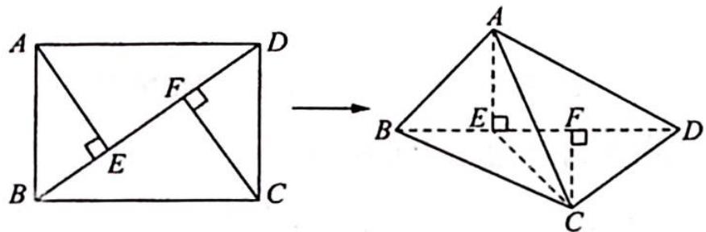

A 选项: 若存在某个位置, 使得直线 $AC$ 与直线 $BD$ 垂直, 则因为 $BD \perp AE$ , 所以 $BD \perp$ 平面 $AEC$ , 从而 $BD \perp EC$ , 这与已知矛盾, A 选项错误.
B 选项: 若存在某个位置, 使得直线 $AB$ 与直线 $CD$ 垂直, 则 $CD \perp$ 平面 $ABC$ , 平面 $ABC \perp$ 平面 $BCD$ ; 取 $BC$ 中点 $M$ , 连接 $ME$ , 则 $ME \perp BD$ , 所以 $\angle AEM$ 就是二面角 $A-BD-C$ 的平面角, 此角显然存在, 即当 $A$ 在底面上的射影位于 $BC$ 的中点时, 直线 $AB$ 与直线 $CD$ 垂直, 故 B 选项正确.
C 选项: 若存在某个位置, 使得直线 $AD$ 与直线 $BC$ 垂直, 则 $BC \perp$ 平面 $ACD$ , 从而平面 $ACD \perp$ 平面 $BCD$ , 即 $A$ 在底面 $BCD$ 上的射影应位于线段 $CD$ 上, 这是不可能的, C 选项错误.
D 选项: 由上所述, D 选项错误.
综上所述, 故选 B.

2.【解析】要求 $AM + MN$ 最小, 将 $AMN$ 翻折到共面, 即求 $AN$ 最小, 先固定 $MN$ 位置, 可知当 $MN \perp$ 平面 $PCE$ 时最短. 如图1所示, 过 $D$ 作 $DF \perp CE$ , 可证 $DF \perp$ 平面 $PCE$ , 所以 $\angle DFP = 90^\circ$ , 将平面 $PDF$ 沿 $PD$ 翻折, 与平面 $PAD$ 共面, 如图2所示, 此时即求 $A$ 到直线 $PF$ 的距离即可.

易知 $PD = 1, DF = \frac{1}{2}$ , 则 $\sin \angle DPF = \frac{1}{2}$ , 所以 $\angle DPF = 30^\circ$ , 且 $\angle DPA = 45^\circ$ , 所以 $\angle APN = 45^\circ + 30^\circ = 75^\circ$ , 可得 $\sin 75^\circ = \frac{\sqrt{6} + \sqrt{2}}{4}$ .

故 $(AM + MN)_{\min} = AN = PA \cdot \sin 75^\circ = \frac{\sqrt{3} + 1}{2}$ . 故选B.

【评注】先找到应该以哪条线进行翻折, 得到 $AM + MN$ 最小值是 $AN$ , 找到角度即可解题.

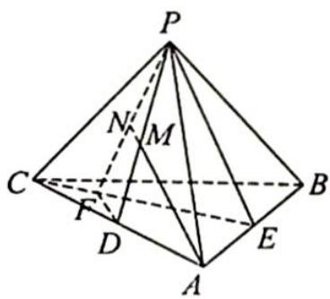
图1

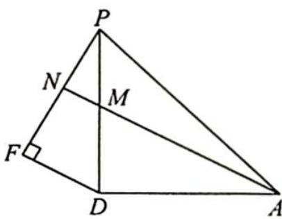
图 2

3.【解析】①: 因为平面 AEFG 分别与平面 $ABB_{1}A_{1}$ ，平面 $ADD_{1}A_{1}$ ，平面 $CDD_{1}C_{1}$ ，平面 $BCC_{1}B_{1}$ 交于 AE，AG，FG，EF，易知平面 $ABB_{1}A_{1} \parallel$ 平面 $DCC_{1}D_{1}$ ，则 $AE \parallel FG$ ，同理 $EF \parallel AG$ ，所以四边形 AGFE 为平行四边形，故①正确.

②: 以 A 为原点, AB, AD, $AA_{1}$ 为 x, y, z 轴, 建立空间直角坐标系, 如图所示, G 在平面 $BCC_{1}B_{1}$ 上的投影点为 H, F, G 在平面 $ABB_{1}A_{1}$ 上的投影点为 I, J.

设 BE = a, CF = b, DG = c, 其中 $0 \leqslant a, b, c \leqslant 1$ , 则 $E(1,0,a), F(1,1,b), G(0,1,c), A(0,0,0)$ , 所以 $\overrightarrow{AE} = (1,0,a), \overrightarrow{GF} = (1,0,b-c)$ , 由 $\overrightarrow{AE} = \overrightarrow{GF} \Rightarrow b = a + c$ , 则 $\left\{\begin{aligned}&0 \leqslant a \leqslant 1 \\&0 \leqslant a + c \leqslant 1\end{aligned}\right.$ 易得 $S_{1} = BE \cdot BC = BE = a, S_{2} = AB \cdot AJ = c$ , 所以 $S_{1} + S_{2} = a + 0 \leqslant c \leqslant 1$

$c=b\leqslant1$ , 故②错误.

③: $S_{1} S_{2} = ac \leqslant \left(\frac{a + c}{2}\right)^{2} \leqslant \frac{1}{4}$ , 当且仅当 $a = c = \frac{1}{2}, b = 1$ 时取等号, 故③正确.

④: $\overrightarrow{AF} = (1, 1, b), \overrightarrow{EG} = (-1, 1, c - a)$ , 令 $\overrightarrow{AF} \cdot \overrightarrow{EG} = -1 + 1 + b(c - a) = 0$ 得 $a = c$ , 即 $\left\{ \begin{array}{l} c = a \\ b = 2a \\ 0 \leqslant a \leqslant \frac{1}{2} \end{array} \right.$ , 则此时 $AF \perp EG$ . 平面四边形 $AEFG$ 为菱形, 而此时 $\overrightarrow{AF} = (1, 1, 2a), \overrightarrow{EG} = (-1, 1, 0), |\overrightarrow{AF}| = \sqrt{4a^{2} + 2}, |\overrightarrow{EG}| = \sqrt{2}$ , 所以 $S_{AEFG} = \frac{\sqrt{2}}{2} \sqrt{4a^{2} + 2}$ , 当 $a = \frac{1}{2}$ 时, $(S_{AEFG})_{\max} = \frac{\sqrt{2}}{2} \sqrt{4 \times \frac{1}{4} + 2} = \frac{\sqrt{6}}{2}$ , 故④正确.

综上所述, 答案为①③④.

4.【解析】A:如图1所示,取PA,PD中点分别为M,N,连接BM,MN,CN,则MN⊥BC,所以四边形BCNM为平行四边形,又PB=AB,所以BM⊥PA,NC⊥PA,又PA⊥PD,PD∩CN=N,则PA⊥平面PCD,故A选项正确.
B:若 PA=1,∠PBA=60°,此时 AB⊥平面 PBD 不成立,故 B 选项不一定正确.
C:如图2所示,取AD中点为Q,因为PA⊥PD,所以PQ=1,则△PAD中AD上的高h≤1.当PA=√2时,PQ⊥AD,S△PAD= $\frac{1}{2}$ ×2×1=1.故C选项正确.

图1

图 2

D: $S_{ABCD} = \frac{1}{2} \times (1 + 2) \times \frac{\sqrt{3}}{2} = \frac{3\sqrt{3}}{4}$ , 连接 $BQ, AC$ , 设 $BQ \cap AC = O$ , 连接 $PO$ , 易得 $\triangle PBQ$ 为等边三角形, 所以 $PO \perp BQ$ , 且 $PO = \frac{\sqrt{3}}{2}$ . 在菱形 $ABCQ$ 中, $BQ \perp AC, AC \cap PO = O$ , 所以 $BQ \perp$ 平面 $PAC$ , 进而平面 $PAC \perp$ 底面 $ABCD$ , 所以当平面 $PBQ \perp$ 平面 $ABCD$ , 即 $PO \perp AC$ 时, 点 $P$ 到底面 $ABCD$ 的距离最大为 $PO = \frac{\sqrt{3}}{2}$ , 故四棱锥 $P-ABCD$ 体积最大 ( $V_{P-ABCD}$ ) $_{max} = \frac{1}{3}Sh \leqslant \frac{1}{3} \times \frac{3\sqrt{3}}{4} \times \frac{\sqrt{3}}{2} = \frac{3}{8}$ , 故 D 选项正确.

综上所述,一定正确的选项有 ACD.

5.【解析】如图所示,设四边形 $ABCD$ 外接圆圆心为 $Q$ , 则 $OQ \perp$ 平面 $ABCD$ .
连接 $QA, QB, QC, QD$ , 设 $QA = r, OA = R = 1, h = OQ$ , 则 $r^2 + h^2 = 1$ . $V_{O-ABCD} = \frac{1}{3} S_{ABCD} \cdot h, S_{ABCD} = S_{\triangle QAB} + S_{\triangle QBC} + S_{\triangle QCD} + S_{\triangle QDA} = \frac{1}{2} r^2 (\sin \theta_1 + \sin \theta_2 +$ $\sin\theta_{3}+\sin\theta_{4})\leqslant2r^{2}$ ，其中 $\theta_{1},\theta_{2},\theta_{3},\theta_{4}$ 分别为 $\angle AQB,\angle BQC,\angle CQD,\angle DQA$ ，如图2所示，当 $\theta_{1}=\theta_{2}=\theta_{3}=\theta_{4}=\frac{\pi}{2}$ 时，四边形ABCD的面积最大.

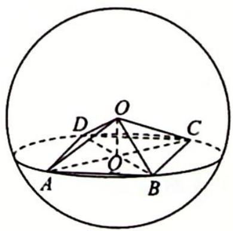
图1

示，当 $v_{1}=v_{2}=v_{3}=v_{4}=2$ 时，四边形 ABCD 的面积最大。
此时 $V=\frac{1}{3}\times2r^{2}\times h=\frac{2}{3}h(1-h^{2})=\frac{2}{3}(h-h^{3})$ ，则 $V'(h)=\frac{2}{3}(1-3h^{2})$ ，所以当 $h^{2}=\frac{1}{3}$ ，即 $h=\frac{\sqrt{3}}{3}$ 时， $V_{\max}=\frac{2}{3}\times\left(\frac{\sqrt{3}}{3}-\frac{\sqrt{3}}{9}\right)=\frac{4\sqrt{3}}{27}$ 。故选 C.

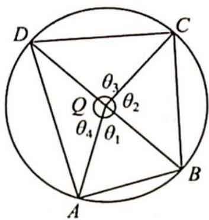
图 2

6.【解析】如图所示, 取 $BC$ 中点 $M$ , 连接 $AM$ 交 $EF$ 于 $N$ , 因为 $EF \parallel BC$ 且 $\triangle ABC$ 为正三角形, 所以 $A' N \perp EF$ 且 $MN \perp BC$ . 又因为平面 $A' EF \perp$ 平面 $BCFE$ , 所以 $A' N \perp$ 平面 $BCFE$ , 从而 $A' N \perp MN$ , 即线段 $MN$ 是异面直线 $A' N$ 与 $BC$ 的公垂线段.

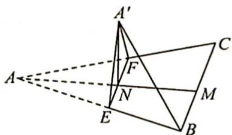

设 $MN = x$ ，则 $A'N = AN = \frac{\sqrt{3}}{2} a - x$ ，由异面直线上两点间距离公式得 $A'B^2 = MN^2 + A'N^2 + BM^2 - 2A'N \cdot BM \cdot \cos 90^\circ = x^2 + \left(\frac{\sqrt{3}}{2} a - x\right)^2 + \left(\frac{a}{2}\right)^2 = 2\left(x - \frac{\sqrt{3}}{4} a\right)^2 + \frac{5}{8} a^2$ .

故当 $x = \frac{\sqrt{3}}{4} a, A'B_{\min} = \frac{\sqrt{10}}{4} a$ ，即 $EF$ 为 $\triangle ABC$ 的中位线时， $A'B$ 的长度最小.

7.【解析】如图所示,将圆台的侧面沿母线 $A_{1}A_{2}$ 展开为扇形,延长 $A_{2}A_{1}, A_{2}^{\prime}A_{1}^{\prime}$ 交于 P,易知扇形的圆心角 $\theta=\frac{r_{2}-r_{1}}{A_{1}A_{2}}\cdot360^{\circ}=\frac{10-5}{20}\cdot360^{\circ}=90^{\circ}$ .

(1) 连接 $A_{2}^{\prime} M$ , 如果 $A_{2}^{\prime} M$ 与扇形 $A_{1}^{\prime} P A_{1}$ 不相交, 则 $A_{2}^{\prime} M$ 为绳子的最短长度.

在 Rt△A'₂PM 中，PM = PA₁ + A₁M = 20 + 10 = 30，PA'₂ = 40，所以 A'₂M = 50，作 PC ⊥ A'₂M 于 C，由 PC · A'₂M = PM · PA'₂ 知 PC = $\frac{PM \cdot PA'_{2}}{A'_{2}M}$ = $\frac{30 \times 40}{50}$ = 24 > 20 = PA₁.

故 $A_{2}^{\prime}M$ 与扇形 $A_{1}^{\prime}PA_{1}$ 不相交，所以绳子的最短长度为 50cm.

(2)设 $PC$ 交圆弧 $A_{1}^{\prime}A_{1}$ 于 $D$ , 证明 $CD$ 为绳子上点与上底面圆周上点的连线中的最短者, 假设 $CD$ 不是最短的, 那么另有一条更短的线段 $C^{\prime}D^{\prime}$ .

连接 $PC'$ , 于是 $PD' + D'C' \geqslant PC' \geqslant PD + CD$ , 其中两个等号不能同时成立, 否则 $C'D'$ 与 $CD$ 重合, 而 $PD = PD'$ , 所以 $C'D' > CD$ , 这与 $C'D'$ 最小相矛盾. 故最短连线长 $CD = PC - PD = 24 - 20 = 4$ .

综上所述,绳子上的点与上底圆周上点的连线的最小长度为4.

## 训练 36

1.【解析】因为 AB=AC=2， $\angle BAC=120^{\circ}$ ，易知 $BC=2\sqrt{3}$ ，所以 $\triangle ABC$ 外接圆的直径 $2r=\frac{2\sqrt{3}}{\sin120^{\circ}}=4$ ，又 $AA_{1}=2$ ，则由汉堡模型可知其外接球的直径 $(2R)^{2}=(2r)^{2}+h^{2}=16+4=20$ ，即其表面积 $S=4\pi R^{2}=20\pi$ 。

2.【分析】四面体可嵌入正方体中研究.

【解析】如图所示, 设该正四面体外接球的球心为 O, AB, CP 的中点分别为 $O_{1}, O_{2}$ , 连接 $O_{1}P, O_{1}C$ , 则截面中的三角形大小与 $\triangle O_{1}PC$ 相同. 易知 PC = 2, $O_{1}O_{2} = \sqrt{2}$ .

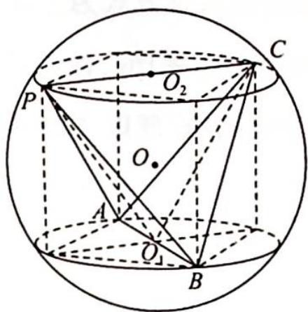

所以 $S_{\triangle O_1PC} = \frac{1}{2}\times 2\times \sqrt{2} = \sqrt{2}.$

3.【解析】由题意知,点 S 的轨迹是平行于平面 ABCD 的截面圆,OS=OD=1,所以 $OO_{1}=OO_{2}$ , 即球心 O 到平面 ABCD 的距离等于到 $\odot O_{2}$ 的距离, 如图所示,则 $O_{2}S=\frac{\sqrt{2}}{2},|SO_{1}|=\sqrt{O_{1}O_{2}^{2}+O_{2}S^{2}}=\sqrt{2+\frac{1}{2}}=\frac{\sqrt{10}}{2}$ . 故选 A.

【评注】球体性质的关键 $r^{2}+d^{2}=R^{2}$ (其中 r 表示截面圆的半径, d 表示球心到截面的距离, R 表示球的半径).

4.【解析】由正弦定理知 $\frac{c}{\sin C}=2r$ ，故 $\sin C=\frac{\sqrt{3}}{2}$ ， $\angle C=60^{\circ}$ 或 $120^{\circ}$ .

如图1所示，在圆锥 $P - ABC$ 中， $h = PO = \sqrt{3^2 - 1} = 2\sqrt{2}$ 。如图2所示， $S_1 = S_{\triangle ABC_1} = \frac{1}{2} \times \sqrt{3} \times \frac{3}{2} = \frac{3\sqrt{3}}{4}$ ， $V_1 = \frac{1}{3} S_1 h = \frac{\sqrt{6}}{2}, S_2 = S_{\triangle ABC_2} = \frac{1}{2} \times \sqrt{3} \times \frac{1}{2} = \frac{\sqrt{3}}{4}, V_2 = \frac{1}{3} S_2 h = \frac{\sqrt{6}}{6}$ 。

故选 AB.

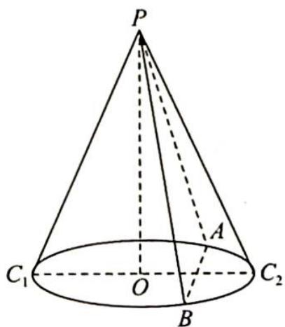
图1

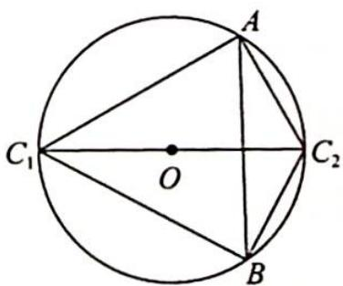
图 2

5.【解析】解法一:如图所示,设 $\triangle EAB$ 的外接圆圆心为 $O_{1}$ ,矩形 $ABCD$ 外接圆圆心为 $O_{2}$ ,设多面体 $E-ABCD$ 的外接球球心为 $O$ ,连接 $OO_{1},OO_{2}$ ,则 $OO_{1}\perp$ 平面 $EAB,OO_{2}\perp$ 平面 $ABCD$ .

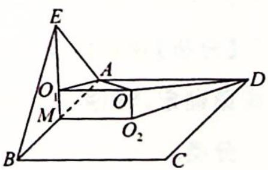

因为 EA=EB=3， $\angle AEB=60^{\circ}$ ，所以 $\triangle EAB$ 为等边三角形，又平面 $EAB \perp$ 平面ABCD，取AB中点M，则 $O_{1}M = OO_{2} = \frac{1}{3} EM = \frac{\sqrt{3}}{2}$ ，矩形ABCD外接圆半径为 $r = \frac{1}{2}\sqrt{BC^2 + CD^2} = \frac{\sqrt{13}}{2}$ 故外接球半径 $R^2 = r^2 +d^2 = 4$ ，则 $S_{\text{表}} = 4\pi R^2 = 16\pi .$

解法二:补形为直三棱柱,可改变直三棱柱的放置方式为立式,算法可同上或通过算圆柱的轴截面的对角线长来求球的直径:(2R) $^{2}$ = $(2\sqrt{3})^{2}$ +2 $^{2}$ =16,S表=16π.故外接球半径R $^{2}$ =4.

6.【解析】如图1所示,设该阳马的外接球半径为R,所以该阳马补形得到的长方体的对角线即为外接球的直径,有 $(2R)^{2}=AB^{2}+AD^{2}+AP^{2}=16+16+9=41$ ,即 $R=\frac{\sqrt{41}}{2}$ .

图1

图2

因为侧棱 $PA \perp$ 底面 $ABCD$ , 且底面为正方形, 所以内切球 $O_{1}$ 在侧面 $PAD$ 内的正视图是 $\triangle PAD$ 的内切圆, 如图 2 所示, 因为内切球半径为 $r = \frac{a + b - c}{2} = 1$ (直角三角形的内切圆半径), 即 $\frac{R}{r} = \frac{\sqrt{41}}{2}$ .

【评注】因为本题的内切圆半径是特殊三角形的内切圆,所以可以比较快速地求解,如果是一般的棱锥,可以用 $r=\frac{3V}{S}$ 来求解.

7.【解析】如图所示,由题意可知三棱锥的四个面全等,且每一个面的面积均为 $\frac{1}{2}\times6\times4=12$ .

设三棱锥的内切球的半径为 r，则三棱锥的体积 $V=\frac{1}{3}S_{\triangle ABC} \cdot r \cdot 4=16r$ .
取 CD 的中点 O，连接 AO, BO，则 $CD \perp$ 平面 AOB, AO = BO = 4, $S_{\triangle AOB} = \frac{1}{2} \times 6 \times \sqrt{7} = 3\sqrt{7}$ .

所以 $V_{A-BCD}=2V_{C-AOB}=2\times\frac{1}{3}\times3\sqrt{7}\times3=6\sqrt{7},16r=6\sqrt{7}$ ，解得 $r=\frac{3\sqrt{7}}{8}$ 。故内切球的表面积为 S= $4\pi r^{2}=\frac{63\pi}{16}$ 。

## 训练 37

1.【分析】观察集合 E 中的元素, 是四元点集, 其中每个元素的前三个坐标 p, q, r 都与 s 有关系, 所以只要 s 取值确定, 其他三个变量的取值范围也就确定了, 因此计算 E 中的元素个数, 可以按照 s 的不同取值进行分类.

$F$ 集合同样也是四元点集, 这四个数前面两个有大小关系, 后面两个也有大小关系, 但是前后两组没有必然关系, 所以考虑 $F$ 的元素, 可以按照先选出前面 2 个, 再选出后面 2 个这两个步骤进行, 整体是分步计数. 在每个步骤中再分类,是一个分步计数与分类计数的综合过程.

【解析】当 s=4 时，p,q,r 都是取 0,1,2,3 中的一个，有 $4 \times 4 \times 4 = 64$ 种；当 s=3 时，p,q,r 都是取 0,1,2 中的一个，有 $3 \times 3 \times 3 = 27$ 种；当 s=2 时，p,q,r 都是取 0,1 中的一个，有 $2 \times 2 \times 2 = 8$ 种；当 s=1 时，p,q,r 都取 0，有 1 种，所以 $\mathrm{card}(E)=64+27+8+1=100$ .
当 t=0 时，u 取 1,2,3,4 中的一个，有 4 种；当 t=1 时，u 取 2,3,4 中的一个，有 3 种；当 t=2 时，u 取 3,4 中的一个，有 2 种；当 t=3 时，u 取 4，有 1 种；所以 t,u 的取值有 $1+2+3+4=10$ 种.
同理，v,w 的取值也有 10 种，所以 $\mathrm{card}(F)=10\times10=100$ ，则 $\mathrm{card}(E)+\mathrm{card}(F)=100+100=200.$ 故选 D.

2.【解析】由正六边形的性质可得,当以 $AD$ 为斜边时,可构成 Rt $\triangle ADB$ ,Rt $\triangle ADC$ ,Rt $\triangle ADE$ ,Rt $\triangle ADF$ 共 4 种;

同理可知当以 BE, CF 为斜边时, 分别也为 4 种, 即直角三角形的个数为 12. 故选 C.

3.【解析】分以下几种情况讨论：

①若5种颜色全用上,先涂A,B,C三点,有 $A_{5}^{3}$ 种,然后在 $A_{1},B_{1},C_{1}$ 三点中选择两点涂另外两种颜色,有 $A_{3}^{2}$ 种,最后一个点有2种选择,此时共有 $A_{5}^{3}A_{3}^{2}\cdot2=720$ 种.
②若用4种颜色染色,有 $C_{5}^{4}$ 种选择方法,先涂A,B,C三点,有 $A_{1}^{3}$ 种,然后在 $A_{1},B_{1},C_{1}$ 三点中选择一点涂最后一种颜色,有3种,不妨设涂最后一种颜色的为点 $A_{1}$ .若点 $B_{1}$ 与点A同色,则点 $C_{1}$ 只有一种颜色可选;若点 $B_{1}$ 与点C同色,则点 $C_{1}$ 有两种颜色可选,此时共有 $C_{5}^{4}A_{4}^{3}\cdot3\times3=1080$ 种.

③若用 3 种颜色染色, 则有 $C_{5}^{3}$ 种选择方法, 先涂 $A, B, C$ 三点, 有 $A_{3}^{3}$ 种, 点 $A_{1}$ 有 2 种颜色可选, 则 $B_{1}, C_{1}$ 的颜色只有一种选择, 此时共有 $C_{5}^{3} A_{3}^{3} \cdot 2 = 120$ 种. 由分类加法计数原理可知, 共有 $720 + 1080 + 120 = 1920$ 种涂色方法, 故选 D.

4.【解析】52 张牌任取 13 张的全部可能为 $C_{52}^{13}$ ，缺某种花色的情况数为 $C_{39}^{13}$ ，缺某两种花色的情况数为 $C_{26}^{13}$ ，缺某三种花色的情况数为 $C_{13}^{13}$ 。用容斥原理即得全部情况是 $C_{52}^{13}-C_{4}^{1}C_{39}^{13}+C_{4}^{2}C_{26}^{13}-C_{4}^{3}C_{13}^{13}$ 。

5.【解析】记 $S=\{1,2,3,\cdots,999\}$ ， $A=\{a\mid a\in S,a=5n\}$ ， $B=\{b\mid b\in S,b=7m\}$ ，则由筛法公式可知 $\left|\overline{A}\cap\overline{B}\right|=\left|S\right|-\left|A\right|-\left|B\right|+\left|A\cap B\right|=999-\left[\frac{999}{5}\right]-\left[\frac{999}{7}\right]+\left[\frac{999}{35}\right]=686.$

故满足既不被 5 整除, 又不被 7 整除的数有 686 个.

6.【解析】将原正方形四等分为面积为 $1 \mathrm{~m}^{2}$ 的 4 个小正方形。已知 $13 = 3 \times 4 + 1$ ，依据抽屉原理，则必存在 4 个点落在面积为 $1 \mathrm{~m}^{2}$ 的小正方形内（或边上），因此，以这 4 个点为顶点的四边形的面积总不超过小正方形的面积，即以这样的 4 个点为顶点的四边形的面积不超过 $1 \mathrm{~m}^{2}$ 。

【评注】这里是将正方形等分为 4 个小的正方形来构造抽屉的，也可将此正方形等分为 4 个小的矩形来构造抽屉。

7.【解析】由①可知数列是递增数列,又因为数列是有限的,若至少有8个数,由抽屉原理可知至少有4个正数或者4个负数.

不妨设有 4 个负数 $a_1 < a_2 < a_3 < a_4 < 0$ ，利用②可知 $a_1, a_2, a_3$ 应满足 $a_2 + a_3 = a_1, a_1, a_2, a_4$ 应满足 $a_2 + a_4 = a_1$ ，所以 $a_3 = a_4$ ，这与 $a_3 < a_4$ 矛盾。所以 $N$ 的最大值为 7。

下面说明 N=7 成立. 取 $a_{1} \sim a_{7}$ 分别为 -3, -2, -1, 0, 1, 2, 3 满足题意, 故 N 的最大值为 7. 故选 B.

8.【解析】设 $a_{1}, a_{2}, a_{3}, \cdots, a_{9}, a_{10}$ 分别代表不超过 10 的十个自然数，它们围成一个圈，它们三个相邻的数的组成是 $(a_{1}, a_{2}, a_{3}), (a_{2}, a_{3}, a_{4}), (a_{3}, a_{4}, a_{5}), \cdots, (a_{9}, a_{10}, a_{1}), (a_{10}, a_{1}, a_{2})$ 共十组，现在把他们看成是十个抽屉，每个抽屉的物体数是 $a_{1} + a_{2} + a_{3}, a_{2} + a_{3} + a_{4}, a_{3} + a_{4} + a_{5}, \cdots, a_{9} + a_{10} + a_{1}, a_{10} + a_{1} + a_{2}$ .
则 $(a_{1}+a_{2}+a_{3})+(a_{2}+a_{3}+a_{4})+\cdots+(a_{9}+a_{10}+a_{1})+(a_{10}+a_{1}+a_{2})$ $=3(a_{1}+a_{2}+\cdots+a_{9}+a_{10})$ $=3(1+2+\cdots+9+10)$ $=3\times\frac{(10+1)\times10}{2}=165=16\times10+5.$

根据推论 2, 至少有一个括号内的三数和不小于 17, 即至少有三个相邻的数的和不小于 17.

## 训练 38

1.【解析】全装错的情况共有 $D_{4}=9$ 种, 4 封信的所有装信封方式有 $4!=24$ 种, 所以全装错的概率为 $\frac{9}{24}=\frac{3}{8}$ . 只要有一封信装错信封, 就至少有另一封信也会装错信封, 所以恰好只有一封信装错是不可能事件, 概率为 0.

2.【解析】可以分类解决：

第一类,所有同学都不坐自己原来的位置;第二类,恰有一位同学坐自己原来的位置;第三类,恰有两位同学坐自己原来的位置.
设 n 个元素全错位排列的排列数为 $D_{n}$ , 则对于第一类排列数为 $D_{5}$ ; 第二类先确定一个排原来位置的同学有 $C_{5}^{1}=5$ 种可能, 其余四个同学全错位排列, 所以第二类的排列数为 $5D_{4}$ ; 第三类先确定两个排原位的同学, 有 $C_{5}^{2}=10$ 种, 所以第三类的排列数为 $10D_{3}$ , 因此满足条件的所有坐法种数为 $D_{5}+5D_{4}+10D_{3}=44+5\times9+10\times2=109$ .

3.【分析】已知本题首尾两项的值,相邻两项之差的绝对值是常数,可以利用叠加法寻求差值的数量关系.
【解析】由题意得 $a_{k+1}-a_{k}=5$ 或 -5, $a_{100}=(a_{100}-a_{99})+(a_{99}-a_{98})+\cdots+(a_{2}-a_{1})=475$ .
设 99 个差中有 x 个 5, 99 - x 个 - 5, 故 $5x + (-5)(99 - x) = 475 \Rightarrow x = 97$ , 于是所求数列的 99 个差 $a_{k+1} - a_{k}(k=1,2,\cdots,99)$ 中, 有 97 个 5, 2 个 -5.
由于这 97 个 5,2 个 -5 的每一个排列均唯一对应一个满足条件的数列,从而所求数列的个数为 $C_{99}^{2}=4851$ .

4.【解析】该过程可以分为两个阶段进行,选10个学生中的任意两个学生排在甲、乙之间,并作直线排列,有 $2A_{10}^{2}$ 种不同的排法.当恰有两人排在甲乙两人之间的一种排法取定之后,把这四个人的这种排法看成一个整体,再与剩余8个学生一起任意排成一个圆圈,并注意到要考虑顺或逆时针方向,可求这种圆排列的种数为 $\frac{9!}{9}=8!$ ,显然第一个阶段的任一种排法与第二阶段的任一种排法搭配都可以看成整个过程的一种排法,因此,所求排列数是 $2\times10\times9\times8!=7257600$ .

5.【解析】(1)可以看成是6个元素的圆排列,有(6-1)!=5!=120种坐法.

(2)若父母要相邻而坐,可以把父母看成一个整体,与其余四个元素做圆排列,再考虑父母之间的位置关系,

一共有 $2 \times (5 - 1)! = 2 \times 24 = 48$ 种坐法.

(3)若父母要相对而坐,则其中一位的位置确定后,另外一位的位置也相应确定.先固定父亲坐在第1位,则母亲必然坐在第4位,其余四个孩子在2,3,5,6位做全排列有 $4! = 24$ 种直线排列,对应24种圆排列.

(4)若最小的孩子坐在父母中间,把这三个人看成一组,与其他三个孩子做圆排列,有(4-1)!=3!=6,再考虑父母之间的顺序,一共有12种.

【评注】对复杂的排列问题往往可以先处理不计顺序的组合问题,然后再考虑排序.

6.【解析】将正十二边形的顶点依次编号 $1 \sim 12$ . 设被取出的 4 个顶点分别为 $x_{1}, x_{2}, x_{3}, x_{4}$ , 且满足 $\left\{ \begin{array}{l} 1 \leqslant x_{1} < x_{2} < x_{3} < x_{4} \leqslant 12 \\ x_{i+1} - x_{i} \geqslant 2 (i = 1, 2, 3) \end{array} \right.$ .

当 $x_{1} = 1$ 时， $x_{4} \leqslant 11$ ，令 $a = x_{2} - x_{1} - 1, b = x_{3} - x_{2} - 1, c = x_{4} - x_{3} - 1, d = 12 - x_{4}$ ，则 $a + b + c + d = 8$ 。共有 $\mathbf{C}_7^3$ 种不同取法。

当 $2 \leqslant x_{1} \leqslant 6$ 时， $x_{4} \leqslant 12$ . 令 $a = x_{2} - x_{1} - 1, b = x_{3} - x_{2} - 1, c = x_{4} - x_{3} - 1, d = 13 - x_{4}$ ，则 $a + b + c + d = 10 - x_{1}$ .

①若 $x_{1}=2$ ，则共有 $C_{7}^{3}$ 种不同取法.

②若 $x_{1}=3$ ，则有 $C_{6}^{3}$ 种不同取法.

③若 $x_{1}=4$ ，则有 $C_{5}^{3}$ 种不同取法.

④若 $x_{1}=5$ ，则有 $C_{4}^{3}$ 种不同取法.

⑤若 $x_{1}=6$ ，则有 $C_{3}^{3}$ 种不同取法.

所以一共有 $C_{7}^{3} + C_{7}^{3} + C_{6}^{3} + C_{5}^{3} + C_{4}^{3} + C_{3}^{3} = 105$ 种取法.

7.【解析】当 $0 \leqslant m \leqslant 20$ 时，满足 $x + y = m$ ，且 $0 \leqslant x \leqslant 20, 0 \leqslant y \leqslant 20$ 的非负整数解 $(x, y) = (j, m - j)(0 \leqslant j \leqslant m)$ ，共有 $m + 1$ 组。当 $20 < m \leqslant 40$ 时，满足 $x + y = m$ ，且 $0 \leqslant x \leqslant 20, 0 \leqslant y \leqslant 20$ 的非负整数解 $(x, y) = (j, m - j)(m - 20 \leqslant j \leqslant 20)$ ，共有 $40 - m + 1$ 组。所以，满足 $k_{1} + k_{3} = k_{2} + k_{4}$ 的解共有 $\sum_{m=0}^{20}(m+1)^{2} + \sum_{m=21}^{40}(40 - m + 1)^{2} = 2 \times \frac{1}{6} \times 20 \times 21 \times 41 + 21^{2} = 6181$ 。

8.【分析】本题的难点是不定方程中的变元较多,且系数不全相等,针对这一特点,作代换 $x_{1}+x_{2}+x_{3}=x$ , $x_{4}+x_{5}=y$ , $x_{6}=z$ ,则有 $x+3y+5z=21(x \geqslant 3,y \geqslant 2,z \geqslant 1)$ ,于是,先确定 $(x,y,z)$ ,即可再由分步计数原理求解.

【解析】令 $x_{1}+x_{2}+x_{3}=x, x_{4}+x_{5}=y, x_{6}=z$ ，则 $x \geqslant 3, y \geqslant 2, z \geqslant 1$ .

先考虑不定方程 $x + 3y + 5z = 21$ 满足 $x \geqslant 3, y \geqslant 2, z \geqslant 1$ 的正整数解，因为 $x \geqslant 3, y \geqslant 2, z \geqslant 1$ ，所以 $5z = 21 - x - 3y \leqslant 12, 1 \leqslant z \leqslant 2.$

当 z=1 时，有 $x+3y=16$ ，此方程满足 $x\geqslant3, y\geqslant2$ 的正整数解为 $(x,y)=(10,2),(7,3),(4,4)$ .

当 z=2 时，有 $x+3y=11$ ，此方程满足 $x\geqslant3, y\geqslant2$ 的正整数解为 $(x,y)=(5,2)$ .

所以不定方程 $x + 3y + 5z = 21$ 满足 $x \geqslant 3, y \geqslant 2, z \geqslant 1$ 的正整数解为 $(x, y, z) = (10, 2, 1), (7, 3, 1), (4, 4, 1), (5, 2, 2)$ .

又方程 $x_{1} + x_{2} + x_{3} = x (x \in \mathbb{N}, x \geqslant 3)$ 的正整数解的组数为 $\mathrm{C}_{x-1}^{2}$ , 方程 $x_{4} + x_{5} = y (y \in \mathbb{N}, x \geqslant 2)$ 的正整数解的组数为 $\mathrm{C}_{y-1}^{1}$ , 故由分步计数原理知, 原不定方程的正整数解的组数为 $\mathrm{C}_{9}^{2} \mathrm{C}_{1}^{1} + \mathrm{C}_{6}^{2} \mathrm{C}_{2}^{1} + \mathrm{C}_{3}^{2} \mathrm{C}_{3}^{1} + \mathrm{C}_{4}^{2} \mathrm{C}_{1}^{1} = 36 + 30 + 9 + 6 = 81$ .

9.【解析】设该 n 棱锥的顶点为 S，底面多边形的顶点分别为 $A_{1}, A_{2}, \cdots, A_{n}$ ，则顶点 S 有 m 种染色方法，且 $A_{1}, A_{2}, \cdots, A_{n}$ 均不能与 S 同色，问题转化为用 m-1 种颜色给多边形 $A_{1}A_{2}\cdots A_{n}$ 的顶点染色，相邻的顶点不同色.

设有 $a_{n}$ 种染法，则 $a_{3}=(m-1)(m-2)(m-3)$ ; 对 n>3, 下面考虑 $\{a_{n}\}$ 的递推关系.

若从 $A_{1}$ 开始染色，则 $A_{1}$ 有 m-1 种染法，继而 $A_{2}, \cdots, A_{n-1}$ 分别均有 m-2 种染法，最后对 $A_{n}$ 染色，如果仅要求 $A_{n}$ 与 $A_{n-1}$ 异色（不要求 $A_{n}$ 与 $A_{1}$ 异色），则仍有 m-2 种染法，于是，总共有 $(m-1)(m-2)^{n-1}$ 种染法。上述 $(m-1)(m-2)^{n-1}$ 种染法可分为两类：（1） $A_{n}$ 与 $A_{1}$ 不同色，这符合题设要求，有 $a_{n}$ 种染法；（2） $A_{n}$ 与 $A_{1}$ 同色，这不符合题设要求，这时可将 $A_{n}$ 与 $A_{1}$ 合并成一点，得出 $a_{n-1}$ 种符合题设的染法。

$$
a _ {n} + a _ {n - 1} = (m - 1) (m - 2) ^ {n - 1} (n > 3)
$$

$$
a _ {n} - (m - 2) ^ {n} = - \left[ a _ {n - 1} - (m - 2) ^ {n - 1} \right]
$$

故 $a_{n} - (m - 2)^{n} = -\left[a_{n - 1} - (m - 2)^{n - 1}\right]$ $= (-1)^{2}\left[a_{n - 2} - (m - 2)^{n - 2}\right] = \dots = (-1)^{n - 3}\left[a_3 - (m - 2)^3\right]$ $= (-1)^{n - 3}\left[(m - 1)(m - 2)(m - 3) - (m - 2)^3\right] = (-1)^{n - 2}(m - 2) = (-1)^{n}(m - 2)$ ，得 $a_{n} = (m - 2)\left[(m - 2)^{n - 1} + (-1)^{n}\right].$

由于顶点 S 有 m 种染色方法, 从而整个棱锥的染法总数 $N = m(m - 2)[(m - 2)^{n-1} + (-1)^{n}]$ .

## 训练 39

1.【解析】(1)甲班抽取的2人能完成该项活动的概率 $P(A)=\frac{C_{3}^{2}}{C_{4}^{2}}=\frac{1}{2}$ ，乙班抽取的2人能完成该项活动的概率 $P(B)=\left(\frac{3}{4}\right)^{2}=\frac{9}{16}$ . 故从甲、乙两个班级的选手中抽取的4人都能完成该项活动的概率 $P(AB)=P(A)$ $P(B)=\frac{1}{2}\times\left(\frac{3}{4}\right)^{2}=\frac{9}{32}.$

(2)甲班抽取的选手中能完成该项活动的人数分别为 $X$ ，则 $X$ 的取值为1,2.

$P(X=1)=\frac{C_{3}^{1}}{C_{4}^{2}}=\frac{1}{2};P(X=2)=\frac{C_{3}^{2}}{C_{4}^{2}}=\frac{1}{2};$ 则 $E(X)=1\times\frac{1}{2}+2\times\frac{1}{2}=\frac{3}{2},D(X)=\left(1-\frac{3}{2}\right)^{2}\times\frac{1}{2}+\left(2-\frac{3}{2}\right)^{2}\times\frac{1}{2}=\frac{1}{4}.$

乙班抽取的选手中能完成该项活动的人数分别为 Y，则 Y 的取值为 0,1,2，由已知 $Y \sim B\left(2, \frac{3}{4}\right)$ ，所以 $E(Y) = 2 \times \frac{3}{4} = \frac{3}{2}$ ， $D(Y) = 2 \times \frac{3}{4} \times \left(1 - \frac{3}{4}\right) = \frac{3}{8}$ .

因为 $E(X)=E(Y)$ , $D(X)<D(Y)$ , 故甲班更有希望夺冠.

2.【解析】(1)若乙笔试部分三个环节一个都没有通过或只通过一个,则不能参与面试,故乙未能参与面试的概率 $p=\frac{1}{4}\times\frac{2}{3}\times\frac{1}{2}+\frac{1}{4}\times\frac{1}{3}\times\frac{1}{2}+\frac{3}{4}\times\frac{2}{3}\times\frac{1}{2}+\frac{1}{4}\times\frac{2}{3}\times\frac{1}{2}=\frac{11}{24}$ .

(2) $X$ 的可能取值为 $0,1,2,3,4,5$ , 则 $P(X=0)=\left(\frac{1}{3}\right)^{3}=\frac{1}{27}; P(X=1)=C_{3}^{1} \cdot \left(\frac{1}{3}\right)^{2} \times \frac{2}{3}=\frac{2}{9}; P(X=2)$ $= C_{3}^{2} \cdot \left(\frac{2}{3}\right)^{2} \times \frac{1}{3} \times \frac{1}{4} \times \frac{1}{2}=\frac{1}{18}; P(X=3)=\left(\frac{2}{3}\right)^{3} \times \frac{1}{4} \times \frac{1}{2}+C_{3}^{2} \times \left(\frac{2}{3}\right)^{2} \times \frac{1}{3} \times \left(\frac{1}{4} \times \frac{1}{2}+\frac{3}{4} \times \frac{1}{2}\right)=\frac{7}{27};$ $P(X=4)=\left(\frac{2}{3}\right)^{3} \times \left(\frac{1}{4} \times \frac{1}{2}+\frac{3}{4} \times \frac{1}{2}\right)+C_{3}^{2}\left(\frac{2}{3}\right)^{2} \times \frac{1}{3} \times \frac{3}{4} \times \frac{1}{2}=\frac{17}{54}; P(X=5)=\left(\frac{2}{3}\right)^{3} \times \frac{3}{4} \times \frac{1}{2}=\frac{1}{9}.$

则 $X$ 的分布列为

<table><tr><td>X</td><td>0</td><td>1</td><td>2</td><td>3</td><td>4</td><td>5</td></tr><tr><td>P</td><td> $\frac{1}{27}$ </td><td> $\frac{2}{9}$ </td><td> $\frac{1}{18}$ </td><td> $\frac{7}{27}$ </td><td> $\frac{17}{54}$ </td><td> $\frac{1}{9}$ </td></tr></table>

$$
E (X) = 0 \times \frac {1}{2 7} + 1 \times \frac {2}{9} + 2 \times \frac {1}{1 8} + 3 \times \frac {7}{2 7} + 4 \times \frac {1 7}{5 4} + 5 \times \frac {1}{9} = \frac {7 9}{2 7}.
$$

(3)由(2)可知,甲成为在职教师的概率 $p_{\text{甲}} = \frac{1}{9} + C_{3}^{2} \times \left(\frac{2}{3}\right)^{2} \times \frac{1}{3} \times \frac{3}{4} \times \frac{1}{2} = \frac{5}{18}$ , 乙成为在职教师的概率 $p_{乙}=\left(1-\frac{11}{24}\right)\times\frac{2}{3}\times\frac{3}{4}=\frac{13}{48}.$

因为 $p_{甲} > p_{乙}$ ，所以甲更可能成为该校的在职教师。

3.【解析】(1)记“甲第一次摸出了绿色球,甲获胜”为事件A,则 $P(A)=\frac{C_{1}^{1}C_{6}^{1}+C_{3}^{2}}{C_{7}^{2}}=\frac{9}{21}=\frac{3}{7}$ .

(2)如果乙第一次摸出红球,则可以再从袋子里摸出3个小球,则得分情况有:6分,7分,8分,9分,10分,11分.

则 $P(\xi=6)=\frac{C_{3}^{3}}{C_{7}^{3}}=\frac{1}{35};\quad P(\xi=7)=\frac{C_{3}^{2}C_{3}^{1}}{C_{7}^{3}}=\frac{9}{35};\quad P(\xi=8)=\frac{C_{3}^{1}C_{3}^{2}}{C_{7}^{3}}=\frac{9}{35};\quad P(\xi=9)=\frac{C_{3}^{2}C_{1}^{1}}{C_{7}^{3}}+\frac{C_{3}^{3}}{C_{7}^{3}}=\frac{4}{35};$ $P(\xi=10)=\frac{C_{3}^{1}C_{3}^{1}C_{1}^{1}}{C_{7}^{3}}=\frac{9}{35};\quad P(\xi=11)=\frac{C_{3}^{2}C_{1}^{1}}{C_{7}^{3}}=\frac{3}{35}.$

所以 $\xi$ 的分布列为

<table><tr><td>ξ</td><td>6</td><td>7</td><td>8</td><td>9</td><td>10</td><td>11</td></tr><tr><td>P</td><td> $\frac{1}{35}$ </td><td> $\frac{9}{35}$ </td><td> $\frac{9}{35}$ </td><td> $\frac{4}{35}$ </td><td> $\frac{9}{35}$ </td><td> $\frac{3}{35}$ </td></tr></table>

所以 $\xi$ 的数学期望 $E(\xi) = 6 \times \frac{1}{35} + 7 \times \frac{9}{35} + 8 \times \frac{9}{35} + 9 \times \frac{4}{35} + 10 \times \frac{9}{35} + 11 \times \frac{3}{35} = \frac{60}{7}$ .

(3)由第(1)问知,若第一次摸出来绿球,则摸球人获胜的概率 $p_1 = \frac{3}{7}$ ; 由第(2)问知,若第一次摸出了红球,则摸球人获胜的概率 $p_2 = \frac{9 + 4 + 9 + 3}{35} = \frac{5}{7}$ ; 若第一次摸出了黄球,则摸球人获胜的概率 $p_3 = \frac{C_6^2 + C_2^2 + C_2^1 C_3^1}{C_7^3} = \frac{22}{35}$ ; 若第一次摸出了白球,则摸球人获胜的概率 $p_4 = \frac{(C_6^2 - 1) + C_3^2}{C_7^3} = \frac{17}{35}$ , 则摸球人获胜的概率 $p = \frac{1}{8} \times \frac{3}{7} + \frac{1}{8} \times \frac{5}{7} + \frac{3}{8} \times \frac{22}{35} + \frac{3}{8} \times \frac{17}{35} = \frac{157}{280} > \frac{1}{2}$ .

所以比赛不公平.

【评注】本题第(3)问,判断是否公平,即判断任何一方获胜的概率是不是 $\frac{1}{2}$ ,但是由于第一次摸出什么球对后面摸球有影响,所以需要对第一次摸球进行分类.

4.【解析】(1)因为甲解开密码锁所需时间的中位数为 47, 所以 $0.01 \times 5 + 0.014 \times 5 + b \times 5 + 0.034 \times 5 + 0.04 \times (47 - 45) = 0.5$ , 解得 $b = 0.026$ .

又 $0.04 \times (50 - 47) + 0.032 \times 5 + a \times 5 + 0.010 \times 10 = 0.5$ ，解得 $a = 0.024$ .

所以甲在1分钟内解开密码锁的频率是 $f_{\text{甲}} = 1 - 0.01 \times 10 = 0.9$ ，乙在1分钟内解开密码锁的频率是 $f_{\text{乙}} = 1 - 0.035 \times 5 - 0.025 \times 5 = 0.7$ .

(2)由(1)知,甲、乙、丙在1分钟内解开密码锁的概率分别是 $p_{1}=0.9,p_{2}=0.7,p_{3}=0.5$ ,且各人是否解开密码锁相互独立.

设按乙、丙、甲的顺序对应的数学期望为 $E(X_{1})$ ，按丙、乙、甲的顺序对应的数学期望为 $E(X_{2})$ ，则 $P(X_{1} = 1) = p_{2};P(X_{1} = 2) = (1 - p_{2})p_{3};P(X_{1} = 3) = (1 - p_{2})(1 - p_{3}),E(X_{1}) = p_{2} + 2(1 - p_{2})p_{3} + 3(1 - p_{2})(1 - p_{3})$ $= 3 - 2p_{2} - p_{3} + p_{2}p_{3} = 3 - (p_{2} + p_{3}) + p_{2}p_{3} - p_{2}.$

①所以 $E(X_{1})=3-(p_{2}+p_{3})+p_{2}p_{3}-p_{2}=1.45$ ，同理可求得 $E(X_{2})=3-(p_{2}+p_{3})+p_{2}p_{3}-p_{3}=1.65$ .
所以按乙、丙、甲派出的顺序期望更小.

②应先派出甲,再派乙,最后派丙.

5.【解析】(1)设事件 $A_{i}$ 为“甲在第 $i$ 局获胜”，所以 $P(\xi = 2) = P(A_{1}A_{2}) + P(\overline{A_{1}}\overline{A_{2}}) = \left(\frac{2}{3}\right)^{2} + \left(\frac{1}{3}\right)^{2} = \frac{5}{9}$ . (2) $\xi$ 可取的值为 2,4,6.

则 $P(\xi=2)=\frac{5}{9}$ ; $P(\xi=4)=P(A_{1}\overline{A_{2}}A_{3}A_{4})+P(A_{1}\overline{A_{2}}\overline{A_{3}}\overline{A_{4}})+P(\overline{A_{1}}A_{2}A_{3}A_{4})+P(\overline{A_{1}}A_{2}\overline{A_{3}}\overline{A_{4}})=\frac{2}{3}\times\frac{1}{3}\times\left(\frac{2}{3}\right)^{2}+\frac{2}{3}\times\frac{1}{3}\times\left(\frac{1}{3}\right)^{2}+\frac{1}{3}\times\frac{2}{3}\times\left(\frac{2}{3}\right)^{2}+\frac{1}{3}\times\frac{2}{3}\times\left(\frac{1}{3}\right)^{2}=\frac{20}{81}$ ; $P(\xi=6)=1-P(\xi=2)-P(\xi=4)=\frac{16}{81}$ .

所以 $\xi$ 的分布列为

<table><tr><td>ξ</td><td>2</td><td>4</td><td>6</td></tr><tr><td>P</td><td>5/9</td><td>20/81</td><td>16/81</td></tr></table>

故 $E(\xi) = 2 \times \frac{5}{9} + 4 \times \frac{20}{81} + 6 \times \frac{16}{81} = \frac{266}{81}$ .

6.【解析】(1)每位运动员进入胜者组的概率为 $\frac{30}{90}=\frac{1}{3}$ ，每位败者组运动员复活的概率为 $\frac{10}{60}=\frac{1}{6}$ .

(2)由已知条件得进入胜者组的人数为 $X \sim B\left(5, \frac{1}{3}\right)$ , 所以 $P(X = n) = C_5^n \cdot \left(\frac{1}{3}\right)^n \left(1 - \frac{1}{3}\right)^{5-n}$ , 其中 $n = 0$ , $1, 2, 3, 4, 5$ , 则 $P(X = 0) = C_5^0 \cdot \left(\frac{1}{3}\right)^0 \left(1 - \frac{1}{3}\right)^5 = \frac{32}{243}; P(X = 1) = C_5^1 \cdot \left(\frac{1}{3}\right)^1 \left(1 - \frac{1}{3}\right)^4 = \frac{80}{243}; P(X = 2) = C_5^2 \cdot \left(\frac{1}{3}\right)^2 \left(1 - \frac{1}{3}\right)^3 = \frac{80}{243}; P(X = 3) = C_5^3 \cdot \left(\frac{1}{3}\right)^3 \left(1 - \frac{1}{3}\right)^2 = \frac{40}{243}; P(X = 4) = C_5^4 \cdot \left(\frac{1}{3}\right)^4 \left(1 - \frac{1}{3}\right)^1 = \frac{10}{243}; P(X = 5) = C_5^5 \cdot \left(\frac{1}{3}\right)^5 \left(1 - \frac{1}{3}\right)^0 = \frac{1}{243}.$

$X$ 的分布列为

<table><tr><td>X</td><td>0</td><td>1</td><td>2</td><td>3</td><td>4</td><td>5</td></tr><tr><td>P</td><td>32/243</td><td>80/243</td><td>80/243</td><td>40/243</td><td>10/243</td><td>1/243</td></tr></table>

数学期望 $E(X)=np=5\times\frac{1}{3}=\frac{5}{3}.$

(3)设从败者组选取的10人中有 $k(k \in \mathbb{N}^*)$ 人复活，则 $k \sim B(10, \frac{1}{6})$ ，所以 $P(k) = C_{10}^{k}\left(\frac{1}{6}\right)^{k}\left(1 - \frac{1}{6}\right)^{10 - k}$ . 当 $P(k)$ 最大时，满足 $\left\{\begin{array}{l} P(k) \geqslant P(k-1) \\ P(k) \geqslant P(k+1) \end{array}\right.$ ，即 $\left\{\begin{array}{l} C_{10}^{k}\left(\frac{1}{6}\right)^{k}\left(1 - \frac{1}{6}\right)^{10 - k} \geqslant C_{10}^{k-1}\left(\frac{1}{6}\right)^{k-1}\left(1 - \frac{1}{6}\right)^{11 - k} \\ C_{10}^{k}\left(\frac{1}{6}\right)^{k}\left(1 - \frac{1}{6}\right)^{10 - k} \geqslant C_{10}^{k+1}\left(\frac{1}{6}\right)^{k+1}\left(1 - \frac{1}{6}\right)^{9 - k} \end{array}\right.$ ，解得 $\frac{5}{6} \leqslant k \leqslant \frac{11}{6}$ .

又因为 $k \in N^{*}$ ，所以 k = 1，即最有可能有 1 人复活。

7.【解析】(1) $X$ 的所有取值为 0, 1, 2, 3, 4，因为重量不少于 1000 克的概率为 $\frac{60}{100} = \frac{3}{5}$ ，所以 $X \sim B\left(4, \frac{3}{5}\right)$ . $P(X=0) = C_4^0 \cdot \left(1 - \frac{3}{5}\right)^4 = \frac{16}{625}; P(X=1) = C_4^1 \cdot \frac{3}{5} \times \left(1 - \frac{3}{5}\right)^3 = \frac{96}{625}; P(X=2) = C_4^2 \cdot \left(\frac{3}{5}\right)^2 \times \left(1 - \frac{3}{5}\right)^2 = \frac{216}{625}; P(X=3) = C_4^3 \cdot \left(\frac{3}{5}\right)^3 \times \left(1 - \frac{3}{5}\right) = \frac{216}{625}; P(X=4) = C_4^4 \times \left(\frac{3}{5}\right)^4 = \frac{81}{625}.$

$X$ 的分布列为

<table><tr><td>X</td><td>0</td><td>1</td><td>2</td><td>3</td><td>4</td></tr><tr><td>P</td><td> $\frac{16}{625}$ </td><td> $\frac{96}{625}$ </td><td> $\frac{216}{625}$ </td><td> $\frac{216}{625}$ </td><td> $\frac{81}{625}$ </td></tr></table>

数学期望 $E(X)=4\times\frac{3}{5}=\frac{12}{5}$ .

(2)①由题意知 $X \sim N(1000, 50^2)$ , 因为 $\frac{\sigma^2}{100} = \frac{50^2}{100} = 25$ , 所以 $Y \sim N(1000, 5^2)$ .

又 $990 = 1000 - 2 \times 5$ ， $P(\mu - 2\sigma \leqslant \eta \leqslant \mu + 2\sigma) = 0.9545$ ，所以 $P(\eta \leqslant \mu - 2\sigma) = \frac{1 - 0.9545}{2} = 0.02275$ ，则 $P(Y \leqslant 990) = P(Y \leqslant \mu - 2\sigma) = 0.02275.$

②由①知 $P(Y \leqslant 990) = P(Y \leqslant \mu - 2\sigma) = 0.02275$ ，这100天收到的每份水果重量的平均值 $Y = 988.72 < 990$ ，而 $0.02275 < 0.05$ ，所以概率为0.02275的事件是小概率事件，小概率事件基本不会发生，因此，李师傅的投诉是有道理的。

8.【解析】(1)记事件 M 为第 1 管血样检测结果呈阳性,事件 N 为总共进行 4 次检测,则 $P(M)=\frac{A_{2}^{1}}{A_{7}^{1}}=\frac{2}{7}$ , $P(MN)=\frac{A_{2}^{2}A_{5}^{2}}{A_{7}^{4}}=\frac{1}{21}$ ,所求概率为 $P(N|M)=\frac{P(MN)}{P(M)}=\frac{\frac{1}{21}}{\frac{2}{7}}=\frac{1}{6}$ .

所以 A 在第 1 管血样检测结果呈阳性的条件下, 总共进行了 4 次检测的概率为 $\frac{1}{6}$ .

(2)检测进行了6次,说明前5次只检测出一管阳性,不管第六次检测的结果是阳性还是阴性,都能找到两管阳性血样,从而所求概率 $p = \frac{C_{2}^{1}A_{5}^{1}A_{5}^{4}}{A_{7}^{5}} = \frac{10}{21}$ .

(3)由已知可得 A, B, C 中有 1 人识别成功的概率 $p_{1}=0.6(1-a)^{2}+(1-0.6)\cdot\mathrm{C}_{2}^{1}a(1-a)=0.2(1-a)\cdot(3+a)$ ; 有 2 人识别成功的概率 $p_{2}=0.6\cdot\mathrm{C}_{2}^{1}a(1-a)+(1-0.6)a^{2}=0.4a(3-2a)$ .

$p_1 - p_2 = 0.2(1 - a)(3 + a) - 0.4a(3 - 2a) = 0.2(3a^2 -8a + 3)$ ，由 $3a^{2} - 8a + 3 > 0$ ，且 $0 <   a <   1$ ，得 $0 <   a <   \frac{4 - \sqrt{7}}{3}$ ；由 $3a^{2} - 8a + 3 <   0$ ，且 $0 <   a <   1$ ，得 $\frac{4 - \sqrt{7}}{3} <  a <   1$ ；由 $3a^{2} - 8a + 3 = 0$ ，且 $0 <   a <   1$ ，得 $a = \frac{4 - \sqrt{7}}{3}$

所以当 $\frac{4 - \sqrt{7}}{3} < a < 1$ 时， $p_2 > p_1$ ，即 $A, B, C$ 中有 1 人识别病毒成功的概率小于有 2 人识别病毒成功的概率；当 $0 < a < \frac{4 - \sqrt{7}}{3}$ 时， $p_1 > p_2$ ，即 $A, B, C$ 中有 1 人识别病毒成功的概率大于有 2 人识别病毒成功的概率；当 $a = \frac{4 - \sqrt{7}}{3}$ 时， $p_1 = p_2$ ，即 $A, B, C$ 中有 1 人识别病毒成功的概率等于有 2 人识别病毒成功的概率。

## 训练 40

1.【分析】(1)是在一位是45岁以下的条件下,另一位是45岁以上,这是条件概率;(2)与第(1)问不同的是与顺序有关的条件概率;(3)直接用概率计算公式即可.本题涉及“有序与无序”“条件概率与无条件概率”两组核心概念的辨析.要在题目中发现这两个条件的特征,合理使用计算公式求解.

【解析】(1)这是个条件概率问题. 即求“在抽到一人是 45 岁以下的条件下, 抽到另一人是 45 岁以上的概率”, 记“抽到一人是 45 岁以下”为事件 $A$ , “抽到另一人是 45 岁以上”为事件 $B$ , 求 $P(B \mid A)$ . 这种情形下抽取与顺序无关, 是无序的.

解法一(条件概率的定义): $P(A)=\frac{C_{6}^{2}+C_{6}^{1}C_{2}^{1}}{C_{8}^{2}}=\frac{27}{28}, P(AB)=\frac{C_{6}^{1}C_{2}^{1}}{C_{8}^{2}}=\frac{3}{7}$ ，则 $P(B|A)=\frac{P(AB)}{P(A)}=\frac{\frac{3}{7}}{\frac{27}{28}}=\frac{4}{9}$ .

解法二(古典概型定义):由古典概型的定义可知 $P(B|A)=\frac{P(AB)}{P(A)}=\frac{n(AB)}{n(A)}, n(A)=C_{6}^{2}+C_{6}^{1}C_{2}^{1}=27,$ $n(AB)=C_{6}^{1}C_{2}^{1}=12$ , 所以 $P(B|A)=\frac{n(AB)}{n(A)}=\frac{C_{6}^{1}C_{2}^{1}}{C_{6}^{2}+C_{6}^{1}C_{2}^{1}}=\frac{12}{27}=\frac{4}{9}.$

(2)题目中涉及第一人,第二人,所以是与顺序有关的条件概率.记“抽到的第一人是45岁以下”为事件A, “抽到的第二人是45岁以上”为事件B.

解法一(利用条件概率定义): $P(A)=\frac{A_{6}^{1}A_{7}^{1}}{A_{8}^{2}}=\frac{6}{8}=\frac{3}{4}, P(AB)=\frac{A_{6}^{1}A_{2}^{1}}{A_{8}^{2}}=\frac{12}{56}=\frac{3}{14}$ ，则 $P(B|A)=\frac{P(AB)}{P(A)}=\frac{\frac{3}{14}}{\frac{3}{4}}=\frac{2}{7}$ .

解法二(缩小样本空间)第一次抽出45岁以下的人不再考虑,第二次是在余下的7个人中(45岁以下5人,45岁以上2人)抽到45岁以上的人,故 $P(B|A)=\frac{2}{7}$ .

(3)记事件 A 表示“抽取的 2 人中 1 人在 45 岁以下”,事件 B 表示“另一人在 45 岁以上”.

解法一: 可以认为是一次性抽取 2 人, 该过程与顺序无关, 故 $P(AB)=\frac{C_{6}^{1}C_{2}^{1}}{C_{8}^{2}}=\frac{3}{7}$ .

解法二：认为是分两次抽取2人，该过程与顺序有关，故 $P(AB)=\frac{A_{6}^{1}A_{2}^{1}+A_{2}^{1}A_{6}^{1}}{A_{8}^{2}}=\frac{3}{7}$ .

【评注】(1)关于条件概率,一定要根据题意判断是否是条件概率.如果要求的是随机变量的分布列,而该随机变量的概率是条件概率,还可以利用分布之和等于1验证正误.(2)对抽取的顺序有两种考虑,因此会出现两种解法.这两种解法的结果是一样的.因此解题时为了避免出错,对顺序的考虑必须把握一个原则:总事件数和所求事件包含的事件数要么都考虑有序,要么都考虑无序.

2.【解析】从装有 5 个白球和 5 个黑球的袋子中任取 5 球共有 $C_{10}^{5}$ 种取法,而且每一种取法都是等可能的,但是由于最后从第三袋中取出了一个白球(不妨记为 $x_{1}$ ),因此可以确定第一次取出的 5 球必含有此白球,从而可知第一次任取出 5 球(含有白球 $x_{1}$ )的取法只有 $C_{9}^{4}$ 种,其中取出的全是白球只有 $C_{5}^{5}$ 种,并且注意到每一种取法也是等可能的,所以第一次取出的 5 个球全是白球的概率 $p=\frac{C_{5}^{5}}{C_{9}^{4}}=\frac{1}{126}$ .

3.【分析】AB选项的判断可利用条件概率公式,对于CD选项, $P(B)=P(AB)+P(\overline{A}B)$ ,接下来也用条件概率公式进行运算,来比较 $P(AB)$ 与 $P(A)P(B)$ .
【解析】由题设知， $P(A\mid B)=\frac{P(AB)}{P(B)}=\frac{P(B\mid A)P(A)}{P(B)}$ ， $P(\overline{A}\mid B)=\frac{P(\overline{A}B)}{P(B)}=\frac{P(B\mid\overline{A})P(\overline{A})}{P(B)}=\frac{P(B\mid A)P(\overline{A})}{P(B)}$ ，故不能判定 $P(A\mid B)$ 与 $P(\overline{A}\mid B)$ 之间的关系，因此不选A或B.
由 $B=(AB)\cup(\overline{AB})$ ， $(AB)\cap(\overline{AB})=\varnothing$ 及 $P(B\mid A)=P(B\mid\overline{A})$ 知， $P(B)=P(AB)+P(\overline{A}B)=P(A)P(B\mid A)+P(\overline{A})P(B\mid\overline{A})=[P(A)+P(\overline{A})]P(B\mid A)=P(B\mid A)$ ，故 $P(AB)=P(A)P(B\mid A)=P(A)P(B)$ .
故选 C.

【评注】直观理解 $P(B|A) = P(B|\overline{A})$ ，事件 $A$ 发生或者不发生都不影响事件 $B$ 的发生，所以两个事件相互独立.

【解析】解法一:以(i,j)表示第1颗骰子为i点,第2颗骰子为j点,则这个试验的样本空间为 $\Omega=\{(1,1),(1,2),\cdots,(1,6),(2,1),(2,2),\cdots,(2,6),\cdots,(6,1),(6,2),\cdots,(6,6)\}$ ,且 $B=\{(1,1),(2,2),(3,3),(4,4),(5,5),(6,6)\},A=\{(1,3),(2,2),(3,1)\},AB=\{(2,2)\},A\bar{B}=\{(1,3),(3,1)\}$ .

根据条件概率公式得 $P(A|B)=\frac{P(AB)}{P(B)}=\frac{\frac{1}{36}}{\frac{6}{36}}=\frac{1}{6},P(A|\bar{B})=\frac{P(A\bar{B})}{P(\bar{B})}=\frac{\frac{2}{36}}{\frac{30}{36}}=\frac{1}{15}$ .

解法二:也可以直接从条件概率的含义来考虑问题,当B发生时,样本空间缩减为 $\Omega'=B=\{(1,1),(2,2),(3,3),(4,4),(5,5),(6,6)\}$ ,在 $\Omega'$ 中只有样本点(2,2) $\in$ A,于是 $P(A|B)=\frac{1}{6}$ .

同样, 当 $\bar{B}$ 发生时, 样本空间缩减为 $\Omega'' = \bar{B} = \Omega - B$ , 在 $\Omega''$ 中有 30 个样本点, 其中只有样本点 (1,3), (3,1) $\in A$ , 于是 $P(A|\bar{B}) = \frac{2}{30} = \frac{1}{15}$ .

5.【解析】A 选项: 因为甲地中位数为 2, 极差为 5, 故最大值不会大于 $2+5=7$ , A 正确.

B 选项: 若乙地过去 10 日分别为 0, 0, 0, 2, 2, 2, 2, 2, 8, 则满足总体平均数为 2, 众数为 2, 但不满足每天新增疑似病例不超过 7 人, B 错误.

C 选项: 若丙地过去 10 日分别为 0, 0, 0, 0, 0, 0, 0, 0, 1, 9, 则满足总体平均数为 1, 总体方差大于 0, 但不满足每天新增疑似病例不超过 7 人, C 错误.

D 选项: 利用反证法, 若至少有一天疑似病例超过 7 人, 则方差大于 $\frac{1}{10} \times (8 - 2)^{2} = 3.6 > 3$ . 与题设矛盾, 故连续 10 天, 每天新增疑似病例不超过 7 人. D 正确.

综上所述,故选 AD.

6.【解析】由题意知, $\xi_{1}\sim B(3,\frac{1}{3})$ ,故 $E(\xi)_{1}=3\times\frac{1}{3}=1,D(\xi_{1})=3\times\frac{1}{3}\times\frac{2}{3}=\frac{2}{3}$ .

$\xi_{2} = 0,1,2$ ，则 $P(\xi_2 = 0) = \frac{\mathrm{A}_4^3}{\mathrm{A}_6^3} = \frac{1}{5};P(\xi_2 = 1) = \frac{\mathrm{C}_2^1\mathrm{A}_3^1\mathrm{A}_4^2}{\mathrm{A}_6^3} = \frac{3}{5};P(\xi_2 = 2) = \frac{\mathrm{A}_3^2\mathrm{A}_4^1}{\mathrm{A}_6^3} = \frac{1}{5}$ 则 $E(\xi_2) = 1\times \frac{3}{5} +$ $2\times \frac{1}{5} = 1,D(\xi_2) = \frac{1}{5}(0 - 1)^2 +\frac{3}{5} (1 - 1)^2 +\frac{1}{5} (2 - 1)^2 = \frac{2}{5}.$

则 $E(\xi_1) = E(\xi_2), D(\xi_1) > D(\xi_2)$ . 故选 C.

7.【解析】(1)20件产品中恰有2件不合格品的概率 $f(p)=C_{20}^{2}p^{2}(1-p)^{18}=190p^{2}(1-p)^{18}$ .

$$
f ^ {\prime} (p) = 1 9 0 \left[ 2 p (1 - p) ^ {1 8} - 1 8 p ^ {2} (1 - p) ^ {1 7} \right] = 3 8 0 p (1 - p) ^ {1 7} (1 - 1 0 p).
$$

令 $f'(p)=0$ ，得 p=0.1。当 $p\in(0,0.1)$ 时， $f'(p)>0$ ；当 $p\in(0.1,1)$ 时， $f'(p)<0$ 。所以 $f(p)$ 的最大值点为 $p_{0}=0.1$ 。

(2)由(1)知，p=0.1.

①令 Y 表示余下的 180 件产品中的不合格品件数，依题意知 $Y \sim B(180, 0.1)$ ， $E(Y) = 180 \times 0.1 = 18$ ， $X = 20 \times 2 + 25Y$ ，即 $X = 40 + 25Y$ 。

所以 $E(X)=E(40+25Y)=40+25E(Y)=490.$

②如果对余下的产品作检验,则这一箱产品所需要的检验费为 400 元.由于 $E(X)>400$ ,故应该对余下的产品作检验.

8.【解析】(1)X=-1,0,1.

则 $P(X = -1) = (1 - m)n; P(X = 0) = mn + (1 - m)(1 - n); P(X = 1) = m(1 - n)$ .

$X$ 的分布列为

<table><tr><td>X</td><td>-1</td><td>0</td><td>1</td></tr><tr><td>P</td><td>(1-m)n</td><td>mn+(1-m)(1-n)</td><td>m(1-n)</td></tr></table>

(2)由题意得， $x=(1-0.5)\times0.6=0.3,\ y=0.5\times0.6+(1-0.5)(1-0.6)=0.5,\ z=0.5\times(1-0.6)=0.2.$

于是有 $0.3p_{i - 1} - 0.5p_i + 0.2p_{i + 1} = 0$ ，整理可得 $\frac{3}{2} p_{i - 1} + p_{i + 1} = \frac{5}{2} p_i.$

根据中点公式有 $\frac{\frac{3}{2}p_{i-1}+p_{i+1}}{2}=\frac{5}{4}p_{i}$ ，命题得证.

(3)由(2)可知, $p_{i+1}=\frac{5}{2}p_{i}-\frac{3}{2}p_{i-1}.$

$$
\begin{array}{r l} \text {于是} p _ {6} & = \frac {5}{2} p _ {5} - \frac {3}{2} p _ {4} = \frac {5}{2} \left(\frac {5}{2} p _ {4} - \frac {3}{2} p _ {3}\right) - \frac {3}{2} p _ {4} = \frac {1 9}{4} p _ {4} - \frac {1 5}{4} p _ {3} \\ & = \frac {1 9}{4} \left(\frac {5}{2} p _ {3} - \frac {3}{2} p _ {2}\right) - \frac {1 5}{4} p _ {3} = \frac {6 5}{8} p _ {3} - \frac {5 7}{8} p _ {2} = \frac {6 5}{8} \left(\frac {5}{2} p _ {2} - \frac {3}{2} p _ {1}\right) - \frac {5 7}{8} p _ {2} \\ & = \frac {2 1 1}{1 6} p _ {2} - \frac {1 9 5}{1 6} p _ {1} = \frac {2 1 1}{1 6} \left(\frac {5}{2} p _ {1} - \frac {3}{2} p _ {0}\right) - \frac {1 9 5}{1 6} p _ {1} \\ & = \frac {6 6 5}{3 2} p _ {1} - \frac {6 3 3}{3 2} p _ {0}. \end{array}
$$

又 $p_0 = 0, p_6 = 1$ ，所以 $p_1 = \frac{32}{665}, p_2 = \frac{5}{2} p_1 - \frac{3}{2} p_0 = \frac{16}{133}$ .

$p_{2}$ 表示甲累计得分为 2 分时, 最终认为甲获胜概率, 由计算结果可以看出, 在甲过关的概率为 0.5, 乙过关的概率为 0.6 时, 认为甲获胜的概率为 $p_{2}=\frac{16}{133}\approx0.12$ , 此时得出甲获胜的概率非常小, 说明这种游戏规则是公平的.
