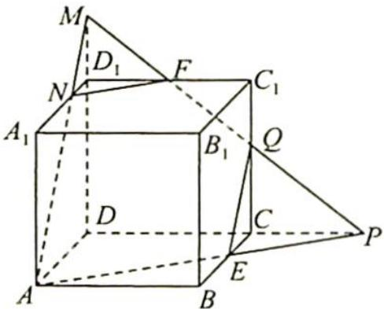

> [!faq]- 《高考数学培优40讲》例题解析
>
> > [!success]- **【答案】** 详见解析
>
> > [!note]- **【分析】**
> > 分析 ▶ A, E, F 三点确定一个平面, 设为 $\alpha$ , 且 $E \in \alpha$ , $E \in$ 平面 $BCC_{1}B_{1}$ , 则平面 $\alpha$ 与平面 $BCC_{1}B_{1}$ 相交, 设交线为 $l$ , 通过延长线可得到完整的截面 $\alpha$ 和交线 $l$ .
>
> > [!note]- **【解析】**
> > 解析 如图所示,延长 AE 与 DC 的延长线交于点 P,连接 FP 交 $CC_{1}$ 于点 Q,则 QE 是截面与侧面 $BCC_{1}B_{1}$ 的交线段, $\triangle FC_{1}Q\sim\triangle PCQ$ ,由比例知 CE=2, $QC=\frac{8}{3}$ , $QE^{2}=4+\frac{64}{9}=\frac{100}{9}$ ,所以 $QE=\frac{10}{3}$ .
> > 
> > 延长 $QF$ 交 $DD_{1}$ 的延长线于点 $M$ , 连接 $MA$ 交 $A_{1}D_{1}$ 于点 $N$ , 连接 $NF$ , 截面为五边形 $AEQFN$ . 可以用至少 3 种方法作此截面.
