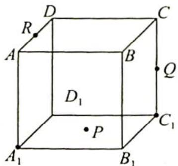
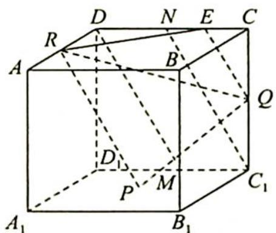
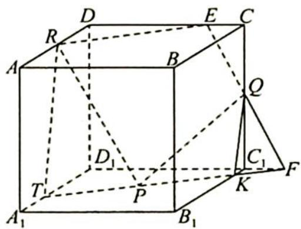
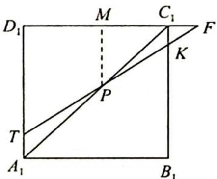
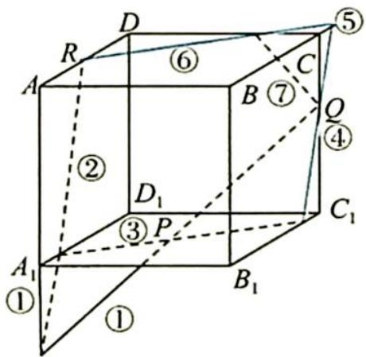
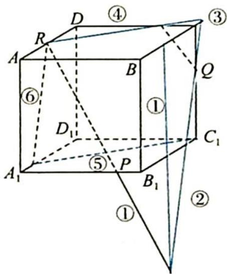

> [!faq]- 《高考数学培优40讲》例题解析
>
> > [!success]- **【答案】** 详见解析
>
> > [!note]- **【分析】**
> > 本题未单列分析。
>
> > [!note]- **【解析】**
> > 
> > 解析 ▶ 作法如下: (1) 如图 1 所示, 连接 PQ, RQ, PR, 显然 △PQR 不是截面多边形. (截面是平面与几何体的公共部分图形, 包含边界及其内部)
> > (2)取 $D_{1}C_{1}$ 中点 $M$ , 连接 $DM$ , 易证 $DM \parallel PR$ , 取 $DC$ 中点 $N$ , 连接 $C_{1}N$ , 可得 $DM \parallel C_{1}N$ .
> > 取 ${NC}$ 中点 $E$ ,连接 ${QE}$ ,易知 ${QE}//{PR}.{QE}$ 是截面 ${PQR}$ 与平面 $D{D}_{1}{C}_{1}C$ 的交线.
> > (3) 连接 $RE$ , 则 $RE$ 为截面 $PQR$ 与平面 $ABCD$ 的交线. $(R, E \in$ 平面 $ABCD, R, E \in$ 截面 $PQR)$
> > (4)如图2所示,延长EQ,交 $D_{1}C_{1}$ 延长线于点F,易知 $C_{1}F=\frac{1}{2}=CE$ .连接FP交 $B_{1}C_{1}$ 于点K,延长FP交 $A_{1}D_{1}$ 于点T,如图3所示.在底面 $A_{1}B_{1}C_{1}D_{1}$ 中,因为边长为2, $C_{1}F=\frac{1}{2}$ , $C_{1}K\parallel MP\parallel D_{1}T$ , $\triangle FC_{1}K\sim\triangle FMP\sim\triangle FD_{1}T$ ,由相似比易知 $C_{1}K=\frac{1}{3},D_{1}T=\frac{5}{3}$ .故TK即为截面PQR与底面 $A_{1}B_{1}C_{1}D_{1}$ 的交线.
> > (5)连接 QK, TR, 则 QK, TR 分别为截面 PQR 与侧面 $BB_{1}C_{1}C$ 及侧面 $AA_{1}D_{1}D$ 的交线.
> > 
> > 图 1
> > 
> > 图2
> > 
> > 图 3
> > 该题还可以用至少2种方法作截面,如下图所示.
> > 
> > 
