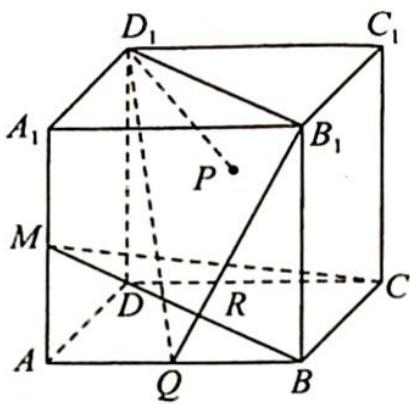
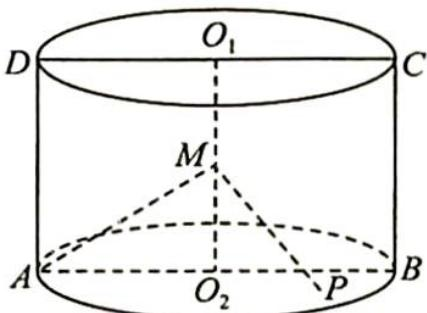

> [!faq]- 《高考数学培优40讲》例题解析
>
> > [!success]- **【答案】** 详见解析
>
> > [!note]- **【分析】**
> > 分析 ▶ 因为 $D_{1}P \perp CM$ , 所以动点 $P$ 在 $CM$ 的垂面内, 又因为 $P \in$ 平面 $ABB_{1}A_{1}$ , 所以点 $P$ 在 $CM$ 的垂面和平面 $ABB_{1}A_{1}$ 的交线上, 且 $P$ 的运动轨迹为一条线段.
>
> > [!note]- **【解析】**
> > 解析 如图所示, 取 AB 中点 Q, 连接 $B_{1}Q, D_{1}Q, B_{1}D_{1}, B_{1}Q$ 与 BM 相交于点 R, 易证
> > $B_{1}D_{1}\perp CM,B_{1}Q\perp CM,$ 则平面 $D_{1}B_{1}Q\perp CM,$ 又 $D_{1}P\perp CM,$ 所以 $D_{1}P\subset$ 平面 $D_{1}B_{1}Q,$ 且 $P\in$ 平面 $ABB_{1}A_{1},$ 故 $P\in B_{1}Q.$
> > 
> > $S_{\triangle PBC}=\frac{1}{2}\cdot BC\cdot d=d$ ，当d为BC与 $B_{1}Q$ 的公垂线，即d=BR时， $\triangle PBC$ 的面积最小. 在 $Rt\triangle BB_{1}Q$ 中， $d_{\min}=BR=\frac{2}{\sqrt{5}}=\frac{2\sqrt{5}}{5}$ ，故 $\triangle PBC$ 的面积的最小值为 $\frac{2\sqrt{5}}{5}$ .
> > 
