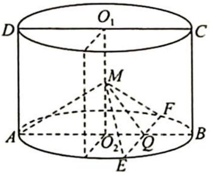
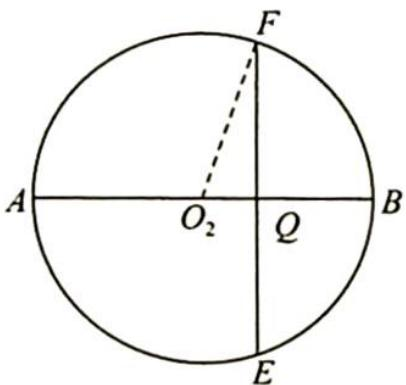

> [!faq]- 《高考数学培优40讲》例题解析
>
> > [!success]- **【答案】** 详见解析
>
> > [!note]- **【分析】**
> > 本题未单列分析。
>
> > [!note]- **【解析】**
> > 解析 ▶ 在线段 $O_{2}B$ 上取一点 Q，使得 $O_{2}Q = \frac{1}{4}O_{2}B$ ，则由边长关系可得 $\triangle AMO_{2} \sim \triangle MQO_{2}$ ，所以 $\angle AMO_{2} = \angle MQO_{2}$ ， $\angle QMO_{2} = \angle MAO_{2}$ ，且 $\angle AMQ = \angle AMO_{2} + \angle QMO_{2} = \angle AMO_{2} + \angle MAO_{2} = 90^{\circ}$ ，即 $AM \perp MQ$ 。
> > 如图所示, 过 $Q$ 作 $AB$ 的垂线, 交 $\odot O_{2}$ 于 $E, F$ , 则 $EF \perp AB, EF \perp MQ$ , 所以 $EF \perp$ 平面 $AMQ$ , 即 $EF \perp AM$ , 又因为 $AM \perp MQ$ , 所以 $AM \perp$ 平面 $MEF$ .
> > 故点 $P$ 在底面的轨迹为线段 $EF, EF = 2\sqrt{FO_2^2 - QO_2^2} = 2\sqrt{4 - \frac{1}{4}} = \sqrt{15}$ .
> > 
> > 
> > ## 评注
> > 本题依然是对三垂线定理的应用,也有对三角形相似的考查.在几何体中,对基本几何关系要熟悉.
