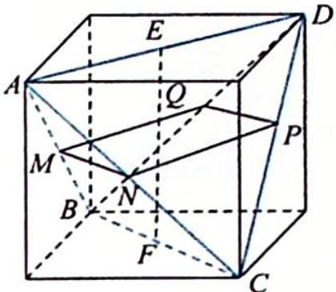

> [!faq]- 《高考数学培优40讲》例题解析
>
> > [!success]- **【答案】** A
>
> > [!note]- **【分析】**
> > 分析 ▶ 借助正方体构造正四面体.
>
> > [!note]- **【解析】**
> > 解析 如图所示, 将正四面体嵌在正方体中, $EF \perp AD$ , $EF \perp BC$ .
> > 设平面 $\alpha$ 与 $AB, AC, CD, BD$ 分别交于点 $M, N, P, Q$ , 则 $\alpha \parallel AD$ , $\alpha \parallel BC$ . 因为平面 $ABC \cap \alpha = MN$ , 所以 $MN \parallel BC$ . 同理可证 $NP \parallel AD$ . 而 $BC \perp AD$ , 所以 $MN \perp NP$ , 四边形 $MNPQ$ 为矩形.
> > 
> > 设 $MN = k, k \in (0,1)$ , 则 $NP = 1 - k, S = k(1 - k) \leqslant \left[\frac{k + (1 - k)}{2}\right]^2 = \left(\frac{1}{2}\right)^2 = \frac{1}{4}$ . 当且仅当 $k = \frac{1}{2}$ 时等号成立,
> >
> > 故选 **A**.
