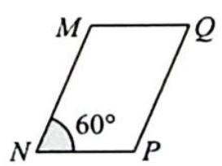
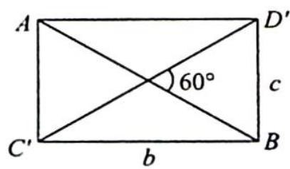

> [!faq]- 《高考数学培优40讲》例题解析
>
> > [!success]- **【答案】** B
>
> > [!note]- **【分析】**
> > 分析 ▶ 借助长方体构造四面体.
>
> > [!note]- **【解析】**
> > 解析 如图1所示,将四面体嵌入长方体中,设长方体的长、宽、高分别为a,b,c,则 $\left\{\begin{array}{l}a^{2}+b^{2}=7\\b^{2}+c^{2}=4\\a^{2}+c^{2}=5\end{array}\right.$ ,解得 $\left\{\begin{array}{l}a=2\\b=\sqrt{3}\\c=1\end{array}\right.$ .
> > 设平面 $\alpha$ 与 $AD, AC, BC, BD$ 分别交于点 $M, N, P, Q$ , 则 $MN \parallel PQ \parallel CD, NP \parallel MQ \parallel AB$ . 设 $\frac{MN}{CD} = k, k \in (0,1)$ , 则 $\frac{NP}{AB} = 1 - k$ , 又 $AB = CD = 2$ , 所以平行四边形 MNPQ 对边分别为 $2k, 2(1 - k), k \in (0,1)$ .
> > 由 $MN$ 与 $NP$ 的夹角即是 $CD$ 与 $AB$ 的夹角且易知 $AB$ 与 $CD$ 的夹角 $\theta$ 为 $60^{\circ}$ . 如图2所示, 则平行四边形 $MNPQ$ 的面积 $S = |MN||NP|\sin 60^{\circ} = 2k \cdot 2(1 - k) \cdot \frac{\sqrt{3}}{2} = 2\sqrt{3}k(1 - k) \leqslant \frac{\sqrt{3}}{2}$ , 当且仅当 $k = \frac{1}{2}$ 时等号成立, 故选B.
> > 
> > 图1
> > 
> > 
> > 图 2
